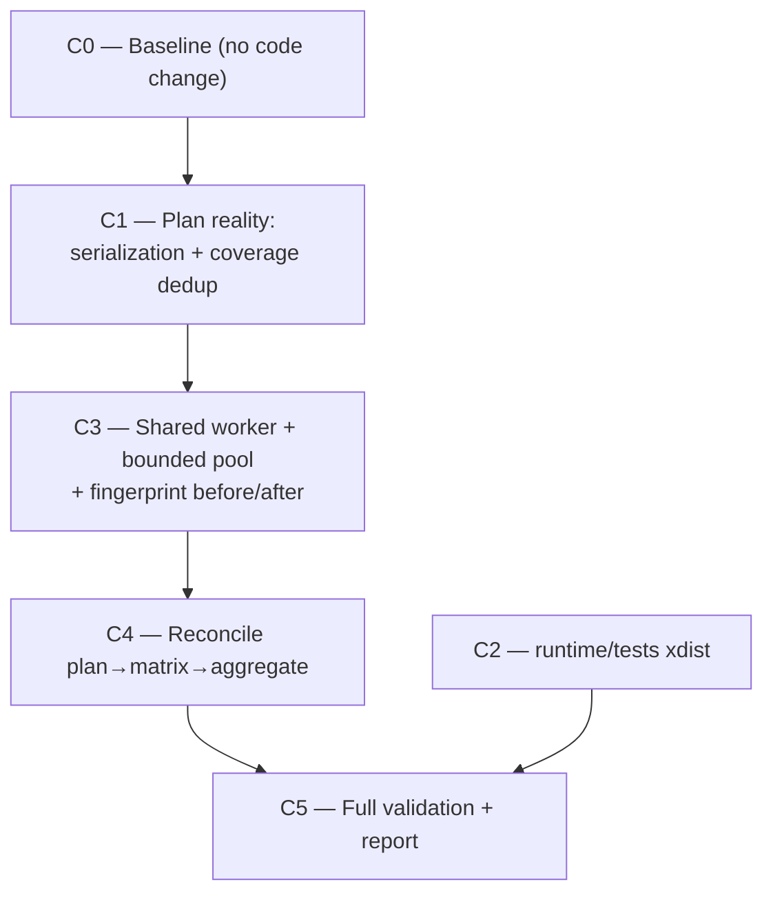
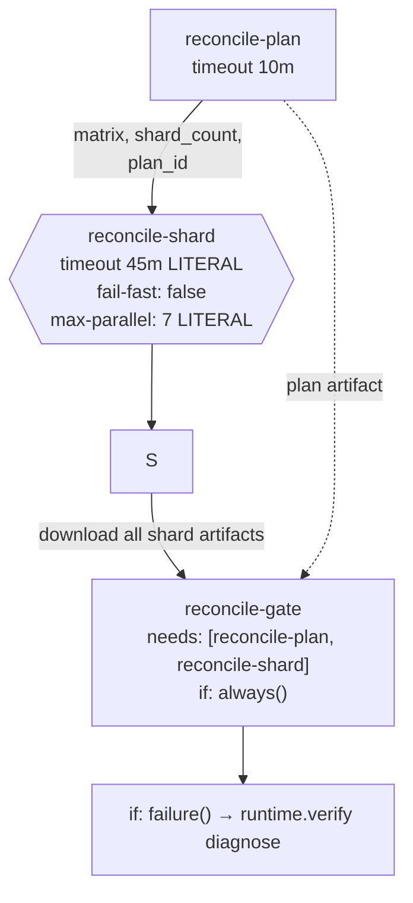

# M10-R2 — Verification Execution Parallelization: Milestone 1 (Primitives + Reconcile)

**Goal.** Prove the shared parallel execution, plan serialization, sharding, aggregation,
fingerprint integrity, and evidence-preservation primitives on **Verification Reconcile**
first. The three required gates (Backend/Frontend/Runtime Verification) receive **only
topology-preserving runtime optimizations** in this milestone — no workflow file changes,
no job or check-identity changes. A later milestone may migrate required workflows to
plan→matrix→aggregate under their existing identities.

> **Governing rule.** Do not make verification weaker to make it faster. Make independent
> verification execute concurrently, eliminate redundant computation, and preserve the
> same evidence and certification semantics.

---

## 1. Decisions (resolved with the user)

| # | Decision | Rationale |
|---|---|---|
| **D1** | Promote `_execute_shell_task` **into** `parallel_executor.py` as the single worker; delete that file's `_run_task`. | One execution abstraction. `_execute_shell_task` (`:1576`) is contract-complete and carries the deliberate 2026-09-30 streaming-evidence fix (`:1598-1622`, written because `capture_output=True` produced 0-byte logs on kill). `parallel_executor._run_task` buffers output and has no process-group kill — reusing it verbatim would regress evidence. |
| **D2** | Reconcile topology (`plan → matrix → aggregate`) is **this milestone only**. | Reconcile is **not** a required check (`validate_actions.py:75-80` lists exactly Backend Verification, Frontend Verification, Runtime Verification, Analyze), so its topology is unconstrained. Required gates are untouched. |
| **D3** | Shard path serializes **`ExecutionPlan`**, not `ControlPlanePlan`. | `ControlPlane.run()` loads a C48 plan that has no `.tasks`; the shard lives in the C49 `ExecutionPlan`. `:385` also unconditionally rebuilds the full plan, so fixing only `ControlPlanePlan.from_dict` would not scope a shard. |
| **D4** | Required gates get: shared worker wired into **both** `_run_profile_alias` and `ExecutionOrchestrator.execute`, plus `runtime/tests` xdist. No workflow edits. | `verify backend|frontend|runtime` execute via `_run_profile_alias`, not the orchestrator. Wiring only the orchestrator would leave required gates at zero improvement. Both paths share one worker, so no second abstraction. |
| **D5** | Shard partitioning: deterministic duration-weighted **LPT bin-packing**; escalation tasks are a **barrier** replicated to every shard. | `depends_on` is set only for escalation tasks (`:1219-1227`). Replicating them keeps stop-on-sufficiency (`:1442`) from being evaluated on an incomplete mandatory view. |
| **D6** | Coverage dedup keys on **resolved scope**, not command string; per-capability records are fanned out at aggregation. | `--out` embeds the capability name, so command-string dedup cannot collapse them. `_finalize`/evidence lookup stay untouched. |
| **D7** | Fingerprint: **capture-before / capture-after**, not per-task. | Per-task capture (`:1418`) both assumes serial execution and re-walks all of `backend/src` every iteration. |

---

## 2. Verified facts this plan rests on

| # | Fact | Evidence |
|---|---|---|
| F1 | `_run_profile_alias` is a serial, **fail-fast** loop | `control_plane_facade.py:1332-1405` |
| F2 | `check` execution is a serial loop | `execution_orchestrator.py:1416` |
| F3 | `ParallelExecutor` is unwired; refs are only its own file + `test_e2e_smoke.py:243-295`, `test_regression_suite.py:104` | grep |
| F4 | `depends_on` set only for escalation (= all mandatory ids) | `:1219-1227` |
| F5 | `_inject_revalidations` has no dedup; `--out` carries the capability name | `:1044-1080` |
| F6 | 7 of 12 recorded measurement tasks were the same `coverage tests/unit/engines` | `m9-c49/logs/execplan-d3fa20f767d7/exec-0011-stdout.log:3-19` |
| F7 | `ControlPlanePlan` has no `from_dict`; `run(plan_path=…)` silently regenerates, can exit 0 on a corrupt file | `:372-385` |
| F8 | `RepositoryFingerprint.from_dict` exists — pattern established | `:414-422` |
| F9 | `capture()` runs **once per task**, re-walking all of `backend/src` | `:1418`, `_hash_tree :331-344` |
| F10 | `_finalize` is order-independent over records but reads measurements **from disk** | `:2082-2170`, esp. `:2147` |
| F11 | `mutation.yml` proves plan → dynamic matrix → `fail-fast:false` + literal `max-parallel` | `:156,180,258-303` |
| F12 | **A dynamic `timeout-minutes` on a matrix job makes the job silently vanish** | `mutation.yml:284-293` |
| F13 | Zero-shard guard is `needs.<job>.outputs.count != '0'`, not `matrix != '[]'` | `mutation.yml:272-280` |
| F14 | Rule 12 enforces `matrix.` interpolation in matrix artifact names | `validate_actions.py:375-398` |
| F15 | Rule 7a makes `paths:` on a required check a hard error (PR #8) | `:155-236` |
| F16 | Backend test DB is **already xdist-safe**: per-worker session template via `tmp_path_factory` | `backend/tests/fixtures/database.py:10,105` |
| F17 | `pytest-xdist==3.8.0` installed; `-n auto` used in only 2 of 15 CI scripts; no `pytest-randomly` | `pyproject.toml:61-65` |
| F18 | `record_execution_report` is **once per run**, after `execute()` — no fan-out hazard | `event_store.py:346` |
| F19 | `ExecutionTaskSpec(**{**t.to_dict(), …})` rebuild at `:1226` breaks if a field is absent from `to_dict()` | verified |

### 2.1 Verified xdist hazards — five, in three files

| File / line | Hazard |
|---|---|
| `test_mutation_infra.py:315,359` | writes + restores real `backend/pyproject.toml` — which `capture()` hashes (`:381`) |
| `test_full_pipeline_integration.py:21-29,43` | writes + restores real `backend/src/engines/loan_engine/emi.py` — hashed by `_hash_tree` (`:379`) |
| `test_m9_c55.py:566` `test_g20` | runs `pytest runtime/tests/test_m9_c54.py` **twice**, asserting both pass — the repetition *is* the certification claim; concurrent execution of `test_m9_c54.py` elsewhere makes the two runs legitimately disagree |
| `test_m9_c55.py:607` `test_g22` | nested `measure_coverage_cli` → shared `.coverage` write |
| `test_m9_c55.py:628` `test_g23` | nested `run_mutation_cli(["--smoke"])` — a real mutation run |

`test_mutation_infra.py:303-313` already declares hermetic intent; the fix direction is established.

### 2.2 Open — settled by measurement, not assumption

| # | Open | Settled by |
|---|---|---|
| A1 | The 97-min figure (2026-10-01, 4-core, loadavg ~9.6) is a **shape** datapoint, not a baseline | C0. **Never cite it in an acceptance claim.** |
| A2 | Reclaimable ≈ `max(single task)`, not `sum/N` | C0 per-task `duration_seconds` |
| A3 | Whether the other `runtime/tests` files are xdist-safe | C2 pilot, 3 consecutive runs |
| A4 | Real cache hit rate on recent runs | C0, `gh run view --log` |
| A5 | CI runner core count — caps in-process speedup | C0 `nproc` |

---

## 3. Corrected premises (do not action)

| Brief claim | Reality |
|---|---|
| Baseline `bfcf336b…` | HEAD is `f500f27f8692975f463722a4f9f124d937ea9a5c` on `m11/parallelism-correctness`. Re-baseline in C0. |
| "outstanding issue: `frontend-verify.yml` bypasses the frontend profile" | **Already compliant** — `frontend-verify.yml:128-129` runs `runtime.verify frontend`; M11 Task 11 routed it through the profile (proof at `:74-127`). |
| `runtime/foundation/{control_plane_facade,parallel_executor,execution_orchestrator,control_plane,profiles}.py` | Actual: `runtime/foundation/verification/<name>.py`. Brief's paths do not exist. |
| `python tools/validate_actions.py` | `.venv/bin/python .github/scripts/validate_actions.py` (already wired at `quality.yml:133`). |

---

## 4. Ordered task list



C2 is fully independent of C1/C3 and can start immediately.

---

### C0 — Baseline

No code change. Re-baseline on current HEAD.

1. Confirm and record the call graph by reading, not comments:
   `CLI → runtime/verify.py → runtime/foundation/verification/{profiles,control_plane,control_plane_facade,execution_orchestrator,parallel_executor} → executor → subprocess → evidence → reconcile/certify`.
   Mark every serial loop; record `ParallelExecutor`'s 4 disconnection blockers.
2. Measure on a quiesced machine → `docs/audits/m10-r2-baseline.md` + `runtime/generated/verification-performance.json`:
   `verify quick|backend|frontend|runtime`; `verify check` on a representative boundary (**per-task `duration_seconds`**, `plan_id`, `plan_fingerprint`, task count, duplicate-command count, critical-path task); `pytest runtime/tests/` alone; each `.github/scripts/run_*.sh`; coverage expansion counts (total / exact-duplicate / metadata-differing); last 10 reconcile runs from CI with cache hit-miss and per-step times; `nproc` + loadavg.
3. **Gate:** baseline committed; working tree clean. Nothing proceeds to C1 without this — it is the anti-regression oracle.

---

### C1 — Plan reality

**1a. Serialization.** In `execution_orchestrator.py`, adjacent to existing `to_dict`:
- `ExecutionTaskSpec.from_dict` — total over `dataclasses.fields`; ignore unknown keys.
- `ExecutionPlan.from_dict` — rebuild tasks; reuse `RepositoryFingerprint.from_dict` (F8).
- Reject any dict whose `"schema"` is present and ≠ `"m9-c49-execution-plan/v1"` (emitted at `:536`). Silent schema drift is exactly how the `hasattr` guard hid F7.

In `control_plane.py`: add `ControlPlanePlan.from_dict` with the same discipline, making the dead branch at `:372` live.

In `control_plane_facade.py:372-385`: supplied plan becomes **authoritative** — skip `:385`; unparseable plan ⇒ hard error naming the file (today it regenerates and can exit 0); absent ⇒ unchanged.

**1b. Coverage dedup (D6).** In `_inject_revalidations`, group by `(kind, resolved_scope)` **after** the `:1046-1051` resolution. Per group: one task; `capabilities = tuple(sorted(group_caps))`; `primary_capability = sorted(group_caps)[0]`; `--out` → `measurement-truth-<sorted(group_caps)[0]>-coverage.json`; `source_task_id = "revalidate::<caps>::coverage"`; **`origin` stays `"revalidation"`** (`test_m9_c49.py:312` asserts it); `reasons` names every requesting capability; `revalidation_sources` keeps **one entry per capability**.

Soundness: `_find_measurement_record:1195-1202` already enforces that a record speaks only for its measured scope, via `_component_for_mapping`. Same scope ⇒ legitimately one measurement.

New fan-out helper, called before `_finalize`: for each group × requesting capability, if `measurement-truth-<cap>-coverage.json` is absent, write it from the group measurement preserving `requested_scope`/`actual_scope`/`score`/`repository_sha`/`evidence_fingerprint`, plus additive `measurement_provenance`. **Net effect: `_finalize` and `_find_measurement_record` are untouched** — every per-capability lookup still finds a per-capability file. Only execution count drops. Certification impact: none — the gate at `:2142-2161` inspects only `minimum_mutation_score`.

**1c. Tests.**
- New `runtime/tests/test_execution_plan_serialization.py`: field-for-field round trip (catches F19); unknown-key tolerance; correct schema accepted / wrong schema raises; **`cp.run(plan_path=<1-task plan>)` executes exactly 1 task** even when the live boundary would expand to 20 *(the regression test for F7/D3)*; corrupt plan ⇒ non-zero naming the file; recorded `plan_fingerprint` matches recomputation.
- New `runtime/tests/test_coverage_revalidation_dedup.py`: same scope ⇒ 1 task with all caps; different scopes ⇒ no cross-scope merge; `revalidation_sources` length unchanged; deterministic across two builds; fan-out yields a parseable record per cap; `_find_measurement_record` non-`None` per cap *(the regression that matters)*; `contract`/`api-contracts` still resolve to scope `.`; mutation **not** deduped (`test_m9_c49.py:213` holds); `test_m9c57_verification_self_contract.py:858-877` determinism holds.
- Full `runtime/tests` green.

**Gate:** coverage task count 12 → ≤5 for the recorded shape; report before/after counts and duplicates removed.

---

### C2 — `runtime/tests` parallel execution

**2a. Audit (blocking, read-only).** Classify every file: xdist-safe · shared-state · subprocess/global · order-sensitive · intentionally serial · excluded. Instrument a serial run; `git status --porcelain` before/after to surface real-tree writes; grep for `backend/src`, `pyproject.toml`, `.coverage`, `os.chdir`, `sqlite3.connect`, `monkeypatch.chdir`, `os.environ[`, nested `pytest`/`mutmut`/`coverage`.

**2b. Fix the hazards first** (pure test hygiene, unblocks 2d):
- `test_mutation_infra.py` → point `backend_pyproject` at a `tmp_path` copy (intent already declared at `:303-313`).
- `test_full_pipeline_integration.py:21-29` → `tmp_path` copy of `emi.py`.

**2c. Pilot (blocking).**
1. Serial reference run ⇒ exact id list + duration (the only trustworthy baseline).
2. `-n auto` × **3 consecutive** runs ⇒ identical id sets. Divergence ⇒ shared state, not flake.
3. `capture()` equal before/after the whole run.
4. `git status --porcelain` clean after (excl. `.pytest_cache`).
5. Retry with `--dist loadfile`.

**2d. Enable, in order.**
- Preferred: `--dist loadfile` + 2b. One pytest invocation ⇒ `--junitxml`, the log, and `run_runtime_verification.sh`'s exit contract all unchanged.
- Fallback: `collect_ignore_glob` in `runtime/tests/conftest.py` for `test_m9_c55.py`, `test_mutation_infra.py`, `test_full_pipeline_integration.py`; `-n auto` for the rest.
- Last resort: no parallelisation; instead measure and parallelise `runtime.verify integrity` (`run_runtime_verification.sh:44`), the other half of that task.

**2e. Preserve deliberate repetition.** Never merge or delete the nested pytest invocations in `test_m9_c55.py::test_g20` — the repetition is the assertion. Keep those three tests serial.

**Gate:** 3 consecutive identical runs; worktree clean; **required Runtime Verification still reports and passes.**

---

### C3 — Shared worker, bounded pool, fingerprint

**3a. Resolve D1.**
- Move `_execute_shell_task` + `_kill_process_group` + `_classify_termination` + `_summarise_pytest_outcome` + `_tee` into `parallel_executor.py` as the single worker body.
- Delete `parallel_executor.py:_run_task` (`:111-190`); its `capture_output=True` (`:154`) must not survive.
- `ParallelExecutor` retains grouping + `ProcessPoolExecutor` + bounded workers + incremental result collection.
- Reconcile grouping with `_add_dependency_edges`: read `depends_on`, and treat `is_escalation` as the barrier predicate (F4).
- Redirect the existing `ParallelExecutor` tests; keep them green.

**3b. Wire both call paths (D4).**
- `ExecutionOrchestrator.execute` — replace the serial `:1416` loop with a pool over independent tasks.
- `_run_profile_alias` (`:1298`) — same pool. `backend` profile = 6 independent tasks (the 7th, `"Aggregate evidence"`, is already name-skipped at `:1333`); `runtime` = 1 effective task; `frontend` = 1 task ⇒ **no gain, and report that honestly**.

**3c. Worker bound.** Keep `min(cpu_count, 4)` as the default. Add `VERIFY_MAX_WORKERS` as an explicit documented override. Never unbounded `os.cpu_count()`. **Exclude mutation / `authorization_required` tasks from any concurrent set** — they mutate by definition (also the fingerprint-race guard, 3d).

**3d. Fingerprint (D7).** Replace per-task `capture()`:
```
live_fp_before = capture()                          # reuse :766, do not re-capture
validate plan.repository_fingerprint == live_fp_before   # fail closed → SCOPE
… fan-out …
live_fp_after = capture()
if after != before → one record: task_id="fingerprint-integrity",
  completion_state=SCOPE, stage=INVALID_SCOPE,
  reason="repository state changed during execution: before=<12> after=<12>"
```
`_finalize:2100-2104` already maps `SCOPE` → `VALIDATION_BLOCKED`. **No new decision value, no threshold change.** Strictness improves: today a change inside the *final* task is missed; before/after cannot miss it. Record the loss of early-`break` in the report's `decisions`.

**3e. Evidence namespace before concurrency.** Logs are `m9-c49/logs/{plan_id}/{task_id}-stdout.log` (`:1580-1583`) — unique per task. **Assert at partition time** that no two concurrently-scheduled tasks share an evidence destination; fail closed if any do. Never resolve a collision by overwriting.

**3f. Deterministic reconciliation.** Collect by `task_id`, reconcile in plan order — never completion order. `total_duration_seconds` = wall clock, not the sum. Recompute `efficiency` via existing `_compute_efficiency`.

**3g. Fail-fast → collect-all.** `_run_profile_alias` (`:1369-1402`) currently returns on first failure. Run all independent tasks, collect every result, then exit non-zero if any required task failed. Only a declared dependency may short-circuit. **Verdict unchanged**; completeness of diagnosis improves.

**3h. Tests.**
- New `runtime/tests/test_parallel_execution.py`: independent tasks overlap in wall time; `depends_on` respected; one failure does not erase unrelated records; timeout ⇒ `TIMEOUT`; exit code preserved; stdout/stderr streamed to the correct per-task file (explicit 0-byte check — the deleted-`capture_output` regression); task ids deterministic; evidence-path collision detection fires.
- New `runtime/tests/test_fingerprint_integrity.py`: unchanged tree ⇒ `CERTIFIED`; tree changed during run ⇒ `VALIDATION_BLOCKED` + exactly one `SCOPE` record; change inside the **last** task detected *(stricter than today)*; plan ≠ live ⇒ `SCOPE` with **zero** subprocesses; `capture()` called **exactly twice** per `execute()`; mutation tasks excluded from the concurrent set.
- Extend `test_m9_c49.py`: multi-task failure still yields `DIAGNOSTIC` naming **all** failed mandatory tasks.

**Gate:** required Backend/Frontend/Runtime Verification all still report and pass; local `verify backend|frontend|runtime` produce identical exit codes to C0.

---

### C4 — Reconcile `plan → matrix → aggregate`

Reconcile is not a required check, so job names are unconstrained (D2). **No required workflow file is edited.**



**4a. YAML traps — read `mutation.yml` before writing YAML.**
- **F12:** dynamic `timeout-minutes` on a matrix job ⇒ the job silently never exists. Use a **literal** `timeout-minutes` and enforce the per-shard budget **inside** the step with GNU `timeout` (pattern at `mutation.yml:295+`).
- **F13:** zero shards ⇒ `needs.reconcile-plan.outputs.shard_count != '0'`, not `matrix != '[]'`.
- `fail-fast: false` (`mutation.yml:302`) — with `true` the first red shard cancels the rest, their evidence is lost, and the gate reports "incomplete" instead of the real failure (`mutation.yml:151-155`).
- `if: always()` on the gate — otherwise one red shard skips the gate, the context never reports, and the PR blocks with no reason (the PR #8 class).
- **`max-parallel: 7` literal.** Publish `suggested_max_parallel` for the summary only, never as a job property (F12's failure mode).

**4b. Shard partitioning (D5).** Deterministic LPT over `estimated_duration_seconds`:
- `schedulable` = non-escalation tasks (`depends_on == ()`, F4).
- sort by `(-est, task_id)`; assign each to the currently-lightest bin. `task_id` is `exec-NNNN` (zero-padded, `:836`) so the tiebreak is total.
- **Every shard receives all escalation tasks.** Cost is duplicated work only in the already-red failure case.
- Assert est-weighted balance ≤ `1.5 ×` mean.

**4c. CLI.** `check --shard N --shard-count M`, parsed at the CHECK branch of `_dispatch_canonical` (`:1479`, which today discards `args`). Absent `--shard` ⇒ `(0,1)` ⇒ byte-identical to today. Validate `M ≥ 1`, `0 ≤ N < M`; reject `--shard-count` without `--shard`. A shard leg reads the serialized `ExecutionPlan` (D3) and must execute **exactly** its assigned tasks.

**4d. Merge contract.** Shards upload `TaskExecutionRecord[]`; the gate merges, sorts by plan order, then calls `_finalize`.
**Hard invariant, asserted not assumed:** `set(record.task_id) == set(t.task_id for t in plan.tasks)`.
A short set ⇒ `NOT_CERTIFIABLE` with reason *"shard coverage incomplete: {missing ids}"* — **never `CERTIFIED`**. This is the split-brain guard. `_finalize`'s precedence is order-independent (F10), so a single-shard merge must reproduce that shard's verdict exactly — property-test it.

**4e. Artifacts.** All via `./.github/actions/upload-runtime` (Rule 3/4). Every matrix name interpolates `matrix.` ⇒ Rule 14/12 satisfied by construction.
- `reconcile-plan` → the serialized `ExecutionPlan`.
- `reconcile-shard-${{ matrix.n }}` → shard records, `m9-c49/logs/<plan_id>/`, **`m9-c49/measurements/`**, `runtime/generated/evidence/`, caches.
- `reconcile-gate` → merged report + evidence.

**`measurements/` download is mandatory.** F10: `_finalize:2147` globs the filesystem. An aggregator missing those files returns `NOT_CERTIFIABLE` for a reason that *looks like* a quality failure. Keep "incomplete shard evidence" textually distinct from "certification conditions not satisfied".

**4f. Conditional diagnostic.** `if: failure()` → `runtime.verify diagnose`. Reporting only, never a gate; permitted because reconcile is not in `VERIFICATION_PROFILES` (`validate_actions.py:314-316`). Guard it so an empty boundary cannot turn a red build into a confusing second failure.

**4g. Validator.** `.venv/bin/python .github/scripts/validate_actions.py` must exit 0. If a rule misreads the new topology, fix **the validator** with a documented architectural justification plus a regression test proving it still rejects an invalid workflow. Never suppress.
- Rule 7a/15: reconcile gains no `paths:`; the four required contexts are untouched.
- Rule 8: reconcile is not a profile workflow; shard legs run the *same* operation as the gate.
- Rule 9: `runtime.verify status` retained on the gate.
- Rule 12: satisfied by `matrix.` interpolation.
- **Do not action D4/§3** — `frontend-verify.yml` is already compliant.

**4h. Tests.** Matrix failure stays visible; gate runs under `always()`; every leg's records appear in the merge; a deliberately deleted leg ⇒ `NOT_CERTIFIABLE` naming missing ids; `∪ shard(N) == plan.tasks` and pairwise disjoint for `M ∈ 1..7`; deterministic assignment across two builds; invalid `--shard` rejected; `check` with no `--shard` byte-identical to today.

---

### C5 — Validation, caching, cleanup

**5a. Caching — audit before touching.** pip **and** constructed `.venv` caches already exist, keyed OS+arch+exact-interpreter and validated on restore. **Do not redesign.** Measure hit rate in C0 (A4). Only candidate: `architecture-inventory.json` / `cross-layer-map.json` / `knowledge-index.json`, regenerated by `bootstrap-runtime` in all 15+ jobs — cache only if deterministic, reliably keyed, **not canonical evidence**, no stale-state hiding, and measurably worthwhile. Key on a source-tree hash, never a branch name. **Never cache canonical evidence as a dependency.**

**5b. Full local suite:** backend, runtime, frontend, typecheck, lint, build, API contracts, golden, mutation smoke, `validate_actions.py`, `scripts/test-platform-readiness.sh`. Then `verify quick|backend|frontend|runtime|check`, with repeats for concurrency-sensitive paths.

**5c. Live CI — all contexts must report:** Backend Verification, Frontend Verification, Runtime Verification, Analyze, Quality Gate, API Contract Integrity, Playwright, mutation, Verification Reconcile. **Do not declare success from local output.**

**5d. `ParallelExecutor` reachability:** D1 makes it live; no deletion expected. Keep its tests redirected.

**5e. Out of scope — do not mix:** `/forecast` fabricated projections, Recharts `NaN`, wellness-score scaling, Platform Console cold-start, unconsumed backend capabilities, Investments HTTP 500, E2E seed limits. Record as outstanding.

---

## 5. Risks

| # | Risk | Sev | Mitigation |
|---|---|---|---|
| R1 | Split-brain: a mandatory task silently unrun, aggregate certifies a partial record set | **Critical** | §4d invariant, tested |
| R2 | Plan divergence between runners ⇒ gaps / double execution | High | Assert each leg's `plan_fingerprint` equals the plan job's |
| R3 | New `fingerprint-integrity` record changes the evidence schema consumers see | Med | Additive; grep `completion_state` consumers; verdict identical |
| R4 | Missing measurement artifacts at aggregation ⇒ false `NOT_CERTIFIABLE` | Med | §4e; distinct reason string |
| R5 | Coverage dedup masks a genuine per-capability difference | Low | Keyed on resolved scope; C1c tests; coverage is **not** in the certification gate |
| R6 | Dedup changes `plan_fingerprint` ⇒ golden artifact breaks | Low | Search hardcoded `execplan-` ids before landing |
| R7 | In-process fan-out races the fingerprint with a concurrent mutator | Med | Exclude mutation/`authorization_required` tasks (3c); impossible under matrix topology |
| R8 | Required context stops reporting | **Critical** | `always()` on gate; `fail-fast: false`; no `paths:` on required |
| R9 | `ExecutionTaskSpec(**t.to_dict())` breaks on a new field | Low | C1c field-for-field round trip |
| R10 | **New:** parallelizing `_run_profile_alias` makes a *required* gate flaky | Med | Backend DB already xdist-safe (F16); `run_contract_tests.sh:78` uses `-n auto` internally so concurrency **oversubscribes** — cap concurrent profile tasks and prove with repeats before landing (3h) |
| R11 | **New:** collect-all changes when a required gate turns red | Low | Verdict and exit code unchanged; only completeness of diagnosis changes |

---

## 6. Rollback

| Change | Rollback | Note |
|---|---|---|
| C1 serialization | revert commit | Backward compatible: no `--plan` ⇒ today's behaviour |
| C1 dedup | revert | Task count is not an external contract |
| C2 xdist | revert | |
| C3 worker / pool / fingerprint / collect-all | revert | `check` with no `--shard` unchanged; profiles revert to serial fail-fast |
| **C4 reconcile topology** | `git revert` the workflow commit | Highest risk. Keep the prior job definition in the commit message so revert is mechanical. Window: one PR cycle |
| 5a caching | revert | Add a stale-artifact validation step on cache hit |

**Rollback triggers (any one):** validator non-zero · any required context fails to report · gate `final_decision` ≠ C0 serial · `plan_fingerprint` diverges between plan job and any leg · any `SCOPE`/`fingerprint-integrity` record with no concurrent writer · a required gate flakes across 3 repeats.

---

## 7. Acceptance criteria

**Correctness (blocking).**
1. `check` without `--shard` byte-identical to pre-change (plan, order, `final_decision`).
2. `∪ shard(N) == plan.tasks`; shards pairwise disjoint; `M ∈ 1..7`.
3. Assignment deterministic across two builds.
4. Short record set ⇒ `NOT_CERTIFIABLE` naming missing ids — never `CERTIFIED`.
5. `run --plan` executes exactly its plan.
6. Corrupt plan ⇒ non-zero exit naming the file.
7. `capture()` invoked exactly twice per `execute()`.
8. Tree change inside the **last** task ⇒ `VALIDATION_BLOCKED`.
9. Coverage dedup ⇒ one task per scope; every capability resolves a record.
10. All pre-existing runtime tests green except listed intentional edits.
11. `validate_actions.py` exits 0.
12. Multi-task failure names **all** failed mandatory tasks.

**Performance — measured against C0 only.**
13. `Verification Reconcile` elapsed ≤ `max(per-task) × 1.25 + plan overhead` **and** ≥50% below C0.
14. Coverage task count 12 → ≤5 for the recorded shape.
15. `runtime/tests` ≤60% of its C0 serial time (only if C2 pilot passes).
16. `verify backend` speedup reported honestly; **state the 2-core ceiling rather than overclaiming** (A5).
17. Report every result, including **"no improvement"**, in the PR.

**Anti-regression oracle.** For the same boundary, C4's gate `final_decision` must equal C0's serial `final_decision`.

---

## 8. Definition of done

1. One shared parallel execution core, wired into both `_run_profile_alias` and `ExecutionOrchestrator.execute`; no second abstraction.
2. `verify check` executes independent obligations concurrently.
3. Fingerprint integrity still enforced — stricter, in fact.
4. Plan serialization is real and tested; `ExecutionPlan` round-trips field-for-field.
5. A shard executes only its assigned plan; union == plan.
6. Aggregation preserves failures; the missing-record guard is tested.
7. Duplicate coverage executions eliminated with no obligation deleted.
8. `runtime/tests` uses safe parallelism where proven; hazardous tests stay serial; deliberate repetitions preserved.
9. Verification Reconcile is `plan → matrix → aggregate` with evidence preserved and distributed.
10. Required checks retain identity, authority, delegation, and topology — **untouched**.
11. Matrix aggregation never turns a failed leg into a passing gate.
12. Existing dependency caching preserved; only materially useful caching added.
13. `validate_actions.py` passes with zero errors.
14. No verification, security, or quality threshold weakened.
15. No unrelated product defects mixed in.
16. Real GitHub runs show a material critical-path reduction.
17. All required checks report and pass.
18. Final report has measured before/after evidence.
19. Every stage checkpointed; working tree clean.

---

## 9. Final report

`docs/audits/m10-r2-parallel-execution-final-report.md` — architecture (old/new topology, why parallelism is safe, dependency graph, fingerprint semantics); executor (worker promotion, bounds, failure/timeout semantics); plan (serialization, sharding, dedup); runtime (xdist findings, parallel subsets, intentionally-serial tests); GitHub (before/after, `needs`, max-parallel, caching, required-check preservation); measured performance table (`verify runtime`, `verify check`, coverage expansion, the four required contexts, full PR critical path); correctness (tests, races, fingerprint-mutation, shards, dedup, failure propagation, validator); git (checkpoints + SHAs, branch, clean tree); and **remaining issues**, separating unrelated product defects from execution work.

**Milestone boundary:** this plan does **not** migrate `backend-verify.yml`, `frontend-verify.yml`, or `verification-runtime.yml` to matrix topology. A subsequent milestone may, under their existing required identities.

---

## 10. Out of scope for implementation

Source edits to `runtime/foundation/verification/**`, `.github/workflows/verification-reconcile.yml`, and `runtime/tests/**`, plus mutating verification runs, all require an **implementation-capable agent**. This plan is analysis-only; switch agents to execute.