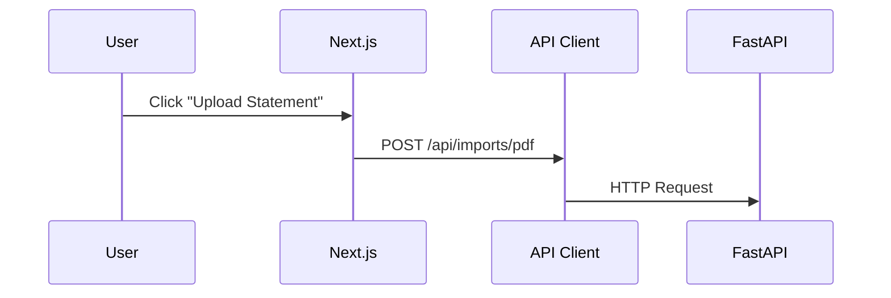
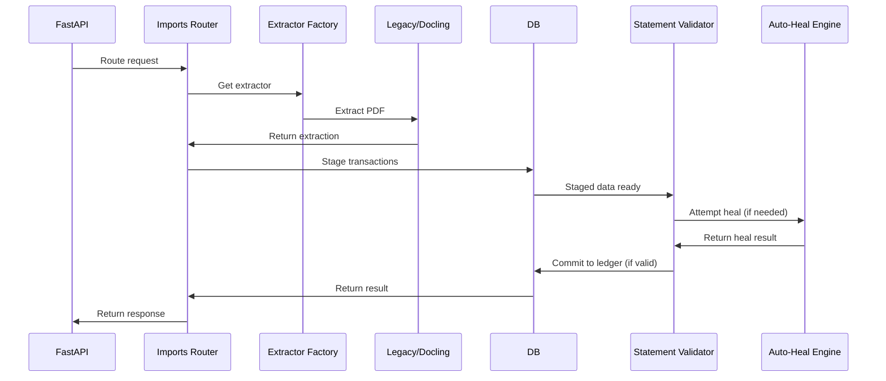
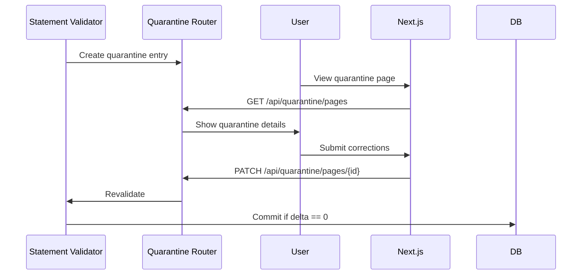
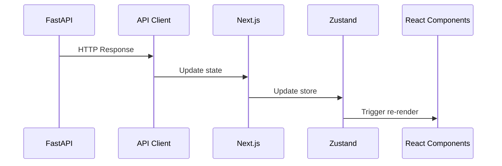
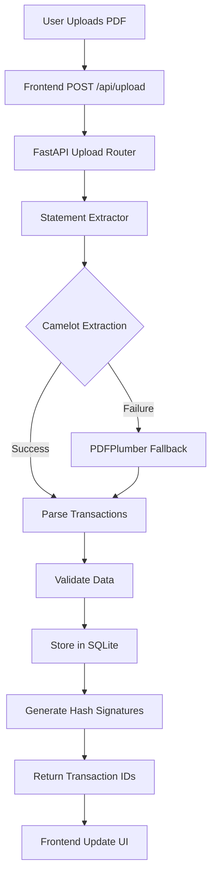
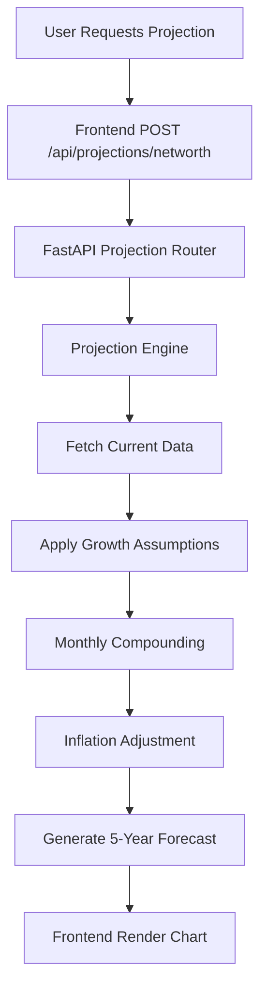
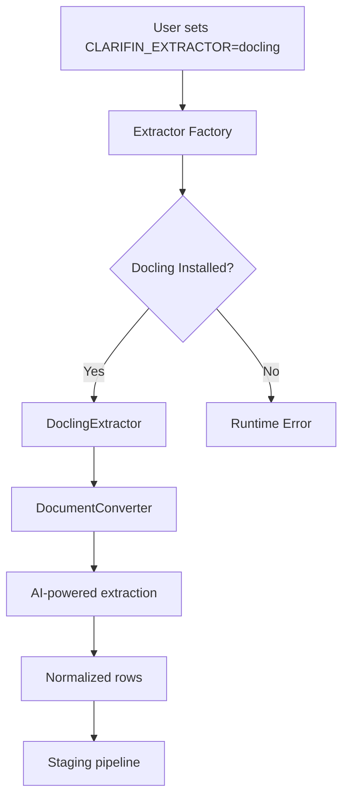

# ClariFin OS Architecture

## System Overview

ClariFin OS is a layered personal finance management system with a clear separation of concerns between presentation, business logic, and data storage.

```
┌─────────────────────────────────────────────────────────────┐
│                     User Interface Layer                     │
│  ┌─────────────┐    ┌─────────────┐    ┌─────────────────┐  │
│  │ Next.js App  │    │ React Comp. │    │ Tailwind CSS     │  │
│  └─────────────┘    └─────────────┘    └─────────────────┘  │
└─────────────────────────────────────────────────────────────┘
┌─────────────────────────────────────────────────────────────┐
│                     API Layer                                │
│  ┌─────────────┐    ┌─────────────┐    ┌─────────────────┐  │
│  │ FastAPI      │    │ 14 Routers   │    │ REST Endpoints  │  │
│  └─────────────┘    └─────────────┘    └─────────────────┘  │
└─────────────────────────────────────────────────────────────┘
┌─────────────────────────────────────────────────────────────┐
│                     Business Logic Layer                     │
│  ┌─────────────┐    ┌─────────────┐    ┌─────────────────┐  │
│  │ 11 Engines   │    │ Services    │    │ Validation      │  │
│  └─────────────┘    └─────────────┘    └─────────────────┘  │
└─────────────────────────────────────────────────────────────┘
┌─────────────────────────────────────────────────────────────┐
│                     Data Layer                                │
│  ┌─────────────┐    ┌─────────────┐    ┌─────────────────┐  │
│  │ SQLite DB    │    │ Repositories│    │ Data Models     │  │
│  └─────────────┘    └─────────────┘    └─────────────────┘  │
└─────────────────────────────────────────────────────────────┘
```

## Engine Dependency Graph

```
financial_engines/
├── balance_engine.py          # Core transaction processing
├── behavior_engine.py         # Behavioral analysis
├── cashflow_engine.py         # Cash flow calculations
├── insight_generator.py       # Financial insights
├── ledger_audit_engine.py     # Data integrity checks
├── loan_engine.py             # Loan calculations
├── networth_engine.py         # Net worth tracking
├── nudge_engine.py            # Personalized recommendations
├── projection_engine.py       # Future projections
├── reconciliation_engine.py    # Account reconciliation
└── recurring_engine.py        # Recurring transaction detection
```

Dependencies flow from bottom to top:
- `balance_engine` → `cashflow_engine` → `networth_engine`
- `loan_engine` → `projection_engine`
- `recurring_engine` → `behavior_engine` → `nudge_engine`

## Request Lifecycle

### 1. Frontend Request


### 2. Backend Processing (V2 Pipeline)


### 3. Quarantine Flow (if validation fails)


### 4. Frontend Update


## Database Schema Relationships

### Core Entities

```
┌─────────────┐       ┌─────────────────┐
│  Accounts   │◄─────►│   Transactions  │
└─────────────┘       └─────────────────┘
       ▲                   ▲
       │                   │
┌──────┴───────┐    ┌──────┴───────┐
│    Cards     │    │  Statements  │
└──────┬───────┘    └──────────────┘
       │                   ▲
       │                   │
┌──────┴───────┐    ┌──────┴───────┐
│ Loan Payments│    │Recurring Txns│
└───────────────┘    └──────────────┘
```

### Financial Tracking

```
┌─────────────┐       ┌─────────────────┐
│   Loans      │◄─────►│  Loan Payments  │
└─────────────┘       └─────────────────┘
       ▲                   ▲
       │                   │
┌──────┴───────┐    ┌──────┴───────┐
│  Investments│    │Monthly Snapshots│
└──────────────┘    └──────────────┘
```

## Data Flow: PDF Upload Operation



## Data Flow: Loan EMI Calculation

```mermaid
flowchart TD
    A[User Requests Amortization] --> B[Frontend GET /api/loans/{id}/amortization]
    B --> C[FastAPI Loan Router]
    C --> D[Loan Engine]
    D --> E[Fetch Loan Details]
    E --> F[Calculate EMI]
    F --> G[Generate Schedule]
    G --> H[Apply Prepayments]
    H --> I[Return Amortization]
    I --> J[Frontend Display Chart]
```

## Data Flow: Net Worth Projection



## Key Architectural Decisions

### 1. Immutable Ledger Pattern
- **Implementation**: SQLite triggers prevent transaction updates/deletes
- **Benefits**: Audit trail, data integrity, historical accuracy
- **Trade-off**: Requires correction transactions instead of edits

### 2. Integer Paise Storage
- **Implementation**: All amounts stored as integers (1 INR = 100 paise)
- **Benefits**: Eliminates floating-point rounding errors
- **Trade-off**: Requires conversion for display

### 3. Engine-Based Architecture
- **Implementation**: 11 specialized engines for financial computations
- **Benefits**: Separation of concerns, testable components
- **Trade-off**: Inter-engine coordination complexity

### 4. Local-First Design
- **Implementation**: No cloud dependency, all data stored locally
- **Benefits**: Privacy, offline access, no subscription costs
- **Trade-off**: No real-time sync across devices

### 5. Deterministic Computation
- **Implementation**: Same inputs always produce same outputs
- **Benefits**: Reproducible results, easier debugging
- **Trade-off**: Less flexibility for adaptive algorithms

## Performance Considerations

### Database Optimization
- **WAL Mode**: Write-Ahead Logging for concurrent access
- **Indexes**: Strategic indexing on frequently queried columns
- **Triggers**: Automatic timestamp updates and validation

### PDF Processing
- **Fallback Chain**: Camelot → PDFPlumber → Manual entry
- **Caching**: Statement metadata cached for repeat imports
- **Parallel Processing**: Multi-page extraction with progress tracking

### Frontend Performance
- **Virtualization**: Large transaction lists use virtual scrolling
- **Memoization**: React.memo and useMemo for expensive calculations
- **Lazy Loading**: Route-based code splitting

## Security Architecture

### Data Protection
- **Local Storage**: All data remains on user's machine
- **No Cloud Sync**: Eliminates data breach vectors
- **File Permissions**: Database files have restricted permissions

### API Security
- **CORS**: Restricted to localhost origins only
- **Input Validation**: Comprehensive validation on all endpoints
- **Error Handling**: Structured error responses without sensitive data

### Authentication
- **Single-User Model**: No authentication needed (personal use)
- **Local Session**: Browser-based session management
- **No Passwords**: Eliminates password management complexity

## Deployment Architecture

### Development Mode
```
┌─────────────┐    ┌─────────────┐
│ Next.js Dev  │    │ FastAPI Dev │
│ Server       │    │ Server      │
└──────┬───────┘    └──────┬───────┘
       │                   │
┌──────▼───────┐    ┌──────▼───────┐
│ Browser      │    │ SQLite DB    │
│ http://localhost:3000 │
└─────────────┘    └─────────────┘
```

### Production Mode (Docker)
```
┌─────────────────────────────────────────────────┐
│                 Docker Container                │
│                                             │
│  ┌─────────────┐    ┌─────────────────┐      │
│  │ Next.js     │    │ FastAPI         │      │
│  │ Production  │◄──►│ Production      │      │
│  └─────────────┘    └──────────┬──────┘      │
│                                 │             │
│                         ┌───────▼───────┐    │
│                         │ SQLite DB     │    │
│                         │ (Volume)      │    │
│                         └───────────────┘    │
│                                             │
└─────────────────────────────────────────────────┘
       ▲
       │
┌──────┴───────┐
│ User Browser│
│ https://your-server.com │
└─────────────┘
```

## V2 Pipeline Architecture (Phase B)

The V2 pipeline introduces a staging-based import system with validation before committing to the immutable ledger.

### V2 Components

```
V2 Pipeline/
├── routers/
│   ├── imports.py          # /api/imports/* endpoints
│   ├── quarantine.py       # /api/quarantine/* endpoints
│   └── jobs.py             # /api/jobs/* endpoints
├── engines/
│   ├── statement_validator.py   # Delta validation and atomic commit
│   ├── auto_heal_engine.py      # Conservative repair for OCR errors
│   └── validation_engine.py     # Integer-only delta calculation
└── extraction/
    ├── factory.py          # Extractor selection (legacy/docling)
    ├── docling_extractor.py # AI-powered extraction
    └── legacy_extractor.py  # Camelot-based extraction
```

### Import Status Flow

```
STAGED → VALIDATED → [if delta == 0] → COMMITTED
   ↓
   [if delta != 0] → NEEDS_REVIEW → QUARANTINED
                                       ↓
                              [user corrects] → RESOLVED
                                       ↓
                              [revalidate] → VALIDATED → COMMITTED
```

### Staging Tables

| Table | Purpose |
|-------|---------|
| `statement_imports` | Import metadata and status tracking |
| `staged_transactions` | Pre-commit transaction staging |
| `statement_pages` | Per-page extraction results |
| `quarantine_pages` | Failed validation pages for manual review |
| `auto_heal_events` | Audit trail of repair attempts |

### Key V2 Features

1. **Atomic Commit**: All-or-nothing transaction insertion
2. **Delta Validation**: Opening + Credits - Debits = Closing (in paise)
3. **Auto-Heal**: 3 repair cycles (sign flip, numeral scrubbing, multiline merge)
4. **Quarantine**: Manual review workflow for failed validations
5. **Extractor Factory**: Pluggable extraction (legacy/docling)

### Docling Integration



**Configuration:**
```bash
# Use legacy extractor (default)
export CLARIFIN_EXTRACTOR=legacy

# Use docling extractor (requires docling>=2.0.0)
export CLARIFIN_EXTRACTOR=docling
pip install 'docling>=2.0.0'
```

**Docling Features:**
- AI-powered table extraction
- Fallback to text extraction
- Bank detection via keyword matching
- Balance extraction via regex patterns
- Same normalization as legacy extractor

This architecture provides a robust foundation for personal finance management while maintaining privacy, security, and performance.
