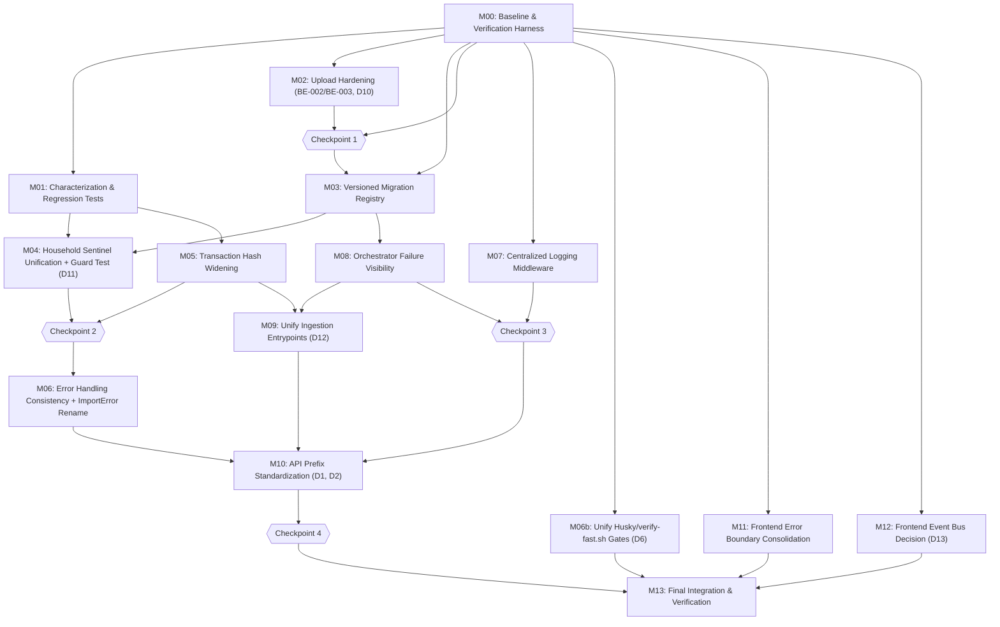

# ClariFin_OS — Remediation Implementation Plan (FINAL, v2)

**Status**: Approved for execution after review corrections.
**Project context**: Personal, single-user, local-first finance application. No authentication, no encryption at rest/in transit, no PostgreSQL/ORM migration are required or in scope — confirmed by the project owner. This is a **correctness, consistency, and reliability** remediation program, not a security-hardening or scaling program.

This document is self-contained. An executing agent should not need any other file from this conversation to run the program — only the live repository itself.

---

## 0. Decisions Recorded Before Execution

Every architectural or product decision an agent would otherwise have to make mid-task is pre-decided here. **No milestone below should re-litigate any of these.** If an agent finds evidence that contradicts a decision here, it must halt and escalate (§10) rather than silently deviate.

| ID | Decision point | Chosen answer | Rationale |
|---|---|---|---|
| D1 | Canonical API prefix | `/api/v1/*` for all product routers; `/platform/v1/*` stays a separate namespace | `/api/v1` is already the majority prefix; `/platform/v1` has a distinct envelope/middleware design and is intentionally separate |
| D2 | Route slug for net-worth | **`net-worth`** (hyphenated) — the form already used by `networth_workspace.py`. The legacy `networth.py`'s `/networth` route is renamed to `/net-worth` as part of M10, not just re-prefixed. | The workspace routers are the newer, `/api/v1`-native generation; standardizing on their convention is lower-risk than the reverse |
| D3 | Money/paise discipline scope | No retroactive sweep of every raw-int-paise usage in this program; `core/domain/money.py::Money` remains the standard for new/touched code only | Not evidenced as broken in reviewed code; a full sweep is a separate, future audit |
| D4 | Frontend state consolidation beyond M11/M12 | No additional consolidation in this program | No further duplication was verified beyond what M11 (error boundaries) and M12 (event buses) cover |
| D5 | `behaviour` vs `behavior` spelling (confirmed: 92 vs 38 files) | **No rename in this program** — explicitly deferred | Real but purely cosmetic; a rename touches ~130 files for zero functional benefit inside a correctness-focused program. Candidate for a separate, dedicated cleanup PR later. |
| D6 | Husky pre-commit hook vs. `scripts/verify-fast.sh` gate mismatch (confirmed: different interpreter, different scope) | **In scope — see Milestone M06b** | Two different lint/type gates with different interpreter resolution and scope is a real correctness risk (change can pass one gate, fail the other); cheap to fix |
| D7 | Authentication/authorization | **Out of scope for the entire program** | Confirmed: personal, single-user project. No auth system exists; none is added. `household_id` unification (M04) remains a data-consistency fix only, never a security boundary. |
| D8 | Encryption at rest / in transit | **Out of scope for the entire program** | Confirmed: personal, local-only deployment |
| D9 | PostgreSQL / ORM migration | **Out of scope for the entire program** | Confirmed: no scale/concurrency requirement; raw SQLite + repository pattern is retained |
| D10 | Upload extension-list source of truth (replaces a prior "use judgment" instruction) | Add two explicit `Settings` properties: `pdf_upload_extensions` (default `[".pdf"]`) and `tabular_upload_extensions` (default `[".csv", ".xlsx", ".xls"]`), replacing the single `allowed_file_extensions` property | A single flat list can't express the real per-endpoint distinction (`upload_statement` only accepts PDFs; `import_detect` only accepts tabular formats) |
| D11 | `household_id` DDL-default divergence risk | Do **not** rebuild the DDL default; instead add a permanent guard test (M04-T4) that fails loudly if a raw insert relying on the DDL default ever produces `'default'` instead of `'primary'` | Bounds the known risk (a future direct-SQL insert bypassing application code could silently reintroduce the split) without the blast radius of a table rebuild |
| D12 | `ingest.py` CLI orchestrator-trigger default | Preserve current behavior (CLI does **not** trigger the post-import intelligence pipeline) as the default; add an explicit `--with-intelligence` opt-in flag | Safest choice absent evidence the current behavior is accidental; avoids a silent behavior change for CLI users |
| D13 | M12 event-bus merge-vs-document tie-break | If investigation (M12-T1) is inconclusive: **document the separation, do not merge** (`M12-T2a`) | `GraphEventBus` has zero external consumers today; merging carries execution risk for no demonstrated benefit |

---

## 1. Implementation Strategy

Work is sequenced so that:

1. **A verification baseline exists before any change** (M00) — without it, no gate below can distinguish a pre-existing failure from a regression.
2. **Regression/characterization tests for the riskiest fixes land before the fixes themselves** (M01) — `BE-001` (transaction dedup) and `DB-002` (household sentinel split) are both proven by automated tests, not manual assertion.
3. **Low-risk, file-scoped security/correctness fixes go first** (M02) — no schema dependency, fastest to land and verify in isolation.
4. **The database migration foundation lands before any data-touching fix** (M03) — `DB-002` (M04) and the hash-widening fix (M05) both need a safe, reversible mechanism.
5. **The two data migrations that depend on M03 are independent of each other** (M04 touches `behaviour_*`/`financial_profiles`; M05 touches `transactions`) and run in parallel.
6. **Router-wide sweeps are batched, not repeated** — M06 (error handling) and M10 (API prefixes) both touch all 31 routers; M06 runs first so M10 isn't touching the same files twice for unrelated reasons.
7. **Cross-cutting reliability work is additive and file-isolated** (M07 logging middleware, M08 orchestrator persistence) and runs in parallel with the router-sweep track.
8. **Ingestion-path unification (M09) waits for what it would otherwise absorb twice** — the hash fix (M05) and orchestrator persistence (M08).
9. **Frontend consolidation (M11, M12) and the Husky/verify-fast.sh fix (M06b) are fully independent** of the backend track and can run at any point from M00 onward.
10. **M10 (API prefix standardization) is the one milestone that must land as a single coordinated backend+frontend changeset** — never split.
11. **Final integration (M13) is a structured, multi-domain verification program**, not "run all tests."

---

## 2. Baseline Requirements

Repository confirmed commands (none invented):

- Backend tests (from repo root): `.venv/bin/python -m pytest backend/tests`
- Backend lint/format/type (from `backend/`): `../.venv/bin/python -m ruff check src/`, `../.venv/bin/python -m black --check src/`, `../.venv/bin/python -m mypy src/`
- Frontend (from `frontend/`): `npm run test`, `npm run type-check`, `npm run lint`, `npm run build`, `npm run test:e2e`
- Schema/migration baseline: start the backend against a scratch DB path and observe `startup.py::run_startup_validation`'s logged table/index/trigger counts against `_REQUIRED_TABLES`/`_REQUIRED_INDEXES`/`_REQUIRED_TRIGGERS` in `backend/src/core/db/schema.py`
- `runtime.verify` harness: `./scripts/verify.sh quick` — **UNKNOWN — REQUIRES VERIFICATION** whether the `runtime/` package (excluded from the reviewed export) is present in the actual working repository

M00 must capture all of the above into a single `BASELINE.md`, explicitly labeling every pre-existing failure as such — later milestones compare against this file, never against an assumed "everything should pass" state.

---

## 3. Milestone Dependency Graph



**Checkpoints** (each is a mandatory, explicit review, not a formality — see the content defined per checkpoint in §4's checkpoint entries below):
- **CP1** — after M00 + M02, before M03 starts.
- **CP2** — after M04 + M05, before M06 starts.
- **CP3** — after M07 + M08, before M10 starts.
- **CP4** — after M10, before M13 starts.

---

## 4. Detailed Milestones

### M00 — Baseline & Verification Harness

- **Phase**: 0 — Baseline and Safety
- **Objective**: Establish a reproducible, recorded baseline (`BASELINE.md`) of test/lint/type/build status before any change.
- **Why Now**: No later gate can distinguish pre-existing failure from regression without this.
- **Preconditions**: `.venv` bootstrapped, `frontend/node_modules` installed.
- **Dependencies**: None.
- **Scope**: Read-only. No source files modified.
- **Out of Scope**: Fixing any failure found during baseline capture.

**Tasks**

| ID | Objective | Commands | Output |
|---|---|---|---|
| M00-T1 | Backend test status | `.venv/bin/python -m pytest backend/tests` | Full pass/fail list with node IDs |
| M00-T2 | Backend lint/format/type | `../.venv/bin/python -m ruff check src/`, `../.venv/bin/python -m black --check src/`, `../.venv/bin/python -m mypy src/` (from `backend/`) | Current violation lists, recorded not fixed |
| M00-T3 | Frontend test/type/lint | `npm run test`, `npm run type-check`, `npm run lint` (from `frontend/`) | Pass/fail counts |
| M00-T4 | Frontend build | `npm run build` (from `frontend/`) | Success/failure |
| M00-T5 | Schema/migration baseline | Start backend against scratch DB; record `verify_schema()` counts | N tables/indexes/triggers |
| M00-T6 | `runtime.verify` harness | `./scripts/verify.sh quick` | Success, or explicit note that `runtime/` is unavailable |
| M00-T7 | Write baseline record | — | New file `BASELINE.md` |

- **Agent Instructions**: Do not fix anything found. Do not modify any source file. Only new file is `BASELINE.md`.
- **Verification**: All commands execute (failures are expected output, not task failure); `BASELINE.md` contains concrete results for every task.
- **Gate**: PASS if `BASELINE.md` exists with results/explicit `UNKNOWN` for all six task categories and zero other files changed. FAIL otherwise.
- **Rollback**: Delete `BASELINE.md`.
- **Parallelization**: Must run first.
- **Checkpoint CP1 content** (evaluated once M00 + M02 are both done): Confirm `BASELINE.md` is complete; confirm M02 introduced zero regressions against it; confirm M02's D10 properties exist and are used correctly by both upload endpoints.

---

### M01 — Characterization & Regression Tests

- **Phase**: 1 — Critical security/correctness fixes (test-first step)
- **Objective**: Add tests characterizing `BE-001` and `DB-002` *before* either is fixed.
- **Why Now**: Test-first rule — M04/M05's fixes must be proven by an automated check.
- **Preconditions**: M00 complete.
- **Dependencies**: M00.
- **Scope**: New test files only. No production code changes.
- **Out of Scope**: Fixing either defect (that's M04/M05).

**Tasks**

| ID | Objective | File | Requirements | Expected state today |
|---|---|---|---|---|
| M01-T1 | Regression test for `BE-001` | New: `backend/tests/unit/repositories/test_transaction_hash_dedup.py` | Insert two transactions via `TransactionRepository.insert_transactions` sharing `account_id`/`date_iso`/`description`/`debit_paise`/`credit_paise`, differing only in list position (→ different `sequence_num`). Assert both rows persist (`COUNT(*) == 2`). Inspect `backend/tests/fixtures/database.py`/`fixtures/builders.py` first; the two dicts must be identical across all five hash-input fields and differ only in list position. | **Fails** (characterizes `BE-001`) |
| M01-T2a | Characterization test — internal consistency (not a gate blocker) | New: `backend/tests/architecture/test_household_sentinel_internal_consistency.py` | Insert one row into each of `behaviour_snapshots`/`behaviour_patterns`/`behaviour_alerts`/`financial_profiles` using each table's own DDL default (don't specify `household_id`); assert all four agree with each other. | **Passes today** — this is a sanity/regression guard for the group, not a characterization of `DB-002` |
| M01-T2b | Regression test — cross-group consistency (the actual gate) | New: `backend/tests/architecture/test_household_sentinel_cross_group_consistency.py` | Insert a row into `financial_goals` (own default) alongside a row in `behaviour_snapshots` (own default); assert `SELECT DISTINCT household_id` across both returns exactly one value. | **Fails** (characterizes `DB-002`) |
| M01-T3 | Update baseline | `BASELINE.md` | Add "Known Expected Failures (introduced by M01, resolved by M04/M05)" listing `test_transaction_hash_dedup.py` and `test_household_sentinel_cross_group_consistency.py` | — |

- **Agent Instructions**: `M01-T1` and `M01-T2b` are *supposed* to fail right now. Do not modify production code to force a pass. Do not weaken assertions. `M01-T2a` is supposed to pass — if it doesn't, that's a different, pre-existing problem to report separately, not fixed here.
- **Verification**: `.venv/bin/python -m pytest backend/tests/unit/repositories/test_transaction_hash_dedup.py backend/tests/architecture/test_household_sentinel_internal_consistency.py backend/tests/architecture/test_household_sentinel_cross_group_consistency.py -v`
- **Gate**: PASS if `M01-T1` and `M01-T2b` fail with clear, defect-identifying assertions (not fixture/collection errors), `M01-T2a` passes, and zero files under `backend/src/` were modified. FAIL if any new test passes against current code when it's supposed to fail, or `M01-T2a` fails, or `backend/src/` was touched.
- **Rollback**: Delete the three new test files.
- **Parallelization**: PARALLEL-SAFE with M02, M03 (different files). Blocks M04 (needs `M01-T2b`) and M05 (needs `M01-T1`).

---

### M02 — Upload Hardening (`BE-002`, `BE-003`, D10)

- **Phase**: 1 — Critical security/correctness fixes
- **Objective**: Sanitize uploaded filenames; enforce upload size and (per D10) per-endpoint extension limits.
- **Why Now**: Self-contained, no schema dependency — lands early, in parallel with M01.
- **Preconditions**: M00 complete.
- **Dependencies**: M00.
- **Scope**: `backend/src/routers/import_router.py`, `backend/src/config.py`.
- **Out of Scope**: The exception-handling sweep (`except Exception → HTTPException(500, str(e))` pattern) in this same file — that's M06's job. Do not touch it here.

**Tasks**

| ID | Objective | File/Symbol | Requirements |
|---|---|---|---|
| M02-T1 | Sanitize filename | `import_router.py::upload_statement`, `::import_detect` | `safe_filename = Path(file.filename or "").name` before `save_path = UPLOAD_DIR / safe_filename`; additionally assert `save_path.resolve().parent == UPLOAD_DIR.resolve()` before writing, else `HTTPException(400, "Invalid filename")`. Apply to both endpoints identically. |
| M02-T2 | Per-endpoint extension enforcement (per D10) | `backend/src/config.py::Settings`, `import_router.py` | Add `pdf_upload_extensions` (default `[".pdf"]`) and `tabular_upload_extensions` (default `[".csv", ".xlsx", ".xls"]`) properties, replacing the existing unused `allowed_file_extensions`. `upload_statement` checks against `pdf_upload_extensions` only; `import_detect` checks against `tabular_upload_extensions` only. This is not a judgment call — implement exactly this. |
| M02-T3 | Enforce upload size | `import_router.py::upload_statement`, `::import_detect` | After `content = await file.read()`, check `len(content) > settings.max_upload_size_bytes`; if exceeded, `HTTPException(413, "File exceeds maximum upload size")` before writing to disk. |

- **Tests**: New `backend/tests/unit/routers/test_import_router_upload_safety.py` covering: traversal-shaped filename rejected/normalized; disallowed extension rejected per endpoint; oversized payload rejected (413); legitimate small valid file still succeeds.
- **Agent Instructions**: Preserve success-case response shape exactly. Do not touch the `try/except` error-handling pattern in this file.
- **Verification**: `.venv/bin/python -m pytest backend/tests/unit/routers/test_import_router_upload_safety.py backend/tests/contract/generated/test_import.py backend/tests/contract/generated/test_upload.py -v`; `mypy src/` from `backend/`.
- **Gate**: PASS if new tests pass, existing upload/import contract tests pass unchanged, mypy passes. FAIL if any contract test regresses or a valid upload now fails.
- **Rollback**: Revert `import_router.py` and `config.py` to pre-M02 versions.
- **Parallelization**: PARALLEL-SAFE with M01.

---

### M03 — Versioned Migration Registry

- **Phase**: 2 — Database/schema integrity
- **Objective**: Replace the unversioned linear `run_migrations()` with a tracked, idempotent, ordered registry (`schema_migrations` table), wrapping existing migration logic unchanged.
- **Why Now**: Prerequisite for M04, M05, M08 to ship safely and reversibly.
- **Preconditions**: M00 complete.
- **Dependencies**: M00.
- **Scope**: `backend/src/core/db/schema.py`, `backend/src/startup.py`, new `backend/src/core/db/migrations/` package.
- **Out of Scope**: Changing the *content* of any existing migration (the column-rename block, `date_iso` backfill, the `SHA256()`/`HEX()` statement — leave byte-for-byte identical, flag but do not fix if confirmed dead).

**Tasks**

| ID | Objective | File | Requirements |
|---|---|---|---|
| M03-T1 | `schema_migrations` table | `schema.py` | `CREATE TABLE IF NOT EXISTS schema_migrations (version INTEGER PRIMARY KEY, description TEXT NOT NULL, applied_at TEXT DEFAULT (datetime('now')))`. Add to `_ALL_DDL_TABLES` **and to `_REQUIRED_TABLES`** (defense-in-depth — without this, `verify_schema()` could pass even if the table failed to create, silently disabling migration tracking). |
| M03-T2 | Migrations package | New: `core/db/migrations/__init__.py`, `_registry.py` | `_registry.py` exports `MIGRATIONS: list[tuple[int, str, Callable[[sqlite3.Connection], None]]]` and `apply_pending_migrations(conn) -> list[int]`, applying unapplied versions in ascending order, each inside its own transaction, recording a `schema_migrations` row only on success. **Version numbers are pre-assigned across this whole program to avoid registry-list merge conflicts: 1 = baseline (M03), 2 = household sentinel (M04), 3 = transaction hash v2 (M05), 4 = import_runs (M08).** |
| M03-T3 | Wrap existing logic as migration 001 | New: `core/db/migrations/m001_baseline.py` | The **unmodified** body of current `run_migrations()` (column renames, `date_iso` backfill, household column additions, the `SHA256()`/`HEX()` block left as-is with a `# NOTE: see DB-003 investigation` comment only), registered as version 1. This is a *move*, not a rewrite. |
| M03-T4 | Wire into startup | `startup.py::run_startup_validation` | Replace the `run_migrations(db_path)` call with `apply_pending_migrations`. Keep `create_all`/`verify_schema` calls unchanged, same order. |
| M03-T5 | Idempotency test | New: `backend/tests/unit/core/db/test_migration_registry.py` | Apply migration 001 twice against the same connection; assert no error and identical resulting schema. Assert a second, unapplied migration in the list runs exactly once. |

- **Agent Instructions**: Do not change what any existing migration does — only how it's tracked. Do not delete `schema.py::run_migrations()` — leave it in place, unused, as a rollback safety net.
- **Verification**: `.venv/bin/python -m pytest backend/tests/unit/core/db/ backend/tests/unit/repositories/test_db.py backend/tests/architecture/ -v`; full suite vs. `BASELINE.md`; `mypy src/`.
- **Gate**: PASS if `schema_migrations` created correctly, migration 001 is behaviorally identical to old `run_migrations()` (existing tests unchanged), idempotency confirmed, full suite shows no new failures. FAIL if any existing migration behavior changes or any baseline-passing test now fails.
- **Rollback**: Revert `startup.py` to call old `run_migrations()` directly (function still present, unused).
- **Parallelization**: SEQUENTIAL — blocks M04, M08.

---

### M04 — Household Sentinel Unification (+ Guard Test, D11)

- **Phase**: 2 — Database/schema integrity
- **Objective**: Unify the "no household" sentinel to `'primary'` across `behaviour_snapshots`/`behaviour_patterns`/`behaviour_alerts`/`financial_profiles`, and add a permanent guard test bounding the known DDL-default divergence risk.
- **Why Now**: Fixes `DB-002` before any new household-scoped feature inherits the split.
- **Preconditions**: M03 complete; `M01-T2b` exists and fails.
- **Dependencies**: M01, M03.
- **Scope**: New `core/domain/household.py`, new migration, `routers/behaviour.py` + any other hardcoded-literal call site (enumerate via `grep -rn '"default"' backend/src/routers/ backend/src/repositories/ backend/src/services/ | grep -i household` before editing).
- **Out of Scope**: `accounts`/`financial_events`/`financial_goals` (already `'primary'`, untouched). No access-control logic — data consistency only, per D7.

**Tasks**

| ID | Objective | File | Requirements |
|---|---|---|---|
| M04-T1 | Canonical constant | New: `core/domain/household.py` | `DEFAULT_HOUSEHOLD_ID: str = "primary"`; `resolve_household_id(raw: str \| None) -> str`. Docstring states this is the single source of truth, replacing the split literals. |
| M04-T2 | Migration | New: `core/db/migrations/m002_household_sentinel_unify.py`, registered version `2` (per D1's/M03's pre-assigned numbering) | For each of the four tables: (a) log pre-migration `COUNT(*) WHERE household_id = 'default'`; (b) `UPDATE ... SET household_id = 'primary' WHERE household_id = 'default'`; (c) re-count, assert 0, before commit. Document (per D11) that the DDL-level `DEFAULT 'default'` clause is **not** rewritten in this migration — a full table rebuild is out of scope — and that M04-T4's guard test is the explicit, permanent record of this compromise's boundary. |
| M04-T3 | Migrate call sites | `routers/behaviour.py` (all `Query("default", ...)`) + full enumerated list | Replace hardcoded `"default"` with `Query(DEFAULT_HOUSEHOLD_ID, ...)`, importing from `core.domain.household`. Replace any `household_id = household_id or "default"` pattern with `resolve_household_id(household_id)`. |
| M04-T4 | Guard test (D11) | New: `backend/tests/architecture/test_no_raw_household_default.py` | Insert a row into each of the four tables via a raw `INSERT` that **omits** `household_id` (relying purely on the DDL default, bypassing `resolve_household_id`); assert the resulting value is `'primary'`. Add a code comment in `schema.py` pointing to this test. **This test is expected to fail** until/unless the DDL default itself is corrected — its failure is the intended, visible tripwire; it must exist and must not be silently deleted or weakened. |

- **Agent Instructions**: This is a data migration on financial-adjacent (not raw transaction) tables. Do not run against a DB without confirming the pre/post row-count verification returns 0 remaining `'default'` rows — if it doesn't, abort, don't continue. Do not touch `accounts`/`financial_events`/`financial_goals`.
- **Verification**: `.venv/bin/python -m pytest backend/tests/architecture/test_household_sentinel_cross_group_consistency.py backend/tests/architecture/test_no_raw_household_default.py backend/tests/contract/generated/test_behaviour.py -v`; full suite vs. `BASELINE.md`; manual row-count check.
- **Gate**: PASS if `M01-T2b` now passes; `M04-T4` exists and its result (pass or documented-expected-fail) is explicitly reported; row-count verification confirms zero data loss; existing contract tests unchanged; full suite shows no regression. FAIL if any row count changes unexpectedly, any contract test regresses, or `M04-T4` is missing/weakened.
- **Rollback**: Compensating migration `UPDATE ... SET household_id = 'default' WHERE household_id = 'primary'` on the four named tables only (safe since they never held `'primary'` before this migration).
- **Parallelization**: PARALLEL-SAFE with M05 (different tables).
- **Checkpoint CP2 content** (evaluated once M04 + M05 both done): Confirm both migrations' row/count verifications are clean; confirm `core/domain/household.py` is now the *only* place a household-sentinel literal is defined (re-run the enumeration grep); confirm the M04-T4 guard test exists and its status is explicitly documented, not silently ignored.

---

### M05 — Transaction Hash Widening (`BE-001`)

- **Phase**: 2 — Database/schema integrity
- **Objective**: Fix the dedup hash so it no longer collides on legitimately distinct transactions, via an additive-then-cutover migration that never alters existing transaction row *content*.
- **Why Now**: Highest-priority financial-correctness fix in the program.
- **Preconditions**: M03 complete; `M01-T1` exists and fails.
- **Dependencies**: M01, M03.
- **Scope**: `repositories/transaction_repository.py::insert_transactions` (**both** call sites in this file — confirmed duplicated hash logic exists at two locations), `schema.py`, new migration.
- **Out of Scope**: Dropping/renaming the old `hash_signature` column. Retroactively changing dedup behavior for already-imported statements beyond the backfill described below.

**Tasks**

| ID | Objective | File | Requirements |
|---|---|---|---|
| M05-T1 | Additive column + index | New: `core/db/migrations/m003_transaction_hash_v2.py`, version `3` | `ALTER TABLE transactions ADD COLUMN hash_signature_v2 TEXT` (idempotent, existing `try/except OperationalError` pattern). Add a new index (not yet unique). Does not backfill existing rows in this task. |
| M05-T2 | Widen hash for new inserts | `transaction_repository.py::insert_transactions` (both locations) | New hash input: `f"{account_id}\|{date_iso}\|{description}\|{debit_paise}\|{credit_paise}\|{sequence_num}"`, written to `hash_signature_v2` on every insert. **Explicit clarification, mandatory**: `hash_signature`'s computation is NOT removed or altered anywhere in this milestone — every insert continues to compute and write both the old formula (unchanged) and the new one, for the full duration of this program. `hash_signature` becomes dead-but-populated once its unique index is replaced (next bullet) — it stays written because the Rollback path depends on its data being current. Its removal is explicitly out of scope, deferred to a future cleanup milestone once the new hash has proven itself in practice. Replace the old `UNIQUE` index `idx_transaction_hash` (on `hash_signature`) with a new `UNIQUE` index `idx_transaction_hash_v2` (on `hash_signature_v2`) as part of this same migration — this is what actually stops the `BE-001` collision on write, not the new column alone. Update `verify_schema()`'s `_REQUIRED_INDEXES` accordingly, only after M05-T3's zero-collision check passes. |
| M05-T3 | Backfill existing rows + safety check | Same migration file | Backfill `hash_signature_v2` for existing rows in Python (parameterized `UPDATE ... WHERE id = ?` loop, matching the existing `date_iso` backfill pattern — **not** an in-SQL `SHA256()` call, to avoid repeating the `DB-003` pattern). Before creating the new unique index, run `SELECT hash_signature_v2, COUNT(*) FROM transactions GROUP BY hash_signature_v2 HAVING COUNT(*) > 1` and assert zero rows. **This check is provably zero-returning by construction**: `hash_signature_v2` includes `sequence_num`, and `account_id` is itself derived deterministically from `statement_id` (via `statements.bank`), so the tuple inherits the existing `UNIQUE(statement_id, date, description, amount_paise, sequence_num)` table constraint — a genuine collision here would indicate that existing constraint was already broken, not something this migration could introduce. If the check ever returns non-zero, **abort and escalate** (§10) — do not proceed with a workaround; this would mean the existing invariant is already violated in a way nothing anticipated. Verify `SELECT COUNT(*) FROM transactions` and `SELECT SUM(amount_paise) FROM transactions` are identical before/after backfill. |

- **Tests**: `backend/tests/unit/repositories/test_transaction_hash_dedup.py` (from M01) must flip to passing. Extend `test_migration_registry.py` with the backfill-safety case (pre-populated scratch DB via `backend/tests/domain/builders/transaction.py` — **inspect this builder first**; if it cannot produce valid rows referencing a real `statements` row for a pre-populated scenario, construct seed rows directly via parameterized `INSERT` in the test setup instead — do not block on the builder).
- **Agent Instructions**: Highest-risk milestone in the program. Existing transaction rows' `id`, `amount_paise`, `date`, `description`, and all content columns must be byte-identical before/after — only `hash_signature_v2` is populated. Do not attempt this without `M01-T1` in place and confirmed failing first.
- **Verification**: `.venv/bin/python -m pytest backend/tests/unit/repositories/test_transaction_hash_dedup.py backend/tests/unit/core/db/test_migration_registry.py backend/tests/golden/ backend/tests/invariants/ -v`; full suite vs. `BASELINE.md`; manual `COUNT`/`SUM` before/after check.
- **Gate**: PASS if `M01-T1` passes; zero-collision confirmed; transaction count/sum unchanged; golden/invariant tests unchanged; full suite shows no regression beyond the expected M01-T1 flip. FAIL if any transaction row count or monetary sum changes, any golden fixture's expected value changes (report, don't silently "fix" it), or the collision check ever returns non-zero.
- **Rollback**: Drop `idx_transaction_hash_v2`, recreate `idx_transaction_hash` as unique on the old column, revert `transaction_repository.py`'s writes to `hash_signature_v2` — old column's data was never altered, so this is a clean revert. (Dropping the `hash_signature_v2` column itself requires SQLite ≥3.35 for `DROP COLUMN` — **UNKNOWN — REQUIRES VERIFICATION**; leave the column in place, unused, if uncertain.)
- **Parallelization**: PARALLEL-SAFE with M04. Blocks M09.

---

### M06 — Error Handling Consistency + `ImportError` Rename

- **Phase**: 3 — Backend architecture normalization
- **Objective**: Remove the banned generic-catch-and-500 pattern across all 31 routers; rename `errors.py::ImportError` → `StatementImportError`.
- **Why Now**: Mechanical, repository-wide sweep done once, before M10 touches the same files again.
- **Preconditions**: M02 complete (same file, `import_router.py`, touched a second time here — no conflict since M02 only touched upload-validation lines, not exception handling).
- **Dependencies**: M02, CP2.
- **Scope**: All `backend/src/routers/*.py`, `backend/src/errors.py`.
- **Out of Scope**: Route prefixes (M10). Successful-response shapes/status codes for legitimate 4xx cases.

**Tasks**

| ID | Objective | Requirements |
|---|---|---|
| M06-T1 | Enumerate + formally classify violations | Run `grep -rn "except Exception" backend/src/routers/`. **Formal classification predicate**: the banned pattern is any `except` clause whose caught type is exactly `Exception` (not a named subclass, not a tuple of specific types) **and** whose handler body either (a) raises `HTTPException`/similar with a stringified exception object or `str(e)` in the detail, or (b) contains only `pass`/no re-raise (silent swallow). A handler catching one or more specific exception types, or catching `Exception` but re-raising a specific `AppError` subclass **without** including raw exception text in the client-visible message, is out of scope and must be preserved. Produce the full file-by-file classification before editing anything. |
| M06-T2 | Rename `ImportError` | `errors.py::ImportError` → `StatementImportError`. Confirm actual usage count first (`grep -rn "ImportError" backend/src/`), being careful to distinguish this domain class from genuine builtin `ImportError` handling (e.g. `config.py::database_path`'s `except ImportError: pass` around a real Python import — must NOT be touched). |
| M06-T3 | Remove banned pattern, one router at a time | Per violating router: replace the banned pattern with either (a) letting the exception propagate to `errors.py::generic_exception_handler` (preferred), or (b) raising a specific `AppError` subclass. **Before starting the sweep, create a git tag (e.g. `pre-m06-sweep`)**; each router's fix lands as its own commit, so recovery from a discovered defect is `git revert` of the specific commit(s), not a full reset to the tag. |
| M06-T4 | Confirm centralized logging | Spot-check (at minimum `import_router.py`) that `log_error()` is now invoked via the global handler when an exception propagates. |

- **Tests**: Per router, its `backend/tests/contract/generated/test_*.py` must pass unchanged; add a test per touched router confirming a forced internal exception returns the generic hidden-internals message, not raw exception text.
- **Agent Instructions**: One router at a time, each independently verified. Preserve every specific, legitimate exception handler. If a router has zero violations, record "no changes needed" explicitly.
- **Verification**: Per-router contract test; full `backend/tests/contract/` suite; full suite vs. `BASELINE.md`; `mypy src/`; final re-run of the M06-T1 grep with every remaining hit justified in the completion report.
- **Gate**: PASS if zero unjustified instances of the banned pattern remain, all contract tests pass, rename is complete with zero broken references. FAIL if any contract test regresses, any router still has an unjustified banned instance, or the rename breaks genuine builtin-`ImportError` handling.
- **Rollback**: Per-router revert via the tagged commit history.
- **Parallelization**: Can be split across multiple agents on **disjoint router subsets** simultaneously (see §5), with the `errors.py` rename done once by a single agent first to avoid a shared-file conflict.

---

### M06b — Unify Husky Pre-Commit and `verify-fast.sh` Gates (D6)

- **Phase**: 4 — Backend reliability/observability
- **Objective**: Make `.husky/pre-commit` use the same interpreter and scope as `scripts/verify-fast.sh`, so a change cannot pass the git hook and fail CI (or vice versa).
- **Why Now**: Independent, cheap, newly-confirmed inconsistency (`.husky/pre-commit` runs bare `python3 -m mypy .` against the whole `backend/` tree; `verify-fast.sh` insists on `.venv/bin/python` scoped to `src/` only).
- **Preconditions**: None.
- **Dependencies**: None.
- **Scope**: `.husky/pre-commit` only.
- **Out of Scope**: Any change to `scripts/verify-fast.sh` itself, or to what ruff/black/mypy actually check.

**Tasks**

| ID | Objective | Requirements |
|---|---|---|
| M06b-T1 | Align the hook | Replace `cd backend && python3 -m ruff check . && python3 -m mypy .` with a call to `scripts/verify-fast.sh` (preferred — single source of truth) or the exact equivalent commands (`.venv/bin/python -m ruff check src/ --fix && .venv/bin/python -m black --check src/ && .venv/bin/python -m mypy src/`), routed through `.venv`, scoped to `src/`, matching `verify-fast.sh` exactly. |

- **Tests**: Stage a file with a deliberate ruff/mypy violation; confirm the hook now catches it identically to how `verify-fast.sh` would.
- **Verification**: Manual hook trigger (`git commit` on a scratch branch with a deliberate violation) compared against `scripts/verify-fast.sh`'s output on the same tree.
- **Gate**: PASS if hook and `verify-fast.sh` produce identical pass/fail on the same working tree. FAIL otherwise.
- **Rollback**: Revert `.husky/pre-commit`.
- **Parallelization**: PARALLEL-SAFE with everything.

---

### M07 — Centralized Logging Middleware

- **Phase**: 4 — Backend reliability/observability
- **Objective**: Add a single app-wide middleware logging method/path/status/duration/correlation-id for every request, closing the gap where 16 of 31 routers emit zero application-level logs.
- **Why Now**: Additive, fully independent of migration/router-sweep work.
- **Preconditions**: M00 complete.
- **Dependencies**: M00.
- **Scope**: New `backend/src/middleware/` package, one new line in `backend/src/api.py`.
- **Out of Scope**: Editing any individual router to add logging (middleware closes the gap, not per-router edits). Removing existing per-router structured logs (e.g. `accounts.py::_timed_log`) — kept as supplementary detail.

**Tasks**

| ID | Objective | Requirements |
|---|---|---|
| M07-T1 | Investigate reuse of `platform.py`'s correlation middleware | Determine whether `install_correlation_middleware` (imported from `runtime.platform.*` in `platform.py`) is importable/reusable for the main app without pulling in platform-specific behavior — **UNKNOWN — REQUIRES VERIFICATION** against the actual working repo (the `runtime/` package was excluded from the reviewed export). Record the finding regardless of outcome. |
| M07-T2 | Implement middleware | New `backend/src/middleware/__init__.py`, `logging_middleware.py`. If M07-T1 finds reuse unavailable, implement a self-contained `BaseHTTPMiddleware` generating/extracting `X-Correlation-Id`, timing the request, and logging via `src/logger.py`'s existing helpers on response. |
| M07-T3 | Register | `api.py::app.add_middleware(LoggingMiddleware)`, placed after `CORSMiddleware`. |

- **Tests**: New `backend/tests/unit/test_logging_middleware.py` — hit a previously-silent endpoint (e.g. `transactions.py`), assert a log line via `caplog`.
- **Verification**: New test; full `backend/tests/contract/` suite unchanged; full suite vs. `BASELINE.md`.
- **Gate**: PASS if new test passes, contract suite unchanged, a previously-silent endpoint now logs, no response body/status/header regression beyond the additive `X-Correlation-Id`. FAIL otherwise.
- **Rollback**: Remove the one `add_middleware` line; delete `middleware/` package.
- **Parallelization**: PARALLEL-SAFE with M03–M06, M06b, M11, M12.
- **Checkpoint CP3 content** (evaluated once M07 + M08 both done): Confirm neither milestone touched route prefixes or router files beyond the middleware registration line and the orchestrator/repository files; confirm the `import_runs` table (M08) uses the migration registry (M03) correctly.

---

### M08 — Orchestrator Failure Visibility

- **Phase**: 4 — Backend reliability/observability
- **Objective**: Persist the post-import pipeline's per-stage summary to a new `import_runs` table; add a top-level `has_errors` boolean to the upload response.
- **Why Now**: Closes the reliability gap where partial pipeline failures are currently invisible beyond a single HTTP response. Depends on M03's registry.
- **Preconditions**: M03 complete.
- **Dependencies**: M03.
- **Scope**: `schema.py` (new migration), `orchestration/statement_orchestrator.py`, new `repositories/import_run_repository.py`, `services/import_service.py`.
- **Out of Scope**: Changing the per-stage try/except graceful-degradation logic. Changing the HTTP status code on partial failure (stays 200).

**Tasks**

| ID | Objective | Requirements |
|---|---|---|
| M08-T1 | `import_runs` table | New: `core/db/migrations/m004_import_runs.py`, version `4`. `CREATE TABLE IF NOT EXISTS import_runs (id INTEGER PRIMARY KEY AUTOINCREMENT, statement_id INTEGER, started_at TEXT DEFAULT (datetime('now')), completed_at TEXT, has_errors INTEGER DEFAULT 0, summary_json TEXT NOT NULL, created_at TEXT DEFAULT (datetime('now')))`. Additive only. |
| M08-T2 | Persist + surface | `statement_orchestrator.py::process_after_upload` | After building the existing `summary` dict (unchanged keys), compute `has_errors = any(k.endswith("_error") for k in summary)`; persist via new `ImportRunRepository` (following `BaseRepository` pattern); add `has_errors` as a new, additive top-level key on the returned summary. Existing `*_error` keys unchanged. |
| M08-T3 | Contract check | `services/import_service.py`, existing contract tests | Verify `test_upload.py`/`test_import.py` tolerate the additive `has_errors` key; if they do strict key-equality matching, report this as a discovered pre-existing brittleness rather than silently working around it. |

- **Tests**: New `backend/tests/unit/orchestration/test_statement_orchestrator_persistence.py` — force one stage to fail (mock a service call to raise), assert both `summary["has_errors"] is True` and a persisted `import_runs` row with `has_errors=1`; assert a fully-successful run persists `has_errors=0`.
- **Verification**: New persistence test; existing `backend/tests/integration/orchestration/test_statement_orchestrator.py`; `test_upload.py`/`test_import.py`; full suite vs. `BASELINE.md`.
- **Gate**: PASS if all above pass, HTTP status unchanged, existing `*_error` keys unchanged. FAIL if status code changes or any existing key is removed/renamed.
- **Rollback**: Revert the three changed/new files; `import_runs` table can remain unused/harmless.
- **Parallelization**: SEQUENTIAL after M03. PARALLEL-SAFE with M04–M06, M06b, M07. Blocks M09.

---

### M09 — Unify Ingestion Entrypoints (D12)

- **Phase**: 3 — Backend architecture normalization (sequenced late, after M05/M08)
- **Objective**: `ingest.py` calls the same `ImportService` methods as the HTTP path, instead of reimplementing extraction/dedup/persistence independently.
- **Why Now**: Sequenced after M05/M08 so the CLI is migrated onto the final, stable shared logic once, not twice.
- **Preconditions**: M05, M08 complete.
- **Dependencies**: M05, M08.
- **Scope**: `backend/src/ingest.py`, `backend/src/services/import_service.py`.
- **Out of Scope**: CLI argument parsing or console output formatting (presentation, unaffected).

**Tasks**

| ID | Objective | Requirements |
|---|---|---|
| M09-T1 | Confirm D12 | Per D12, the CLI's current skip-orchestrator behavior is preserved as default. Search for any documentation/test/comment indicating otherwise before implementing; if found, escalate rather than silently overriding D12. |
| M09-T2 | Shared service method | `import_service.py`: add `ImportService.import_from_path(pdf_path, member, run_orchestrator: bool = True) -> dict`, wrapping the existing extraction → dedup → persist → (optional) orchestrator-trigger sequence. Existing HTTP handlers continue calling it with `run_orchestrator=True` (unchanged behavior). |
| M09-T3 | Migrate CLI | `ingest.py::ingest_pdf`: call `import_from_path(..., run_orchestrator=False)` by default (per D12), exposing `--with-intelligence` to opt into `run_orchestrator=True`. Preserve existing return-dict shape and console output exactly. |

- **Tests**: Existing `test_upload.py`/`test_import.py` unchanged. New `backend/tests/unit/test_ingest_cli.py` confirming `ingest_pdf()`'s return shape/side effects are unchanged for the default (no-flag) case.
- **Verification**: New CLI test; upload/import contract tests; `backend/tests/integration/e2e/test_upload_pipeline.py`/`test_statement_upload_pipeline.py`; manual CLI smoke test; full suite vs. `BASELINE.md`.
- **Gate**: PASS if CLI default behavior unchanged, HTTP endpoints unchanged, opt-in flag works, all listed tests pass. FAIL if CLI default changes without escalation, or HTTP contracts regress.
- **Rollback**: Revert both files — no schema/data impact (code-organization change only).
- **Parallelization**: SEQUENTIAL — depends on M05, M08.

---

### M10 — API Prefix Standardization (D1, D2)

- **Phase**: 3 / 10 — spans backend architecture normalization and cross-system integration
- **Objective**: Standardize all product routers under `/api/v1/*` (D1), including the `net-worth` slug fix (D2), and update the frontend in the same changeset.
- **Why Now**: The single URL-breaking change in the program — sequenced after M06 (avoids double-touching router files) and M09.
- **Preconditions**: M06, M09, CP3 complete.
- **Dependencies**: M06, M09.
- **Scope**: All `backend/src/routers/*.py` prefix declarations, `api.py` (financial_intelligence double-prefix fix), `frontend/lib/api/client.ts`, `frontend/mocks/handlers/*.ts`, `frontend/__tests__/api-contracts/*.contract.test.ts`, any hardcoded `/api/...` literal (enumerate via grep first).
- **Out of Scope**: `/platform/v1/*` routes. Any request/response body schema change. Any sub-path change beyond D2's specific `net-worth` exception.

**Tasks**

| ID | Objective | Requirements |
|---|---|---|
| M10-T1 | Enumerate current-state prefix map + produce shared artifacts | Re-verify the full current prefix list per router (previously established: `/api` for banks/cards_statements/cashflow/export/import/investments/loans/managed_accounts/members/networth/transactions; `/api/v1` for accounts/behaviour_workspace/cashflow_workspace/credit_cards/credit_cards_workspace/forecast/investments_workspace/loans_workspace/networth_workspace/reconciliation_workspace; `/api/v1/behaviour` for behaviour; `/api/audit`, `/api/dashboard`, `/api/financial-events`, `/api/reconciliation`; the split `financial_intelligence.py` case). **Produce two artifacts**: (a) `docs/migration/m10-route-inventory.json` (backend use); (b) `docs/migration/m10-frontend-path-map.md` (human-readable old→new pairs, for the frontend agent to consume directly without re-deriving it). |
| M10-T2 | Standardize each router's prefix | Change every non-conforming `APIRouter(prefix=...)` to `/api/v1` (preserving each router's existing sub-path structure), **except** `networth.py`, whose route changes from `/networth` to `/net-worth` per D2 — this is the one deliberate sub-path change in this milestone. For `financial_intelligence.py`: move its prefix into the router definition itself (`APIRouter(prefix="/api/v1/financial-intelligence", ...)`), remove the external prefix argument at its `include_router()` call in `api.py` — final effective URLs unchanged. |
| M10-T3 | Update backend contract tests | Update `backend/tests/contract/generated/*.py` (or, if auto-generated, its generator/registry source — inspect `contract_registry.py`/`schema_providers.py` first) to the new paths, including the `net-worth` slug change. |
| M10-T4 | Update frontend paths | `frontend/lib/api/client.ts` + every enumerated hardcoded path literal, updated **path-for-path against `docs/migration/m10-frontend-path-map.md`** — no blanket `/api/` → `/api/v1/` replacement, since some paths already had deeper sub-structure. Update `frontend/mocks/handlers/*.ts` and `frontend/__tests__/api-contracts/*.contract.test.ts` (all domains) to match, including the `net-worth` slug. |

- **Agent Instructions**: Must land as a single coordinated changeset — backend and frontend halves reviewed together before either merges. **Establish a known-good git tag immediately before this milestone starts** — the highest-blast-radius milestone in the program; if a defect is found, revert both halves as a pair, never independently.
- **Verification**: Full `backend/tests/contract/` suite; full backend suite vs. `BASELINE.md`; `npm run test` (includes contract tests); `npm run type-check`; `npm run build`; fetch `GET /openapi.json` from a running instance, confirm every product route is under `/api/v1/` and `net-worth` is hyphenated.
- **Gate**: PASS if all backend and frontend contract tests pass against new paths, OpenAPI confirms uniform prefixing and the D2 slug fix, frontend build succeeds, full suite shows no regression beyond expected path-assertion updates. FAIL if any path is wrong (typo, double-prefix, missing sub-path), any contract test fails, build fails, or `/platform/v1/*` is accidentally touched.
- **Rollback**: Revert to the pre-milestone git tag, backend and frontend together.
- **Parallelization**: Backend half (M10-T1, T2, T3) and frontend half (M10-T4) can be worked by two agents in parallel **once M10-T1's map is finalized and shared** — see §5 for ownership boundaries. Final merge is a joint step.
- **Checkpoint CP4 content**: Confirm every product router is under `/api/v1/*`; confirm no response *body* schema changed as a side effect; confirm no component bypasses `lib/api/gateway.ts` with a raw `fetch()` to an old path (if found, report as a newly discovered issue, not silently fixed inline unless trivially in scope).

---

### M11 — Frontend Error Boundary Consolidation

- **Phase**: 7 — Frontend architecture normalization
- **Objective**: Consolidate `frontend/components/ui/error-boundary.tsx` and `frontend/components/error-boundary.tsx` into one canonical implementation.
- **Why Now**: Fully independent of backend work; can run any time from M00 onward.
- **Preconditions**: M00 complete.
- **Dependencies**: M00.
- **Scope**: Both boundary files, every consumer of either.
- **Out of Scope**: Adding error-telemetry (Sentry/etc.) — separate, deferred item.

**Tasks**

| ID | Objective | Requirements |
|---|---|---|
| M11-T1 | Enumerate consumers | `grep -rln` for imports of both files; produce the complete list before editing. |
| M11-T2 | Finalize canonical implementation | `ui/error-boundary.tsx` (already supports `fallback`/`componentName`) — confirm it can express every capability the other implementation's consumers need (e.g. a retry/reset button); extend additively if not. **Must be merged before any M11-T3 work begins.** |
| M11-T3 | Migrate consumers one at a time | Each consumer's import updated to the canonical component, props adjusted to preserve exact prior behavior. **If a sub-agent discovers mid-migration that the canonical component needs further extension, it must halt and escalate (§10) to have M11-T2 revisited — never edit `ui/error-boundary.tsx` while also migrating a consumer in the same change.** |
| M11-T4 | Remove obsolete file | Delete `components/error-boundary.tsx` only after M11-T1's list shows zero remaining imports (re-run the grep to confirm). |

- **Tests**: Extend/add `ui/error-boundary` test coverage; per-consumer existing tests must pass unchanged.
- **Verification**: `npm run test`, `npm run type-check`, `npm run build` after each step and after final deletion; final grep confirming zero remaining references.
- **Gate**: PASS if all consumers migrated with preserved behavior, obsolete file deleted only after confirmed zero references, full suite passes, build succeeds. FAIL otherwise.
- **Rollback**: Per-consumer revert until final deletion (trivially revertible via VCS).
- **Parallelization**: PARALLEL-SAFE with all backend milestones and with M12. Internally, M11-T3 can be split across agents on disjoint consumer subsets, but only after M11-T2 is merged.

---

### M12 — Frontend Event Bus Decision (D13)

- **Phase**: 7 — Frontend architecture normalization
- **Objective**: Resolve whether `lib/graph/event-bus.ts`'s `GraphEventBus` is intentionally scoped separately from `lib/event-bus.ts`.
- **Why Now**: Independent; can run any time.
- **Preconditions**: M00 complete.
- **Dependencies**: M00.
- **Scope**: `lib/event-bus.ts`, `lib/graph/event-bus.ts`, `lib/graph/index.ts`, `lib/graph/runtime.ts`.
- **Out of Scope**: Adding any new event type/capability beyond what exists today.

**Tasks**

| ID | Objective | Requirements |
|---|---|---|
| M12-T1 | Investigate | Confirm `GraphEventBus` currently has zero consumers outside `lib/graph/`. Check `lib/intelligence/`, `lib/simulation/`, `lib/command-center/` for any evidence (comment, unwired hook) of anticipated cross-runtime graph events. Document findings regardless of outcome. |
| M12-T2 | Execute per D13 | If M12-T1's evidence is inconclusive (which is the expected default absent new findings): execute **M12-T2a** — add cross-referencing docstrings to both files explaining the separation. Only execute **M12-T2b** (merge into one bus, delete `graph/event-bus.ts`) if M12-T1 finds concrete evidence a merge is needed — this overrides D13's default only with documented justification. |

- **Tests**: If M12-T2b: existing `lib/graph/__tests__/graph-invocation.test.ts` and other graph runtime tests must pass unchanged.
- **Verification**: Per chosen path, as above.
- **Gate**: PASS if a decision was made and documented with evidence (M12-T1), the chosen path fully executed, and (if merged) all graph runtime tests pass. FAIL if a path is chosen without documenting the investigation, or a merge breaks graph runtime behavior.
- **Rollback**: M12-T2a is comment-only (trivial revert). M12-T2b is revertible by restoring the deleted file and reverting `runtime.ts`.
- **Parallelization**: PARALLEL-SAFE with everything.

---

### M13 — Final Integration & Verification

- **Phase**: 11 — Hardening and final verification
- **Objective**: Structured, multi-domain verification across the fully-remediated system.
- **Why Now**: Final gate; runs after all other milestones.
- **Preconditions**: M01–M12, M06b all complete and individually gated.
- **Dependencies**: All prior milestones.
- **Scope**: Whole-repository verification. No source changes expected — findings are reported, not fixed inline.
- **Out of Scope**: Implementing any fix discovered here.

**Tasks**

| ID | Domain | Commands | Verifies |
|---|---|---|---|
| M13-T1 | Backend unit | `.venv/bin/python -m pytest backend/tests/unit -v` | All unit tests incl. new ones from M01–M09 |
| M13-T2 | Backend integration | `.venv/bin/python -m pytest backend/tests/integration -v` | Cross-layer/orchestration integration |
| M13-T3 | Backend API/contract | `.venv/bin/python -m pytest backend/tests/contract -v` | All routers under `/api/v1/*` (M10) |
| M13-T4 | Backend database | `.venv/bin/python -m pytest backend/tests/unit/core/db backend/tests/unit/repositories -v` | M03/M04/M05/M08 all verified together |
| M13-T5 | Financial correctness | `.venv/bin/python -m pytest backend/tests/invariants backend/tests/golden backend/tests/properties -v` | No financial calculation altered anywhere in the program |
| M13-T6 | Idempotency | `.venv/bin/python -m pytest backend/tests/unit/repositories/test_transaction_hash_dedup.py -v` + manual re-import-same-statement-twice smoke test | M05's fix + continued true-duplicate detection |
| M13-T7 | Authorization | N/A — explicitly not applicable per D7 | Confirms no partial/fake auth was introduced |
| M13-T8 | Security regression | Re-run M02's upload-safety tests + M06's internal-exception-leak tests | `BE-002`/`BE-003`/`BE-004` hold under the integrated system |
| M13-T9 | Frontend unit/component | `npm run test` | All Vitest tests |
| M13-T10 | Frontend API contract | `npm run test` (incl. `__tests__/api-contracts/*`) | Frontend correctly targets `/api/v1/*` (M10) end-to-end |
| M13-T11 | Accessibility | `npm run test -- accessibility` (existing a11y test files) | No regression from M11's error-boundary consolidation |
| M13-T12 | Frontend build | `npm run build` | Production build succeeds |
| M13-T13 | Frontend typecheck | `npm run type-check` | No new TS errors |
| M13-T14 | Critical user flows | `npm run test:e2e` (if runnable; else `UNKNOWN — REQUIRES VERIFICATION`, note the environment limitation) | Upload → view transactions → reconciliation-style flows work end-to-end |
| M13-T15 | Cross-system contract | M13-T3 + M13-T10 combined | Backend/frontend agree on every path post-M10 |
| M13-T16 | Cross-system imports | `.venv/bin/python -m pytest backend/tests/integration/e2e -v` | M09's unified ingestion path works end-to-end |
| M13-T17 | Event flows | `npm run test -- event-bus` (both buses if M12 kept both) | M12's outcome holds |
| M13-T18 | Observability | Manual: trigger a previously-silent endpoint, confirm a log line (M07); force an upload failure, confirm an `import_runs` row (M08) | M07/M08 hold together |
| M13-T19 | Data integrity — record counts | Manual: `SELECT COUNT(*) FROM transactions`, `SELECT SUM(amount_paise) FROM transactions`, before/after vs. `BASELINE.md`'s recorded state | No financial data altered across the whole program |
| M13-T20 | Data integrity — migrations | `SELECT * FROM schema_migrations ORDER BY version` on a fresh DB | Migrations 1–4 applied in order, exactly once each |
| M13-T21 | Gate consistency | Re-run M06b's manual hook-vs-`verify-fast.sh` comparison | D6 fix holds |
| M13-T22 | Guard test status | Confirm `test_no_raw_household_default.py` (M04-T4) still exists and its status is explicitly reported | D11's bounded compromise remains visible, not silently removed |

- **Agent Instructions**: Verification-only. Any failure found is attributed to its owning milestone (per the Regression Policy: pre-existing / newly introduced / expected change / environmental / unknown), not fixed inline.
- **Verification**: All 22 tasks above.
- **Gate**: PASS if every task passes or is explicitly `UNKNOWN — REQUIRES VERIFICATION` with a documented reason, zero unexplained regressions vs. `BASELINE.md`, data-integrity checks clean, migrations applied in order exactly once. FAIL otherwise.
- **Rollback**: N/A directly — recovery is reverting whichever specific milestone owns an attributed failure.
- **Parallelization**: Must run last; not parallelizable.

---

## 5. Parallel Execution Map

| Group | Agent/Task | Files (may modify) | Dependencies | Conflict Risk | Integration Step |
|---|---|---|---|---|---|
| A | M01 | New test files only | M00 | None | Merge before M04/M05 |
| B | M02 | `import_router.py`, `config.py` | M00 | None | Merge before M06 touches this file |
| C | M06b | `.husky/pre-commit` | None | None | Merge any time |
| D | M07 | `middleware/*`, `api.py` (one line) | M00 | Low — `api.py` also touched by M10; sequence M07 before M10 | Merge before M13 |
| E | M11 | Both boundary files + consumers | M00 | None (frontend-only) | Merge before M13 |
| F | M12 | Both event-bus files | M00 | None | Merge before M13 |
| G (sequential, splittable after M03) | M03 → {M04, M05 in parallel} | M03: `schema.py`, `startup.py`, `migrations/*`. M04: `core/domain/household.py`, `migrations/m002_*`, `routers/behaviour.py` +enumerated. M05: `transaction_repository.py`, `migrations/m003_*` | M03 blocks both; M01 blocks each | Medium — both append to `_registry.py::MIGRATIONS`; **version numbers pre-assigned (2, 3) in §0/M03-T2 to avoid conflict** | Merge M04, M05 independently once each individually gated |
| H (sequential, after M03) | M08 | `statement_orchestrator.py`, `import_run_repository.py`, `migrations/m004_*` | M03 | Medium — same `_registry.py` coordination (version 4 pre-assigned) | Merge after M04/M05, before M09 |
| I (sequential, after M05+M08) | M09 | `ingest.py`, `import_service.py` | M05, M08 | Low | Merge before M10 |
| J (sequential sweep, splittable by disjoint subset) | M06, split across 3 agents by router subset | Each agent's assigned routers only; `errors.py` rename by **one** agent only | M02 | Medium — shared `errors.py` rename dependency; do it first as a small sub-step, then subsets proceed independently | Merge each subset as it passes its own gate; final grep-check once all land |
| K (must be a coordinated pair) | M10, backend + frontend agents | 10a: `backend/src/routers/*`, `api.py`. 10b: `frontend/lib/api/client.ts`, `mocks/handlers/*`, `__tests__/api-contracts/*` | M06, M09 (backend); M00 + 10a's finalized map (frontend) | High if landed independently — **must merge together, verified jointly** | Joint verification before either merges |
| L (final, solo) | M13 | None (read-only) | All prior | N/A | Final program gate |

---

## 6. Critical Path

(Dependency analysis, not a quality ranking.)

- **M03** has the highest fan-out — blocks M04, M05, M08 directly.
- **M05** is the second-highest-leverage blocker — M09 is deliberately sequenced after it, and it carries the highest verification burden in the program.
- **M06** is the critical path into M10 — split across parallel agents (Group J) specifically to prevent it from being a serialization bottleneck.
- **M10** is the highest-coordination-risk point — not high fan-out (only M13 depends on it), but the one milestone that cannot be split into independently-mergeable halves without risking the exact frontend/backend mismatch this program is designed to prevent.
- **M07, M06b, M11, M12** are off the critical path entirely — zero downstream dependents besides M13, completable at any point.

---

## 7. Risk-Controlled Migration Sequence

1. **Database**: M03 (foundation) → M04 + M05 in parallel → M08 (additive). Never skip M03.
2. **Backend refactors**: M02 (isolated) → M06 (parallelized sweep) → M09 (after its dependencies stabilize).
3. **API changes**: M10 only, after M06 + M09, landed as one coordinated backend+frontend pair — never split.
4. **Frontend migrations**: M11, M12 at any point in parallel; M10's frontend half is the one exception requiring backend coordination.
5. **Removal of obsolete implementations**: Old `hash_signature` unique index removed only after M05's zero-collision verification; `frontend/components/error-boundary.tsx` deleted only after confirmed zero remaining consumers; `schema.py::run_migrations()` (old flat function) deliberately **not** deleted in this program — left as a rollback safety net, removal explicitly out of scope.

---

## 8. Verification Matrix

| Milestone | Verification | Tests | Data Safety | Security | Gate |
|---|---|---|---|---|---|
| M00 | 6 baseline commands | N/A | N/A | N/A | `BASELINE.md` complete |
| M01 | pytest on 3 new files | 3 new (2 expected-failing, 1 expected-passing) | N/A | N/A | Correct fail/pass split, no `src/` change |
| M02 | New router test + contracts + mypy | New upload-safety tests | No persisted-data change | Traversal + size/extension enforcement | New tests pass, contracts unchanged |
| M03 | Registry tests + full suite + mypy | New registry tests | Idempotent, no schema behavior change | N/A | Zero regression vs. baseline |
| M04 | Sentinel + guard tests + contracts + full suite | M01-T2b flips to pass; M04-T4 exists | Pre/post row-count verified | N/A | Row counts verified, contracts unchanged |
| M05 | Hash test + golden/invariant + full suite | M01-T1 flips to pass | Pre/post count+sum verified; zero-collision check | N/A | Financial totals unchanged |
| M06 | Per-router contracts + grep + mypy | New leak tests per router | N/A | Raw exception leak removed; `ImportError` renamed | Zero unjustified banned pattern |
| M06b | Manual hook comparison | N/A | N/A | N/A | Hook matches `verify-fast.sh` |
| M07 | New middleware test + contracts | New test | N/A | N/A | Previously-silent endpoint logs |
| M08 | New persistence test + orchestrator + upload contracts | New test | Additive table only | N/A | `has_errors` + `import_runs` verified |
| M09 | CLI test + upload/import contracts + e2e | New CLI test | CLI default byte-identical | N/A | Both entrypoints share one implementation |
| M10 | Full backend + frontend contracts + build + typecheck | Path-updated contracts (both sides) | N/A (pure path change) | N/A | Both sides pass jointly, OpenAPI confirms |
| M11 | Frontend suite + build, per-consumer | Extended boundary test | N/A | N/A | One implementation, zero broken refs |
| M12 | Frontend suite (if merged) | Existing graph tests | N/A | N/A | Documented decision, no breakage |
| M13 | All 22 tasks | Full existing + new suites | Full count/sum + migration-order verification | Full security-fix regression | Zero unexplained regression |

---

## 9. Architecture Invariants

1. **One canonical error-to-HTTP translation point**: `errors.py`, after M06.
2. **One canonical migration mechanism**: `core/db/migrations/` + `schema_migrations`, after M03.
3. **Financial ledger history remains immutable**: transaction triggers never modified/disabled/bypassed by any milestone.
4. **No milestone silently changes historical financial totals**: every data-touching migration carries explicit pre/post verification.
5. **One canonical household-scoping constant**: `core/domain/household.py::DEFAULT_HOUSEHOLD_ID`, after M04, with a permanent guard test (M04-T4) bounding the one known, documented exception.
6. **One canonical statement-ingestion entrypoint**: `services/import_service.py`, after M09.
7. **One canonical API prefix scheme for product routes**: `/api/v1/*`, after M10; `/platform/v1/*` remains deliberately separate.
8. **Routers remain HTTP-only**: no new SQL or calculation logic added to any router during this program.
9. **Frontend server state remains exclusively in React Query** via `lib/capabilities/*` hooks; Zustand never holds server-derived data.
10. **Exactly one `ErrorBoundary`** and, per M12's documented decision, either one event bus or two explicitly-justified ones — never an undocumented duplicate.
11. **No milestone introduces authentication, encryption, a background job queue, a shared cache, or a Postgres/ORM migration** (D7–D9) — confirmed out of scope by the project's actual (personal, single-user) deployment model, not merely by absence of evidence.
12. **Every decision recorded in §0 is binding** — no milestone re-litigates a decision already made there; a contradiction found mid-implementation is escalated (§10), not silently resolved.

---

## 10. Agent Operating Rules

1. Read this entire document, and specifically §0 (Decisions), before starting any milestone.
2. Inspect every file listed under a milestone's Scope/Tasks before writing any code.
3. Stay strictly within your milestone's declared Scope — a discovered unrelated defect goes in your Completion Report's "discovered issues" field, never fixed inline.
4. Preserve existing contracts (API shapes, CLI output, status codes) unless the task explicitly instructs otherwise.
5. Every "Tests"/"Verification" item must actually be executed before you report completion — never state a result you didn't observe.
6. Never invent verification results, file paths, line numbers, or command output.
7. Never alter historical financial data without the exact, verified migration procedure specified for that task, including its pre/post verification query.
8. Every decision already recorded in §0 is final — do not re-decide it. If you find evidence contradicting a §0 decision, **escalate**, don't silently deviate.
9. **Escalation means**: stop the current task immediately, make no further code changes, and produce a Completion Report (§11 template) with `FINAL GATE STATUS: FAIL`, with the issue fully described under `UNRESOLVED RISKS`. Do not attempt a workaround. Do not proceed to any task depending on the escalated one.
10. Keep changes reviewable — one router/file/consumer at a time where a milestone specifies incremental migration.
11. Follow the canonical abstraction established by an earlier milestone once it exists (after M03: never add an `ALTER TABLE` outside the migration registry; after M04: never hardcode a household-sentinel literal; after M06: never add a new banned exception pattern).
12. If your milestone's gate fails, halt — do not proceed to a dependent milestone.
13. If a task's stated precondition doesn't actually hold when you begin, stop and report the discrepancy rather than proceeding on a false assumption.

---

## 11. Milestone Completion Report Template

```
MILESTONE: [ID]
DATE/AGENT: [agent identifier, timestamp]

TASKS COMPLETED:
  [Task ID]: [status] — [any deviation from spec, explained]

FILES CHANGED / CREATED / DELETED:
  [exact path] — [nature of change]

TESTS ADDED:
  [exact test file/node ID] — [what it verifies]

TESTS EXECUTED (actual results, not claims):
  [exact command] -> [pass/fail count, or full output if failures]

VERIFICATION RESULTS:
  [each Verification item] -> [actual result]

MIGRATION/DATA-SAFETY RESULTS (if applicable):
  Pre-migration row count: [value]
  Post-migration row count: [value]
  [other required query] -> [result]

ARCHITECTURAL DEVIATIONS:
  [any divergence from spec, and why]

DISCOVERED ISSUES (not fixed in this milestone):
  [description] -> [suggested owning milestone, or "new issue, unassigned"]

UNRESOLVED RISKS:
  [anything uncertain or marked UNKNOWN during the work]

RECOMMENDED FOLLOW-UP:
  [suggestion for a future milestone/task]

FINAL GATE STATUS: [PASS / FAIL — with the specific failing criterion if FAIL]
```

---

## 12. Final Program Gate

The program is complete only when **all** are true, verified by M13 (not asserted without running the checks):

1. Mandatory correctness fixes completed: `BE-001` (M05), `BE-002`/`BE-003` (M02), `BE-004`/`BE-005` (M06), `DB-002` (M04) — each confirmed at its own gate and re-confirmed in M13.
2. Security-adjacent items re-verified intact: upload hardening (M02), error-message-leak prevention (M06) (M13-T8).
3. All Architecture Invariants (§9) hold, re-checked at the final checkpoint.
4. Duplicated sources of truth resolved with documented, evidence-based decisions: ingestion path (M09), error boundaries (M11), event buses (M12).
5. All tests in M13-T1 through M13-T17 pass or are explicitly `UNKNOWN` with justification.
6. No unexplained regressions vs. `BASELINE.md`.
7. Database migrations verified: `schema_migrations` contains exactly versions 1–4, in order, idempotent (M13-T20).
8. Financial/data integrity verified: transaction count and sum unchanged across the whole program (M13-T19); household migration's row counts verified.
9. API/frontend contracts verified: M13-T3, T10, T15 all pass, confirming M10 landed correctly both sides, including the `net-worth` slug (D2).
10. Critical user flows verified (M13-T14) or explicitly `UNKNOWN` with a documented environment-limitation reason.
11. Observability requirements met: M13-T18 confirms M07/M08 function together.
12. Deferred work (§13 below) is re-affirmed as intentionally out of scope, with no silent scope creep having occurred.
13. The M04-T4 guard test (D11) and the M06b hook-alignment fix (D6) both remain in place and verified (M13-T21, M13-T22).

The program is **not** complete based on test-pass counts alone.

---

## 13. Explicitly Deferred / Out of Scope

- **Authentication/authorization** (D7) — no evidence of a multi-user requirement; confirmed unnecessary for this personal, single-user project.
- **Encryption at rest/in transit** (D8) — confirmed unnecessary for this local-only deployment.
- **PostgreSQL / ORM migration** (D9) — no scale/concurrency evidence; confirmed unnecessary.
- **Background job queue, shared cache (Redis/etc.)** — synchronous in-request processing and in-process caching remain appropriate for the current single-process, single-user deployment.
- **`behaviour`/`behavior` spelling unification** (D5) — real but cosmetic; a ~130-file rename is not worth the diff/review cost inside this program.
- **Retroactive Money-class/raw-paise audit, full response-envelope consistency audit, BaseService adoption audit, test-internals audit, N+1/cache-invalidation audit** — these categories were raised in review but not verified against the actual source in this pass; they require a dedicated, fresh audit before being scoped into any implementation plan, not assumption-based inclusion here.
- **`schema.py::run_migrations()` (old flat function) removal** — deliberately kept in place, unused, as a rollback safety net for the duration of this program.
