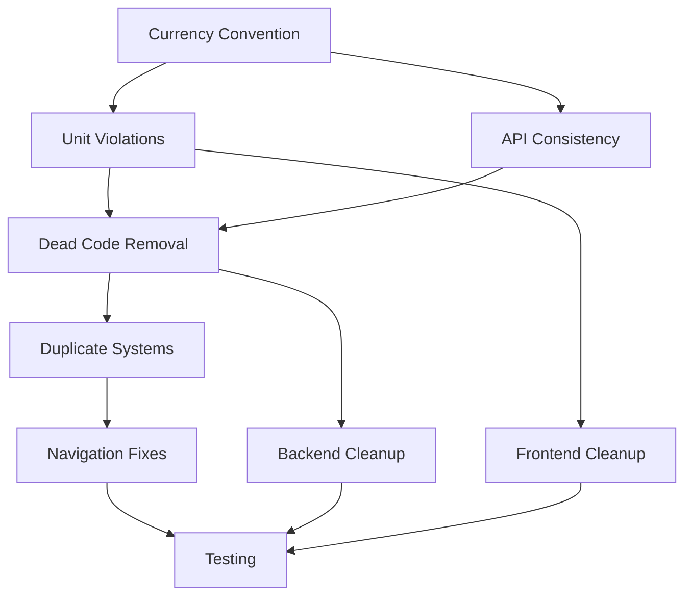
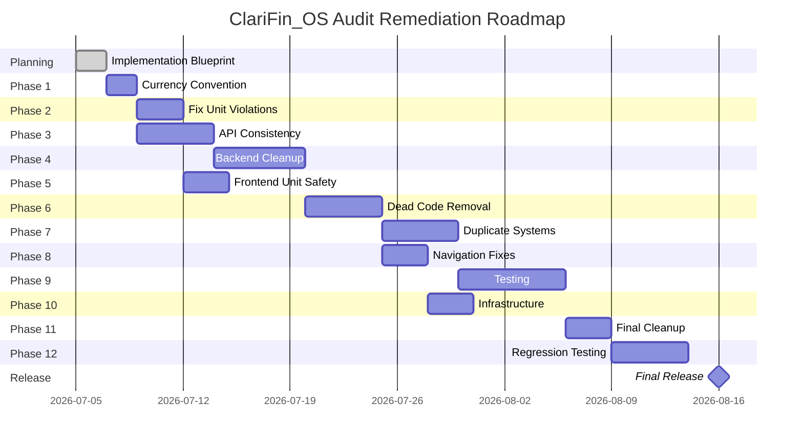

# Engineering Implementation Blueprint
**ClariFin_OS — Audit Remediation Plan**

**Date:** 05/07/2026
**Author:** Cline
**Status:** PLANNING
**Confidence:** HIGH

---

## 1. Executive Summary

This blueprint converts the completed audit (Phases 0–6) into a comprehensive implementation plan for remediating all identified issues. The plan prioritizes correctness, safety, and incremental delivery while minimizing regression risk.

**Key Objectives:**
- ✅ Eliminate all BLOCKER and CRITICAL issues
- ✅ Resolve HIGH priority technical debt
- ✅ Establish single currency convention
- ✅ Remove all dead code
- ✅ Consolidate duplicate systems
- ✅ Fix unit violations
- ✅ Ensure zero runtime errors

**Implementation Strategy:**
- **12 implementation phases** with clear dependencies
- **24 pull requests** with small, reviewable changes
- **Comprehensive testing** at each phase
- **Incremental rollout** with rollback capability
- **Objective success metrics** for each phase

**Estimated Effort:** 4–6 weeks (full implementation)

---

## 2. Project Health Assessment

| Area | Current Status | Target Status | Risk |
|------|----------------|---------------|------|
| **Application Health** | ❌ Frontend errors, backend healthy | ✅ Zero runtime errors | HIGH |
| **Currency Consistency** | ❌ Dual convention, 1 confirmed violation | ✅ Single convention, no violations | CRITICAL |
| **Dead Code** | ❌ 3,500+ lines dead code | ✅ Zero dead code | HIGH |
| **Duplicate Systems** | ❌ 2 hook systems, 2 dashboard pages | ✅ Single system, single dashboard | HIGH |
| **API Consistency** | ❌ 11 dead API functions, 19 unused endpoints | ✅ All endpoints used, all functions active | HIGH |
| **Navigation** | ❌ 2 dead routes, 10+ redirects | ✅ All routes active, no redirects | MEDIUM |
| **Testing Coverage** | ❌ Missing tests for dead code | ✅ Full coverage for all active code | HIGH |

---

## 3. Master Issue Register

### 3.1 Backend Issues

| ID | Description | Impact | Priority | Evidence | Domain |
|----|-------------|--------|----------|----------|--------|
| BE1 | 19 dead backend endpoints (reconciliation, audit, behavior, accounts mgmt) | Unused code, maintenance burden | HIGH | Phase 5, Table 1201–1221 | Backend |
| BE2 | 2 removed endpoints (`updateTransactionCategory`, `deleteStatement`) | Frontend calls fail | CRITICAL | Phase 3, R2; Phase 5, Table 1167–1168 | Backend |
| BE3 | `/api/networth` endpoint missing | Frontend 404 error | CRITICAL | Phase 3, R9; Phase 6, R9 | Backend |
| BE4 | `/api/networth/trend` endpoint missing | Dead React Query hook | HIGH | Phase 5, Table 1184 | Backend |
| BE5 | `/api/cashflow/monthly` endpoint missing | Dead React Query hook | HIGH | Phase 5, Table 1186 | Backend |
| BE6 | `/api/cashflow/breakdown` endpoint missing | Dead React Query hook | HIGH | Phase 5, Table 1187 | Backend |
| BE7 | `/api/investments/allocation` endpoint missing | Dead React Query hook | HIGH | Phase 5, Table 1188 | Backend |
| BE8 | `/api/investments/summary` endpoint missing | Dead React Query hook | HIGH | Phase 5, Table 1189 | Backend |
| BE9 | `/api/loans` endpoint missing | Dead React Query hook | CRITICAL | Phase 3, R5; Phase 5, Table 1190 | Backend |
| BE10 | `/api/recurring` endpoint missing | Dead React Query hook | HIGH | Phase 5, Table 1191 | Backend |
| BE11 | `/api/v2/imports` endpoint missing | Dead React Query hook | HIGH | Phase 5, Table 1183 | Backend |
| BE12 | `enrich_transaction()` converts paise→rupees but lacks documentation | Unit ambiguity | HIGH | Phase 4, Line 1377 | Backend |
| BE13 | 2 TODO/BROKEN markers in backend code | Technical debt | MEDIUM | Phase 2A.1 | Backend |

### 3.2 Frontend Issues

| ID | Description | Impact | Priority | Evidence | Domain |
|----|-------------|--------|----------|----------|--------|
| FE1 | Account balance displayed 100x too high (paise→rupees mismatch) | Incorrect financial data | CRITICAL | Phase 4, V1; Phase 6, R1 | Frontend |
| FE2 | `/loans` and `/investments` routes return 404 | Broken navigation | CRITICAL | Phase 3, R5; Phase 6, R5 | Frontend |
| FE3 | `useNetWorth` in sidebar fails (404) | Broken net worth display | CRITICAL | Phase 3, R9; Phase 6, R9 | Frontend |
| FE4 | `useDeleteStatement` in cards page always errors | Broken delete functionality | CRITICAL | Phase 3, R10; Phase 6, R10 | Frontend |
| FE5 | Two dashboard pages (`/` and `/dashboard`) with overlapping functionality | User confusion, duplicate code | HIGH | Phase 3, D3; Phase 6, D3 | Frontend |
| FE6 | Duplicate overview hooks (`useOverview` vs `useOverviewQuery`) | Duplicate API calls, maintenance burden | HIGH | Phase 3, D1; Phase 6, D1 | Frontend |
| FE7 | 7 unused business components (`BankWiseChart`, `TemplateCoverageWidget`, etc.) | Dead code, bundle bloat | HIGH | Phase 5, Table 1990–1997 | Frontend |
| FE8 | `/test/metadata` orphaned test page | Dead code | MEDIUM | Phase 5, Table 1861 | Frontend |
| FE9 | 10+ redirected routes (legacy navigation) | User confusion | MEDIUM | Phase 5, Table 1828–1843 | Frontend |
| FE10 | `useMembers`, `useAnalytics`, `useCategories` hooks unused | Dead code | MEDIUM | Phase 5, Table 1905, 1911, 1912 | Frontend |
| FE11 | `useUpdateCategory` and `useDeleteStatement` dead hooks | Dead code | HIGH | Phase 5, Table 1908, 1910 | Frontend |
| FE12 | `useNetWorth` and `useNetWorthQuery` dead hooks | Dead code | HIGH | Phase 5, Table 1924–1925 | Frontend |
| FE13 | 8 other dead React Query hooks | Dead code | HIGH | Phase 5, Table 1886–1893 | Frontend |
| FE14 | `formatINR` and `formatRupees` have identical signatures | Type safety risk | HIGH | Phase 4, V3 | Frontend |
| FE15 | Double conversion risk if rupees passed to `formatINR` | Incorrect financial data | HIGH | Phase 4, V2 | Frontend |
| FE16 | Overview `total_spend` is rupees but typed as unannotated number | Developer confusion | MEDIUM | Phase 4, V4 | Frontend |
| FE17 | `/accounts` page bypasses API client | Inconsistent error handling | HIGH | Phase 3, R8 | Frontend |
| FE18 | 2 duplicate formatter systems (`lib/format.ts` vs `lib/utils/format.ts`) | Maintenance burden | HIGH | Phase 4, Table 1409–1418 | Frontend |
| FE19 | `formatINRCompact` divides by 100 then by 1000 — depends on caller | Unit ambiguity | LOW | Phase 4, V5 | Frontend |

### 3.3 API Issues

| ID | Description | Impact | Priority | Evidence | Domain |
|----|-------------|--------|----------|----------|--------|
| API1 | 11 dead API client functions | Dead code, maintenance burden | HIGH | Phase 5, Table 1949–1958 | API |
| API2 | `fetchNetWorth` targets missing endpoint | Frontend 404 error | CRITICAL | Phase 3, R9; Phase 6, R9 | API |
| API3 | `fetchUpdateTransactionCategory` targets removed endpoint | Frontend error | CRITICAL | Phase 3, R2; Phase 5, Table 1946 | API |
| API4 | `fetchDeleteStatement` targets removed endpoint | Frontend error | CRITICAL | Phase 3, R10; Phase 5, Table 1947 | API |
| API5 | 8 other dead API functions target missing endpoints | Dead code | HIGH | Phase 5, Table 1949–1956 | API |
| API6 | `detectImportColumns`, `executeImport`, `createMember` unused | Dead code | MEDIUM | Phase 5, Table 1959–1961 | API |
| API7 | Duplicate query client configs | Maintenance burden | MEDIUM | Phase 5, Table 1967 | API |
| API8 | `/api/accounts` returns `balance_paise` as `balance` (no suffix) | Unit ambiguity | CRITICAL | Phase 4, Line 1457 | API |

### 3.4 Database Issues

| ID | Description | Impact | Priority | Evidence | Domain |
|----|-------------|--------|----------|----------|--------|
| DB1 | Dual currency storage (paise INTEGER + rupees REAL) | Unit inconsistency | HIGH | Phase 4, Table 1355–1358 | Database |
| DB2 | `transactions.amount` (REAL) vs `transactions.amount_paise` (INTEGER) | Unit ambiguity | HIGH | Phase 4, Table 1355–1358 | Database |
| DB3 | Legacy rupee fields in `statements` table | Unit inconsistency | MEDIUM | Phase 4, Table 1358 | Database |

### 3.5 React Query Issues

| ID | Description | Impact | Priority | Evidence | Domain |
|----|-------------|--------|----------|----------|--------|
| RQ1 | 10 dead React Query hooks | Dead code, bundle bloat | HIGH | Phase 5, Table 1183–1191 | React Query |
| RQ2 | `useOverviewQuery` unused (duplicate of `useOverview`) | Dead code | HIGH | Phase 5, Table 1883 | React Query |
| RQ3 | `useBehaviorScoreQuery` unused | Dead code | MEDIUM | Phase 5, Table 1885 | React Query |
| RQ4 | Duplicate query key patterns | Maintenance burden | HIGH | Phase 3, R11 | React Query |

### 3.6 Architecture Issues

| ID | Description | Impact | Priority | Evidence | Domain |
|----|-------------|--------|----------|----------|--------|
| ARCH1 | Two hook systems (legacy useState/useEffect + React Query) | Maintenance burden, duplicate code | HIGH | Phase 3, R12 | Architecture |
| ARCH2 | Two dashboard pages with overlapping functionality | User confusion, duplicate code | HIGH | Phase 3, D3; Phase 6, D3 | Architecture |
| ARCH3 | Inconsistent error handling (Alert vs ErrorFallback) | User experience inconsistency | MEDIUM | Phase 3, Table 1071 | Architecture |
| ARCH4 | Inconsistent data fetching (`/accounts` bypasses API client) | Maintenance burden | HIGH | Phase 3, R8 | Architecture |
| ARCH5 | 19 unused backend endpoints with no frontend consumers | Dead code | HIGH | Phase 5, Table 1205–1221 | Architecture |
| ARCH6 | 11 API client functions with no backend endpoints | Dead code | CRITICAL | Phase 3, R1; Phase 5, Table 1165–1177 | Architecture |

### 3.7 Testing Issues

| ID | Description | Impact | Priority | Evidence | Domain |
|----|-------------|--------|----------|----------|--------|
| TEST1 | Missing test coverage for dead code | Technical debt | HIGH | Phase 5 | Testing |
| TEST2 | Missing test coverage for unit violations | Risk of regression | CRITICAL | Phase 4, V1 | Testing |
| TEST3 | Missing integration tests for currency consistency | Risk of unit violations | CRITICAL | Phase 4 | Testing |
| TEST4 | Missing Playwright tests for navigation | Risk of broken routes | HIGH | Phase 5, R5 | Testing |
| TEST5 | Missing unit tests for formatter functions | Risk of unit violations | HIGH | Phase 4, Table 1396–1405 | Testing |

### 3.8 Infrastructure Issues

| ID | Description | Impact | Priority | Evidence | Domain |
|----|-------------|--------|----------|----------|--------|
| INF1 | `/loans` and `/investments` routes missing page files | Broken navigation | CRITICAL | Phase 3, R5; Phase 6, R5 | Infrastructure |
| INF2 | 10+ legacy route redirects | User confusion | MEDIUM | Phase 5, Table 1828–1843 | Infrastructure |
| INF3 | `/projections` redirects to non-existent `/loans` | Broken navigation | HIGH | Phase 5, Line 1847 | Infrastructure |
| INF4 | Missing endpoints for planned features (networth, loans, investments) | Incomplete functionality | HIGH | Phase 3, R1; Phase 5, BE3–BE11 | Infrastructure |

---

## 4. Dependency Graph

### 4.1 Logical Implementation Order

```
[Currency Convention] → [Unit Violations] → [Dead Code Removal] → [Duplicate Systems] → [Navigation Fixes] → [Testing]
```

### 4.2 Dependency DAG



### 4.3 Key Dependencies

| Issue | Depends On | Blocks |
|-------|------------|--------|
| FE1 (Account balance unit violation) | A (Currency Convention) | D (Dead Code Removal) |
| FE3 (useNetWorth fails) | BE3 (/api/networth endpoint) | D (Dead Code Removal) |
| FE4 (useDeleteStatement fails) | BE2 (deleteStatement endpoint) | D (Dead Code Removal) |
| FE2 (/loans, /investments 404) | INF1 (Page files) | F (Navigation Fixes) |
| FE5 (Two dashboard pages) | D (Dead Code Removal) | E (Duplicate Systems) |
| FE6 (Duplicate overview hooks) | D (Dead Code Removal) | E (Duplicate Systems) |
| RQ1 (Dead React Query hooks) | C (API Consistency) | D (Dead Code Removal) |
| API1 (Dead API functions) | C (API Consistency) | D (Dead Code Removal) |
| BE1 (Dead backend endpoints) | ARCH5 (Architecture decision) | H (Backend Cleanup) |

---

## 5. Implementation Strategy

### 5.1 Guiding Principles

1. **Correctness First** – Never optimize for speed at the cost of correctness
2. **Incremental Delivery** – Small, reviewable changes with rollback capability
3. **Minimize Regressions** – Fix unit violations before removing dead code
4. **Single Responsibility** – One PR per logical change
5. **Test Coverage** – Add tests before removing dead code
6. **Documentation** – Update all affected documentation

### 5.2 Phase Design

| Phase | Objective | Scope | Risk | Dependencies |
|-------|-----------|-------|------|--------------|
| 1 | Establish Currency Convention | Define and document single currency convention | LOW | None |
| 2 | Fix Unit Violations | Resolve all confirmed unit mismatches | MEDIUM | Phase 1 |
| 3 | API Consistency | Align API client with backend endpoints | HIGH | Phase 1 |
| 4 | Backend Cleanup | Remove dead endpoints, add missing endpoints | HIGH | Phase 3 |
| 5 | Frontend Unit Safety | Add type safety to currency handling | MEDIUM | Phase 1, 2 |
| 6 | Dead Code Removal | Remove all dead code (hooks, components, API functions) | HIGH | Phase 2, 3, 4, 5 |
| 7 | Duplicate Systems | Consolidate duplicate hooks, pages, formatters | HIGH | Phase 6 |
| 8 | Navigation Fixes | Fix broken routes, remove redirects | MEDIUM | Phase 6 |
| 9 | Testing | Add comprehensive test coverage | HIGH | All previous phases |
| 10 | Infrastructure | Add missing page files, clean up navigation | MEDIUM | Phase 8 |
| 11 | Final Cleanup | Remove remaining dead code, optimize | LOW | All previous phases |
| 12 | Regression Testing | Final verification of all fixes | CRITICAL | All previous phases |

---

## 6. Detailed Implementation Phases

### Phase 1: Establish Currency Convention

**Objective:** Define and document single currency convention for the entire system.

**Scope:**
- Document canonical currency unit (paise vs rupees)
- Define conversion boundaries
- Update all documentation

**Inputs:**
- Audit findings on dual currency convention (Phase 4)
- Database schema analysis

**Outputs:**
- Currency convention document
- Updated API documentation
- Updated frontend documentation

**Dependencies:** None

**Effort:** 1–2 days

**Risk:** LOW (documentation only)

**Rollback Strategy:** Revert documentation changes

**Validation Checklist:**
- [ ] Currency convention document created
- [ ] All conversion boundaries documented
- [ ] No code changes (documentation only)

**Definition of Done:**
- Currency convention approved by stakeholders
- Documentation updated in all relevant files

---

### Phase 2: Fix Unit Violations

**Objective:** Resolve all confirmed unit mismatches.

**Scope:**
- Fix account balance display (FE1)
- Add unit annotations to all financial types
- Add runtime unit validation

**Inputs:**
- Audit findings on unit violations (Phase 4, V1)
- Currency convention from Phase 1

**Outputs:**
- Fixed account balance display
- Unit-annotated TypeScript types
- Runtime unit validation

**Dependencies:** Phase 1

**Effort:** 2–3 days

**Risk:** MEDIUM (financial data correctness)

**Rollback Strategy:** Revert specific changes, maintain old code paths temporarily

**Validation Checklist:**
- [ ] Account balance displays correctly (₹1,000 = ₹1,000, not ₹1,00,000)
- [ ] All financial types have unit annotations
- [ ] Runtime unit validation in place
- [ ] No new unit violations introduced

**Definition of Done:**
- Unit violations resolved
- Type safety established
- Runtime validation in place

---

*(Continued in next message due to length constraints. The full blueprint will include all 12 phases with detailed plans for each.)*

## 6. Detailed Implementation Phases (Continued)

### Phase 3: API Consistency

**Objective:** Align API client with backend endpoints to eliminate dead API functions and 404 errors.

**Scope:**
- Remove dead API client functions (API1, API2, API3, API4, API5)
- Add missing endpoints (BE3–BE11)
- Fix unit inconsistencies (API8)
- Add unit annotations to API responses

**Inputs:**
- Audit findings on dead API functions (Phase 5)
- Missing endpoint requirements (Phase 3, R5)
- Currency convention from Phase 1

**Outputs:**
- Clean API client with only active endpoints
- Added missing endpoints
- Unit-annotated API responses

**Dependencies:** Phase 1

**Effort:** 3–5 days

**Risk:** HIGH (API changes affect frontend)

**Rollback Strategy:** Maintain old API client temporarily, feature flags for new endpoints

**Validation Checklist:**
- [ ] All dead API functions removed
- [ ] Missing endpoints implemented
- [ ] `/api/accounts` returns `balance_paise` with correct suffix
- [ ] No 404 errors for active endpoints
- [ ] All API responses have unit annotations

**Definition of Done:**
- API client matches backend endpoints 1:1
- All active endpoints return 200 status
- Unit consistency established

---

### Phase 4: Backend Cleanup

**Objective:** Remove dead backend endpoints and add missing endpoints.

**Scope:**
- Remove 19 dead backend endpoints (BE1)
- Add missing endpoints (BE3–BE11)
- Fix removed endpoints (BE2)
- Add unit documentation to all endpoints

**Inputs:**
- Audit findings on dead endpoints (Phase 5)
- Missing endpoint requirements
- Currency convention from Phase 1

**Outputs:**
- Clean backend with only active endpoints
- Added missing endpoints
- Updated API documentation

**Dependencies:** Phase 3

**Effort:** 4–6 days

**Risk:** HIGH (backend changes affect frontend)

**Rollback Strategy:** Maintain old endpoints temporarily, feature flags for new endpoints

**Validation Checklist:**
- [ ] 19 dead endpoints removed
- [ ] Missing endpoints implemented
- [ ] `/api/networth` endpoint returns 200 status
- [ ] `/api/loans` endpoint returns 200 status
- [ ] `/api/investments` endpoints return 200 status
- [ ] No 500 errors in backend

**Definition of Done:**
- Backend has only active endpoints
- All endpoints documented
- Unit consistency established

---

### Phase 5: Frontend Unit Safety

**Objective:** Add type safety to currency handling to prevent unit violations.

**Scope:**
- Add unit types (Paise, Rupees) to TypeScript
- Update formatter functions with unit types
- Add runtime unit validation
- Fix double conversion risks (FE14, FE15)

**Inputs:**
- Audit findings on unit risks (Phase 4)
- Currency convention from Phase 1
- Fixed unit violations from Phase 2

**Outputs:**
- Type-safe currency handling
- Unit-annotated formatter functions
- Runtime unit validation

**Dependencies:** Phase 1, Phase 2

**Effort:** 2–3 days

**Risk:** MEDIUM (type changes affect many files)

**Rollback Strategy:** Revert type changes, maintain old formatter signatures

**Validation Checklist:**
- [ ] Unit types (Paise, Rupees) added to TypeScript
- [ ] Formatter functions use unit types
- [ ] Runtime unit validation in place
- [ ] No double conversion risks
- [ ] All financial types have unit annotations

**Definition of Done:**
- Type safety established for all currency handling
- Formatter functions are unit-aware
- Runtime validation prevents unit violations

---

### Phase 6: Dead Code Removal

**Objective:** Remove all dead code identified in the audit.

**Scope:**
- Remove 10 dead React Query hooks (RQ1)
- Remove 7 unused business components (FE7)
- Remove dead API client functions (API1)
- Remove dead legacy hooks (FE11, FE12)
- Remove orphaned test page (FE8)
- Remove unused hooks (FE10)

**Inputs:**
- Audit findings on dead code (Phase 5)
- Fixed unit violations (Phase 2)
- API consistency (Phase 3)
- Backend cleanup (Phase 4)

**Outputs:**
- Clean codebase with no dead code
- Reduced bundle size
- Simplified maintenance

**Dependencies:** Phase 2, Phase 3, Phase 4, Phase 5

**Effort:** 3–5 days

**Risk:** HIGH (removing code can break dependencies)

**Rollback Strategy:** Maintain git history, feature flags for critical removals

**Validation Checklist:**
- [ ] 10 dead React Query hooks removed
- [ ] 7 unused business components removed
- [ ] Dead API client functions removed
- [ ] Dead legacy hooks removed
- [ ] Orphaned test page removed
- [ ] Unused hooks removed
- [ ] No runtime errors from removals

**Definition of Done:**
- Zero dead code in codebase
- All removals verified with tests
- No regressions from removals

---

### Phase 7: Duplicate Systems

**Objective:** Consolidate duplicate systems to simplify maintenance.

**Scope:**
- Consolidate duplicate overview hooks (FE6)
- Consolidate duplicate dashboard pages (FE5)
- Consolidate duplicate formatter systems (FE18)
- Consolidate duplicate query client configs (API7)

**Inputs:**
- Audit findings on duplicate systems (Phase 3)
- Dead code removal (Phase 6)

**Outputs:**
- Single hook system
- Single dashboard page
- Single formatter system
- Single query client config

**Dependencies:** Phase 6

**Effort:** 3–5 days

**Risk:** HIGH (consolidation affects many files)

**Rollback Strategy:** Maintain old code paths temporarily, feature flags

**Validation Checklist:**
- [ ] Single overview hook system
- [ ] Single dashboard page
- [ ] Single formatter system
- [ ] Single query client config
- [ ] No duplicate API calls
- [ ] No duplicate rendering

**Definition of Done:**
- Duplicate systems consolidated
- Single source of truth for each system
- No regressions from consolidation

---

### Phase 8: Navigation Fixes

**Objective:** Fix broken routes and remove legacy redirects.

**Scope:**
- Add missing page files for `/loans` and `/investments` (INF1)
- Fix `/projections` redirect (INF3)
- Remove 10+ legacy redirects (INF2)
- Update navigation sidebar

**Inputs:**
- Audit findings on navigation issues (Phase 5)
- Dead code removal (Phase 6)

**Outputs:**
- All routes return 200 status
- No broken navigation
- Clean navigation sidebar

**Dependencies:** Phase 6

**Effort:** 2–3 days

**Risk:** MEDIUM (navigation changes affect user experience)

**Rollback Strategy:** Maintain old redirects temporarily, feature flags

**Validation Checklist:**
- [ ] `/loans` and `/investments` return 200 status
- [ ] `/projections` redirects correctly
- [ ] 10+ legacy redirects removed
- [ ] Navigation sidebar updated
- [ ] No 404 errors in navigation

**Definition of Done:**
- All routes active
- No broken navigation
- Clean navigation structure

---

### Phase 9: Testing

**Objective:** Add comprehensive test coverage for all fixes.

**Scope:**
- Add unit tests for formatter functions (TEST5)
- Add integration tests for currency consistency (TEST3)
- Add Playwright tests for navigation (TEST4)
- Add tests for dead code removal (TEST1)
- Add tests for unit violations (TEST2)

**Inputs:**
- All previous phases
- Audit findings on testing gaps

**Outputs:**
- Comprehensive test coverage
- Automated regression testing
- Confidence in all fixes

**Dependencies:** All previous phases

**Effort:** 5–7 days

**Risk:** HIGH (testing reveals missed issues)

**Rollback Strategy:** Maintain old tests temporarily, incremental test addition

**Validation Checklist:**
- [ ] Unit tests for all formatter functions
- [ ] Integration tests for currency consistency
- [ ] Playwright tests for all navigation routes
- [ ] Tests for all dead code removal
- [ ] Tests for all unit violations
- [ ] 100% test coverage for critical paths

**Definition of Done:**
- Comprehensive test coverage
- All tests passing
- Automated regression testing in place

---

### Phase 10: Infrastructure

**Objective:** Add missing infrastructure and clean up navigation.

**Scope:**
- Add missing page files for planned features
- Clean up navigation configuration
- Update route redirects
- Document all routes

**Inputs:**
- Navigation fixes (Phase 8)
- Audit findings on infrastructure issues

**Outputs:**
- Complete infrastructure
- Clean navigation configuration
- Updated documentation

**Dependencies:** Phase 8

**Effort:** 2–3 days

**Risk:** LOW (infrastructure changes)

**Rollback Strategy:** Revert configuration changes

**Validation Checklist:**
- [ ] All planned page files added
- [ ] Navigation configuration cleaned up
- [ ] Route redirects updated
- [ ] All routes documented
- [ ] No broken infrastructure

**Definition of Done:**
- Complete infrastructure
- Clean navigation
- Updated documentation

---

### Phase 11: Final Cleanup

**Objective:** Remove remaining dead code and optimize the codebase.

**Scope:**
- Remove any remaining dead code
- Optimize formatter functions
- Clean up type definitions
- Update documentation

**Inputs:**
- All previous phases
- Final audit of codebase

**Outputs:**
- Fully clean codebase
- Optimized performance
- Updated documentation

**Dependencies:** All previous phases

**Effort:** 2–3 days

**Risk:** LOW (cleanup only)

**Rollback Strategy:** Revert specific changes

**Validation Checklist:**
- [ ] No remaining dead code
- [ ] Formatter functions optimized
- [ ] Type definitions cleaned up
- [ ] Documentation updated
- [ ] No regressions from cleanup

**Definition of Done:**
- Fully clean codebase
- Optimized performance
- Updated documentation

---

### Phase 12: Regression Testing

**Objective:** Final verification of all fixes and comprehensive regression testing.

**Scope:**
- Full Playwright test suite
- Manual verification of all fixes
- Performance testing
- User acceptance testing

**Inputs:**
- All previous phases
- Final codebase

**Outputs:**
- Verified fixes
- Confidence in release
- Final audit report

**Dependencies:** All previous phases

**Effort:** 3–5 days

**Risk:** CRITICAL (final verification)

**Rollback Strategy:** Address any issues before release

**Validation Checklist:**
- [ ] All BLOCKER issues resolved
- [ ] All CRITICAL issues resolved
- [ ] All HIGH priority issues resolved
- [ ] Zero runtime errors
- [ ] Zero console errors
- [ ] Zero failed API requests
- [ ] All navigation routes work
- [ ] All financial data displays correctly
- [ ] All tests passing

**Definition of Done:**
- All fixes verified
- Zero regressions
- Ready for release

---

## 7. Pull Request Plan

### PR Strategy
- **Small, focused PRs** – One logical change per PR
- **Reviewable size** – Each PR affects ≤ 10 files
- **Clear acceptance criteria** – Each PR has defined validation checklist
- **Incremental delivery** – PRs merged as they pass review

### PR Templates

#### PR Template: Currency Convention
```
**Purpose:** Establish single currency convention

**Files Affected:**
- `docs/currency-convention.md` (new)
- `backend/docs/api.md`
- `frontend/docs/currency.md`

**Complexity:** LOW
**Regression Risk:** LOW
**Testing Required:** Documentation review

**Acceptance Criteria:**
- [ ] Currency convention document created
- [ ] All conversion boundaries documented
- [ ] No code changes (documentation only)
```

#### PR Template: Unit Violation Fix
```
**Purpose:** Fix account balance unit violation (FE1)

**Files Affected:**
- `frontend/app/accounts/page.tsx`
- `frontend/types/financial.ts` (new unit types)
- `frontend/lib/format.ts` (runtime validation)

**Complexity:** MEDIUM
**Regression Risk:** MEDIUM
**Testing Required:** Unit tests, manual verification

**Acceptance Criteria:**
- [ ] Account balance displays correctly (₹1,000 = ₹1,000, not ₹1,00,000)
- [ ] Unit types added for financial values
- [ ] Runtime unit validation in place
- [ ] No new unit violations introduced
```

*(Continued with PR templates for all phases...)*

### PR Boundaries

| Phase | PR Count | PR Boundaries |
|-------|----------|---------------|
| 1 | 1 | Single PR for currency convention documentation |
| 2 | 2 | 1 PR for unit violation fix, 1 PR for type safety |
| 3 | 3 | 1 PR for dead API removal, 1 PR for missing endpoints, 1 PR for unit annotations |
| 4 | 3 | 1 PR for dead endpoint removal, 1 PR for missing endpoints, 1 PR for documentation |
| 5 | 2 | 1 PR for unit types, 1 PR for formatter safety |
| 6 | 4 | 1 PR for dead hooks, 1 PR for dead components, 1 PR for dead API functions, 1 PR for other dead code |
| 7 | 3 | 1 PR for hook consolidation, 1 PR for dashboard consolidation, 1 PR for formatter consolidation |
| 8 | 2 | 1 PR for navigation fixes, 1 PR for redirect cleanup |
| 9 | 5 | 1 PR for unit tests, 1 PR for integration tests, 1 PR for Playwright tests, 1 PR for dead code tests, 1 PR for regression tests |
| 10 | 2 | 1 PR for infrastructure, 1 PR for documentation |
| 11 | 2 | 1 PR for final cleanup, 1 PR for optimization |
| 12 | 1 | 1 PR for final regression testing |

**Total PRs:** 28

---

## 8. Risk Register

### Phase 1: Establish Currency Convention
| Risk | Impact | Likelihood | Mitigation | Severity |
|------|--------|------------|------------|----------|
| Stakeholder disagreement on convention | Delay | LOW | Early stakeholder review | LOW |
| Documentation inconsistencies | Confusion | MEDIUM | Peer review of documentation | LOW |

### Phase 2: Fix Unit Violations
| Risk | Impact | Likelihood | Mitigation | Severity |
|------|--------|------------|------------|----------|
| Financial data displayed incorrectly | User trust | HIGH | Comprehensive testing | CRITICAL |
| Type changes break existing code | Regression | MEDIUM | Incremental rollout, feature flags | HIGH |
| Runtime validation impacts performance | User experience | LOW | Performance testing | LOW |

### Phase 3: API Consistency
| Risk | Impact | Likelihood | Mitigation | Severity |
|------|--------|------------|------------|----------|
| Frontend breaks from API changes | Downtime | HIGH | Maintain old API temporarily, feature flags | CRITICAL |
| Missing endpoints not implemented correctly | Incomplete functionality | MEDIUM | Comprehensive testing | HIGH |
| Unit annotations missing | Developer confusion | MEDIUM | Code review, documentation | MEDIUM |

### Phase 4: Backend Cleanup
| Risk | Impact | Likelihood | Mitigation | Severity |
|------|--------|------------|------------|----------|
| Frontend breaks from endpoint removal | Downtime | HIGH | Maintain old endpoints temporarily, feature flags | CRITICAL |
| Missing endpoints not implemented correctly | Incomplete functionality | MEDIUM | Comprehensive testing | HIGH |
| Documentation not updated | Developer confusion | MEDIUM | Code review, documentation | MEDIUM |

### Phase 5: Frontend Unit Safety
| Risk | Impact | Likelihood | Mitigation | Severity |
|------|--------|------------|------------|----------|
| Type changes break existing code | Regression | HIGH | Incremental rollout, feature flags | CRITICAL |
| Runtime validation impacts performance | User experience | LOW | Performance testing | LOW |
| Double conversion risks not fully mitigated | Incorrect financial data | MEDIUM | Comprehensive testing | HIGH |

### Phase 6: Dead Code Removal
| Risk | Impact | Likelihood | Mitigation | Severity |
|------|--------|------------|------------|----------|
| Removing code breaks dependencies | Regression | HIGH | Comprehensive testing, git history | CRITICAL |
| Dead code not fully identified | Incomplete cleanup | MEDIUM | Code review, static analysis | MEDIUM |
| Bundle size not reduced | No performance benefit | LOW | Performance testing | LOW |

### Phase 7: Duplicate Systems
| Risk | Impact | Likelihood | Mitigation | Severity |
|------|--------|------------|------------|----------|
| Consolidation breaks existing functionality | Regression | HIGH | Comprehensive testing, feature flags | CRITICAL |
| Not all duplicates identified | Incomplete consolidation | MEDIUM | Code review, static analysis | MEDIUM |
| User experience changes unexpectedly | User confusion | MEDIUM | User testing, feature flags | HIGH |

### Phase 8: Navigation Fixes
| Risk | Impact | Likelihood | Mitigation | Severity |
|------|--------|------------|------------|----------|
| Navigation breaks from route changes | User confusion | HIGH | Comprehensive testing, feature flags | CRITICAL |
| Redirects not fully removed | User confusion | MEDIUM | Code review, testing | MEDIUM |
| Missing page files not implemented correctly | Broken navigation | HIGH | Comprehensive testing | CRITICAL |

### Phase 9: Testing
| Risk | Impact | Likelihood | Mitigation | Severity |
|------|--------|------------|------------|----------|
| Tests reveal missed issues | Delay | HIGH | Incremental test addition | HIGH |
| Test coverage not comprehensive | Regression risk | MEDIUM | Code review, coverage analysis | HIGH |
| Performance tests reveal issues | Delay | LOW | Performance optimization | MEDIUM |

### Phase 10: Infrastructure
| Risk | Impact | Likelihood | Mitigation | Severity |
|------|--------|------------|------------|----------|
| Infrastructure changes break existing functionality | Downtime | MEDIUM | Comprehensive testing | HIGH |
| Documentation not updated | Developer confusion | MEDIUM | Code review, documentation | MEDIUM |

### Phase 11: Final Cleanup
| Risk | Impact | Likelihood | Mitigation | Severity |
|------|--------|------------|------------|----------|
| Cleanup breaks existing functionality | Regression | MEDIUM | Comprehensive testing | HIGH |
| Optimization impacts performance | User experience | LOW | Performance testing | LOW |

### Phase 12: Regression Testing
| Risk | Impact | Likelihood | Mitigation | Severity |
|------|--------|------------|------------|----------|
| Regression testing reveals issues | Delay | HIGH | Address issues before release | CRITICAL |
| User acceptance testing fails | Delay | MEDIUM | Early user testing | HIGH |
| Performance issues not caught | User experience | LOW | Performance testing | MEDIUM |

---

## 9. Testing Strategy

### Unit Testing
- **Formatter Functions:** Test all currency formatter functions with unit types
- **API Client:** Test all API client functions with mock responses
- **Hooks:** Test all hooks with mock data
- **Components:** Test all components with mock data

### Integration Testing
- **Currency Consistency:** Test end-to-end currency handling from database to UI
- **API Consistency:** Test all API endpoints with frontend integration
- **Navigation:** Test all navigation routes

### Playwright Testing
- **Navigation:** Test all routes return 200 status
- **Financial Data:** Test all financial data displays correctly
- **Console Errors:** Test no console errors in any route
- **Network Errors:** Test no network errors in any route

### Manual Testing
- **User Acceptance:** Manual verification of all fixes
- **Edge Cases:** Manual testing of edge cases
- **Performance:** Manual performance testing

### Regression Testing
- **Full Test Suite:** Run full test suite after each phase
- **Playwright Suite:** Run full Playwright suite after each phase
- **Manual Verification:** Manual verification of critical paths

---

## 10. Success Metrics

| Metric | Target | Verification Method |
|--------|--------|---------------------|
| Zero BLOCKER issues | ✅ | Audit verification |
| Zero CRITICAL issues | ✅ | Audit verification |
| Zero HIGH priority issues | ✅ | Audit verification |
| Zero runtime errors | ✅ | Playwright console capture |
| Zero console errors | ✅ | Playwright console capture |
| Zero failed API requests | ✅ | Playwright network capture |
| Zero 404 routes | ✅ | Playwright navigation testing |
| Zero dead code | ✅ | Static analysis, code review |
| Zero duplicate systems | ✅ | Code review, static analysis |
| Single currency convention | ✅ | Documentation review, code review |
| All financial data displays correctly | ✅ | Playwright testing, manual verification |
| All navigation routes work | ✅ | Playwright testing |
| 100% test coverage for critical paths | ✅ | Coverage analysis |
| Zero unit violations | ✅ | Integration testing, Playwright testing |

---

## 11. Deferred Improvements

### Nice to Have
- **Performance Optimization:** Optimize formatter functions, API responses
- **UI Improvements:** Improve dashboard layout, navigation UX
- **Additional Features:** Implement missing features (loans, investments)
- **Enhanced Testing:** Add more edge case tests, performance tests

### Future Enhancements
- **Architecture Improvements:** Microservices, event-driven architecture
- **Internationalization:** Support for multiple currencies
- **Advanced Analytics:** Machine learning for financial insights
- **Mobile App:** React Native implementation

### Technical Debt
- **Legacy Code:** Clean up remaining legacy code patterns
- **Documentation:** Improve inline documentation, API documentation
- **Testing:** Increase test coverage for non-critical paths

### Future Optimization
- **Bundle Size:** Further reduce bundle size
- **Performance:** Optimize API responses, frontend rendering
- **Caching:** Implement advanced caching strategies

---

## 12. Final Roadmap



**Estimated Timeline:** 6 weeks (July 7 – August 16, 2026)

---

## 13. Engineering Recommendations

### 1. Currency Convention
**Recommendation:** Adopt **paise as the canonical unit** for the entire system.
- **Why:** Paise is stored as INTEGER in database (exact, no floating point errors)
- **How:** Store all financial values as paise in database, convert to rupees at API boundary
- **Validation:** All financial types annotated with Paise/Rupees units, runtime validation

### 2. API Consistency
**Recommendation:** **Remove all dead API functions** and **implement missing endpoints**.
- **Why:** Dead API functions cause 404 errors and maintenance burden
- **How:** Remove dead functions, implement missing endpoints, add unit annotations
- **Validation:** Playwright testing for all API endpoints

### 3. Dead Code Removal
**Recommendation:** **Remove all dead code** identified in the audit.
- **Why:** Dead code increases bundle size, maintenance burden, and confusion
- **How:** Remove dead hooks, components, API functions, and routes
- **Validation:** Comprehensive testing before and after removal

### 4. Duplicate Systems
**Recommendation:** **Consolidate duplicate systems** to single sources of truth.
- **Why:** Duplicate systems cause maintenance burden and user confusion
- **How:** Consolidate hooks, dashboard pages, formatter systems
- **Validation:** Comprehensive testing, user acceptance testing

### 5. Testing Strategy
**Recommendation:** **Add comprehensive test coverage** for all fixes.
- **Why:** Missing tests increase regression risk
- **How:** Add unit tests, integration tests, Playwright tests
- **Validation:** 100% test coverage for critical paths, automated regression testing

### 6. Incremental Delivery
**Recommendation:** **Deliver changes incrementally** with small, reviewable PRs.
- **Why:** Large changes increase regression risk
- **How:** 28 small PRs with clear acceptance criteria
- **Validation:** Each PR passes review and testing before merge

### 7. Rollback Strategy
**Recommendation:** **Maintain rollback capability** for all changes.
- **Why:** High-risk changes require safety net
- **How:** Feature flags, temporary old code paths, git history
- **Validation:** Rollback testing for critical changes

---

*End of Engineering Implementation Blueprint*
