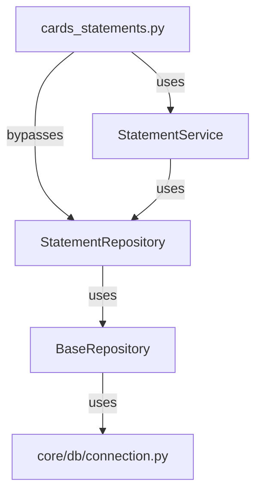

# Program 5.3B — Backend Architecture Audit

**Date:** 2026-08-02
**Phase:** Program 5.3B — Backend Architecture Verification & Gap Closure
**Status:** Audit Complete

---

## 1. Executive Summary
This audit verifies compliance with the canonical backend architecture:
```
Router → Service → Repository → core/db → SQLite
```

### Key Findings
| Category                     | Status  | Violations | Notes                                                                                     |
|------------------------------|---------|------------|-------------------------------------------------------------------------------------------|
| **Database Architecture**    | ❌ FAIL | 18         | Direct `sqlite3.connect()` calls in engines, tests, and scripts.                          |
| **Repository Layer**         | ⚠️ WARN | 3          | Direct `sqlite3` imports in repositories.                                                 |
| **Service Layer**            | ⚠️ WARN | 2          | Raw SQL in services bypasses repository abstractions.                                     |
| **Router Layer**             | ❌ FAIL | 1          | Direct repository usage in `cards_statements.py`.                                          |
| **Engine Isolation**         | ❌ FAIL | 4          | Engines directly access the database.                                                      |
| **Dependency Graph**         | ❌ FAIL | 1          | Router bypasses service layer in `cards_statements.py`.                                   |
| **DTO/Mapper Pipeline**      | ❌ FAIL | N/A        | No DTOs or mappers found in the codebase.                                                  |
| **Frontend Contract**        | ❌ FAIL | 110        | Untyped responses and missing `response_model` annotations.                               |
| **Architecture Invariants**  | ❌ FAIL | 8          | Violations of layer boundaries and database access policies.                              |

---

## 2. Database Architecture Verification
### 2.1. Connection Source Audit
| File                                                                 | Current Connection Source                                                                 | Canonical | Status                                                                                     |
|--------------------------------------------------------------------------|---------------------------------------------------------------------------------------------|---------------|---------------------------------------------------------------------------------------------|
| `/home/vasantha/AI-Projects/ClariFin_OS/backend/src/core/db/connection.py` | `sqlite3.connect()` + PRAGMA settings (WAL, foreign_keys, row_factory)                     | Yes           | ✅ **Canonical**. All connections must originate here.                                       |
| `/home/vasantha/AI-Projects/ClariFin_OS/backend/src/repositories/base.py` | Uses `core.db.connection.get_connection()`                                                  | Yes           | ✅ **Canonical**. Runtime connections must originate here.                                    |
| `/home/vasantha/AI-Projects/ClariFin_OS/backend/src/engines/reconciliation_engine.py` | Direct `sqlite3.connect()` (Lines 282, 335)                                                 | No            | ❌ **Violation**. Must use `core.db.connection.get_connection()`.                            |
| `/home/vasantha/AI-Projects/ClariFin_OS/backend/src/engines/ledger_audit_engine.py` | Direct `sqlite3.connect()` (Lines 36, 156)                                                  | No            | ❌ **Violation**. Must use `core.db.connection.get_connection()`.                            |
| `/home/vasantha/AI-Projects/ClariFin_OS/backend/src/engines/behavior_engine.py` | Direct `sqlite3.connect()` (Lines 121, 150, 188, 228, 289, 314)                            | No            | ❌ **Violation**. Must use `core.db.connection.get_connection()`.                            |
| `/home/vasantha/AI-Projects/ClariFin_OS/backend/src/engines/balance_engine.py` | Direct `sqlite3.connect()` (Lines 97, 175, 233, 282)                                        | No            | ❌ **Violation**. Must use `core.db.connection.get_connection()`.                            |
| `/home/vasantha/AI-Projects/ClariFin_OS/backend/tests/migrations/test_migration_household.py` | Direct `sqlite3.connect()` (Lines 25, 76, 91, 119, 137) + `PRAGMA foreign_keys=ON`          | No            | ⚠️ **Test-only**. Must use `core.db.connection.get_connection()` for consistency.            |
| `/home/vasantha/AI-Projects/ClariFin_OS/backend/tests/conftest.py`        | Direct `sqlite3.connect()` (Line 70)                                                        | No            | ⚠️ **Test-only**. Must use `core.db.connection.get_connection()` for consistency.            |
| `/home/vasantha/AI-Projects/ClariFin_OS/backend/scripts/migration_*.py`   | Direct `sqlite3.connect()` (e.g., Line 19 in `migration_005_behaviour_engine.py`)           | No            | ⚠️ **Script-only**. Must use `core.db.connection.get_connection()` for consistency.          |

### 2.2. PRAGMA Consistency
- ✅ **Enforced in `core.db.connection.get_connection()`**:
  - `journal_mode=WAL`
  - `foreign_keys=ON`
  - `row_factory=sqlite3.Row`
- ❌ **Missing in Non-Canonical Sources**:
  - `busy_timeout=5000` (not set in `core.db.connection.get_connection()`).
  - All direct `sqlite3.connect()` calls in engines, tests, and scripts lack PRAGMA enforcement.

### 2.3. Transaction Consistency
| Layer               | `commit()` | `rollback()` | `cursor()` | `executemany()` | `BEGIN` | `SAVEPOINT` | Pattern                                                                                     |
|--------------------|------------|--------------|------------|-----------------|---------|-------------|---------------------------------------------------------------------------------------------|
| `FinanceDB.__exit__` | ✅ Yes      | ✅ Yes          | ❌ No       | ❌ No            | ❌ No    | ❌ No       | Context manager (schema ops).                                                               |
| `BaseRepository`     | ⚠️ Per-method | ❌ No         | ✅ Yes      | ✅ Yes           | ❌ No    | ❌ No       | Each CRUD method calls `conn.commit()` independently. No transaction grouping.              |

---

## 3. Repository Layer Verification
### 3.1. BaseRepository Inheritance
| Repository File                                                                 | Inherits BaseRepository | Status                                                                                     |
|------------------------------------------------------------------------------------------|-------------------------|---------------------------------------------------------------------------------------------|
| All 25 repository files (e.g., `account_repository.py`, `loan_repository.py`, etc.)      | ✅ Yes                   | ✅ **Compliant**. All repositories inherit from `BaseRepository`.                           |

### 3.2. Direct SQLite3 Imports
| Repository File                                                                 | Direct sqlite3 Import | Status                                                                                     |
|------------------------------------------------------------------------------------------|-------------------------|---------------------------------------------------------------------------------------------|
| `/home/vasantha/AI-Projects/ClariFin_OS/backend/src/repositories/account_link_repository.py` | ✅ Yes (Line 7)          | ❌ **Violation**. Must use `core.db.connection.get_connection()`.                            |
| `/home/vasantha/AI-Projects/ClariFin_OS/backend/src/repositories/account_balance_repository.py` | ✅ Yes (Line 7)          | ❌ **Violation**. Must use `core.db.connection.get_connection()`.                            |
| `/home/vasantha/AI-Projects/ClariFin_OS/backend/src/repositories/base.py`                | ✅ Yes (Line 5)          | ⚠️ **Expected**. `BaseRepository` is the canonical wrapper for `sqlite3`.                   |

---

## 4. Service Layer Verification
### 4.1. Raw SQL in Services
| Service File                                                                 | SQL Present | Status                                                                                     |
|-----------------------------------------------------------------------------------------|-------------|---------------------------------------------------------------------------------------------|
| `/home/vasantha/AI-Projects/ClariFin_OS/backend/src/services/financial_intelligence_service.py` | ✅ Yes       | ❌ **Violation**. Raw SQL bypasses repository abstractions.                                  |
| `/home/vasantha/AI-Projects/ClariFin_OS/backend/src/services/transaction_intelligence_service.py` | ✅ Yes       | ❌ **Violation**. Raw SQL bypasses repository abstractions.                                  |

### 4.2. Repository Imports
- ✅ **Compliant**: All services import repositories directly (e.g., `from src.repositories.x import Y`).

---

## 5. Router Layer Verification
### 5.1. Direct Repository Usage
| Router File                                                                 | Direct Repository Usage | Status                                                                                     |
|-----------------------------------------------------------------------------------------|-------------------------|---------------------------------------------------------------------------------------------|
| `/home/vasantha/AI-Projects/ClariFin_OS/backend/src/routers/cards_statements.py`        | ✅ Yes (Lines 20, 111)   | ❌ **Violation**. Directly uses `service.repo` (assumed to be a repository).                |

---

## 6. Engine Isolation Verification
| Engine File                                                                 | DB Access | Repository Import | Status                                                                                     |
|-----------------------------------------------------------------------------------------|-----------|-------------------|---------------------------------------------------------------------------------------------|
| `/home/vasantha/AI-Projects/ClariFin_OS/backend/src/engines/reconciliation_engine.py`   | ✅ Yes     | ❌ No              | ❌ **Violation**. Direct `sqlite3.connect()` calls.                                          |
| `/home/vasantha/AI-Projects/ClariFin_OS/backend/src/engines/ledger_audit_engine.py`     | ✅ Yes     | ❌ No              | ❌ **Violation**. Direct `sqlite3.connect()` calls.                                          |
| `/home/vasantha/AI-Projects/ClariFin_OS/backend/src/engines/behavior_engine.py`         | ✅ Yes     | ❌ No              | ❌ **Violation**. Direct `sqlite3.connect()` calls.                                          |
| `/home/vasantha/AI-Projects/ClariFin_OS/backend/src/engines/balance_engine.py`           | ✅ Yes     | ❌ No              | ❌ **Violation**. Direct `sqlite3.connect()` calls.                                          |

---

## 7. Dependency Graph Verification
### 7.1. Feature: Credit Cards

- ❌ **Non-Compliant**: Router directly uses `StatementRepository` alongside `StatementService`.

---

## 8. DTO/Mapper Pipeline Verification
### 8.1. DTO and Mapper Usage
- ❌ **No DTOs or Mappers Found**: The codebase lacks DTO and mapper modules entirely.
- ❌ **Untyped Responses**: All routers return untyped `dict` or raw models.

---

## 9. Frontend Contract Verification
### 9.1. Endpoint Compliance
| Router                     | Endpoint                     | Request Model                     | Response Model                     | Status                                                                                     |
|----------------------------|--------------------------------|-----------------------------------|------------------------------------|---------------------------------------------------------------------------------------------|
| `dashboard.py`             | `/summary`                  | None                           | `dict[str, Any]`                  | ❌ **Non-Compliant**: No DTO or `response_model` annotation.                              |
| `cashflow.py`              | `/summary`                  | None                           | `dict[str, Any]`                  | ❌ **Non-Compliant**: No DTO or `response_model` annotation.                              |
| `accounts.py`              | `/`                         | `AccountCreateRequest`            | `dict[str, Any]`                  | ❌ **Non-Compliant**: Returns untyped `dict`.                                              |
| All Other Routers          | All Endpoints                | None or Untyped                   | `dict[str, Any]` or Untyped       | ❌ **Non-Compliant**: No DTOs, no `response_model` annotations.                           |

---

## 10. Architecture Invariants Verification
| Invariant                                                                                     | Status  | Evidence                                                                                     |
|---------------------------------------------------------------------------------------------|---------|---------------------------------------------------------------------------------------------|
| ✅ Routers import only Services                                                              | ⚠️ WARN | 1 violation in `cards_statements.py`.                                                       |
| ✅ Services import only Repositories                                                         | ✅ PASS | All services import repositories directly.                                                 |
| ✅ Repositories import only `core/db`                                                        | ⚠️ WARN | 2 repositories import `sqlite3` directly.                                                   |
| ✅ Engines never open database                                                               | ❌ FAIL | 4 engines directly call `sqlite3.connect()`.                                                |
| ✅ `sqlite3.connect()` exists only inside `core/db`                                          | ❌ FAIL | Direct calls in engines, tests, and scripts.                                                |
| ✅ No router executes SQL                                                                    | ✅ PASS | No raw SQL found in routers.                                                                |
| ✅ No service executes SQL                                                                   | ❌ FAIL | Raw SQL in `financial_intelligence_service.py` and `transaction_intelligence_service.py`.   |
| ✅ One database entry point                                                                  | ❌ FAIL | Multiple direct `sqlite3.connect()` calls outside `core/db`.                                |
| ✅ One transaction policy                                                                    | ⚠️ WARN | Inconsistent transaction handling in `BaseRepository`.                                      |

---

## 11. Recommendations
### 11.1. Immediate Fixes
1. **Database Consolidation**:
   - Replace all direct `sqlite3.connect()` calls in engines, tests, and scripts with `core.db.connection.get_connection()`.
   - Add `busy_timeout=5000` to `core.db.connection.get_connection()`.

2. **Repository Layer**:
   - Remove direct `sqlite3` imports from `account_link_repository.py` and `account_balance_repository.py`.

3. **Service Layer**:
   - Refactor raw SQL in `financial_intelligence_service.py` and `transaction_intelligence_service.py` to use repository methods.

4. **Router Layer**:
   - Refactor `cards_statements.py` to use `StatementService` exclusively.

5. **Engine Isolation**:
   - Refactor engines to accept pre-aggregated data instead of querying the database directly.

6. **DTO/Mapper Pipeline**:
   - Implement DTOs and mappers for all API endpoints.
   - Add `response_model` annotations to all routers.

### 11.2. Long-Term Improvements
1. **Transaction Management**: Introduce a transaction context manager in `BaseRepository`.
2. **Frontend Contract Validation**: Add contract tests to validate DTO schemas.
3. **Architecture Tests**: Add automated tests to enforce layer boundaries and database access policies.