# Program 5.3B — Dependency Graph Verification

**Date:** 2026-08-02
**Phase:** Program 5.3B — Backend Architecture Verification & Gap Closure
**Status:** Audit Complete

---

## 1. Feature Dependency Graphs

### Accounts
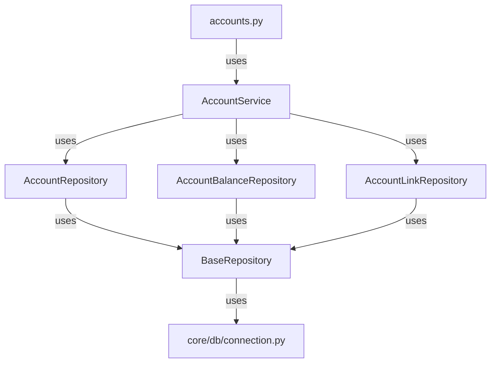
- ✅ **Compliant**: Router → Service → Repository → `core/db`.

---

### Loans
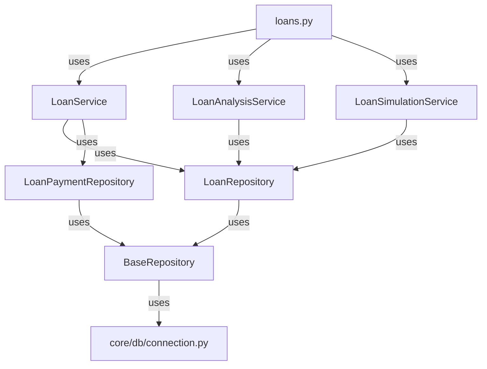
- ✅ **Compliant**: Router → Service → Repository → `core/db`.

---

### Credit Cards
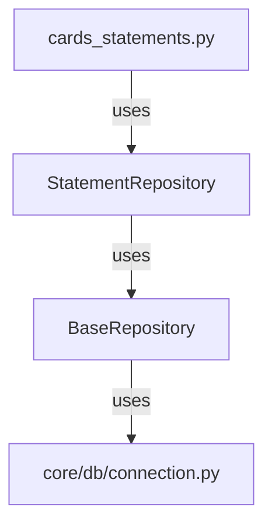
- ❌ **Non-Compliant**: Router bypasses `Service` layer and directly uses `StatementRepository`.

---

### Reconciliation
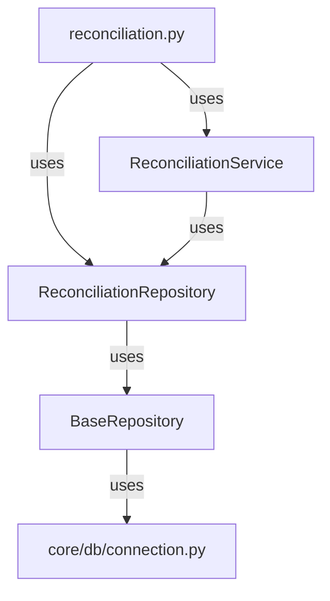
- ❌ **Non-Compliant**: Router directly imports `ReconciliationRepository` alongside `ReconciliationService`.

---

### Cashflow
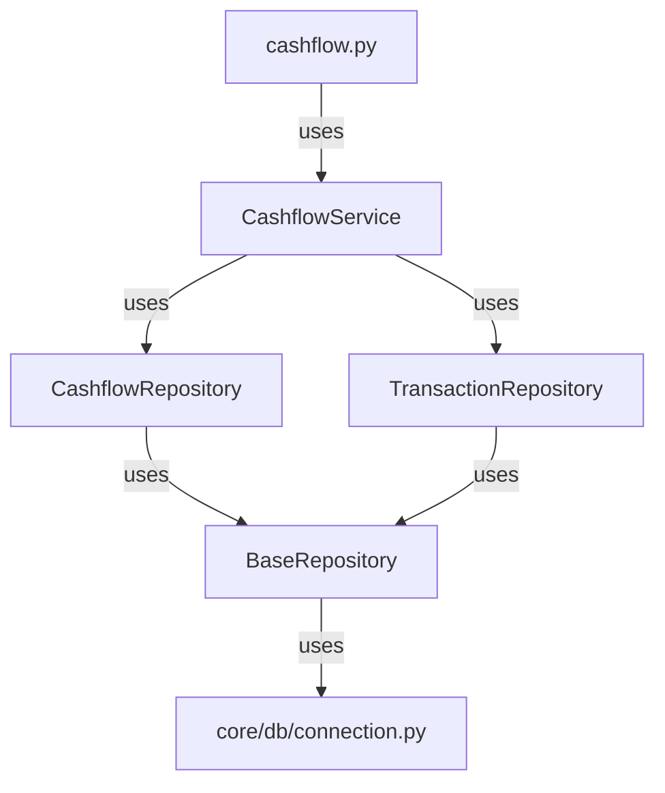
- ✅ **Compliant**: Router → Service → Repository → `core/db`.

---

### Investments
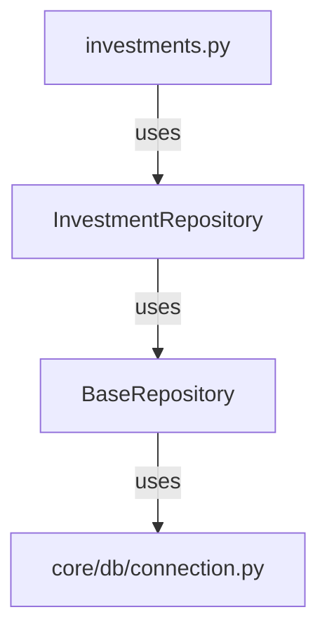
- ❌ **Non-Compliant**: Router bypasses `Service` layer and directly uses `InvestmentRepository`.

---

### Members
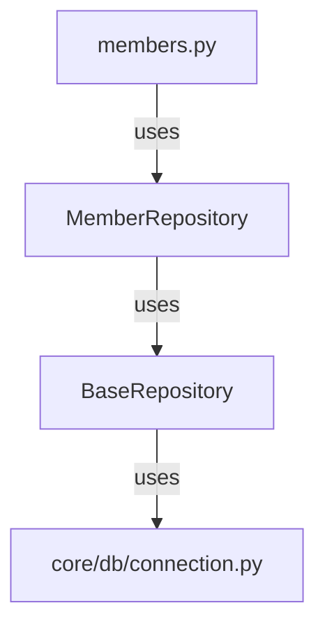
- ❌ **Non-Compliant**: Router bypasses `Service` layer and directly uses `MemberRepository`.

---

### Export
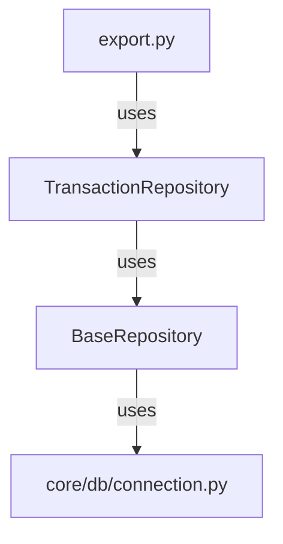
- ❌ **Non-Compliant**: Router bypasses `Service` layer and directly uses `TransactionRepository`.

---

### Banks
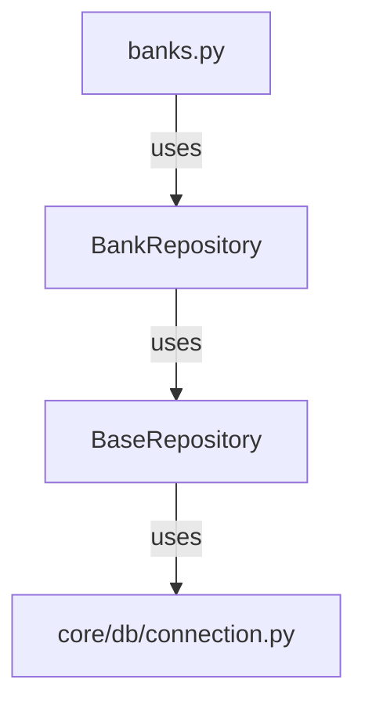
- ❌ **Non-Compliant**: Router bypasses `Service` layer and directly uses `BankRepository`.

---

### Import
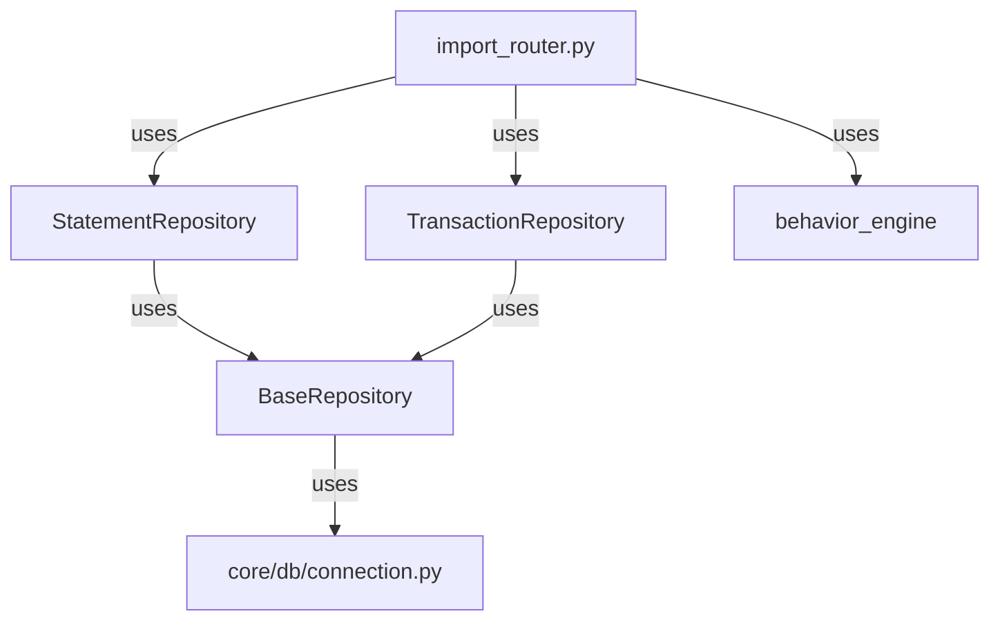
- ❌ **Non-Compliant**: Router bypasses `Service` layer and directly uses `StatementRepository`, `TransactionRepository`, and `behavior_engine`.

---

## 2. Engine Dependency Graphs

### Behavior Engine
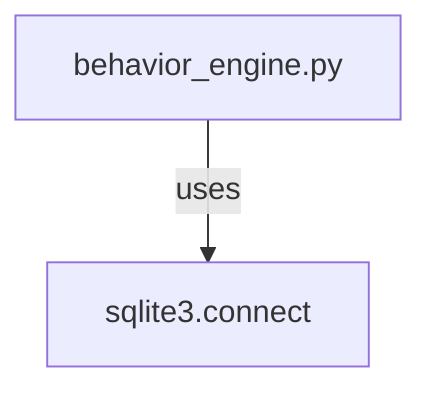
- ❌ **Non-Compliant**: Engine directly accesses the database.

---

### Reconciliation Engine
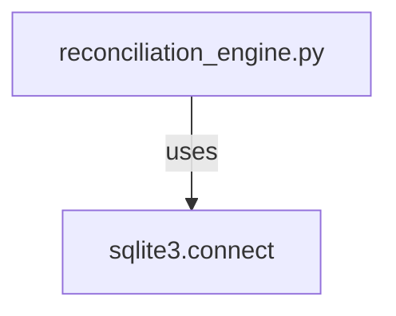
- ❌ **Non-Compliant**: Engine directly accesses the database.

---

### Ledger Audit Engine
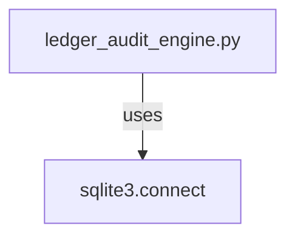
- ❌ **Non-Compliant**: Engine directly accesses the database.

---

### Balance Engine
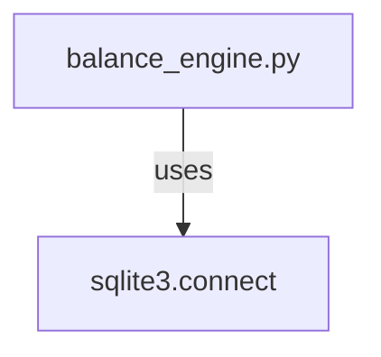
- ❌ **Non-Compliant**: Engine directly accesses the database.

---

## 3. Summary of Violations

| Feature          | Violation Type                          | Details                                                                                     |
|------------------|-----------------------------------------|---------------------------------------------------------------------------------------------|
| Credit Cards     | Router → Repository Bypass              | `cards_statements.py` directly uses `StatementRepository`.                                 |
| Reconciliation   | Router → Repository + Service           | `reconciliation.py` directly imports `ReconciliationRepository`.                           |
| Investments      | Router → Repository Bypass              | `investments.py` directly uses `InvestmentRepository`.                                     |
| Members          | Router → Repository Bypass              | `members.py` directly uses `MemberRepository`.                                             |
| Export           | Router → Repository Bypass              | `export.py` directly uses `TransactionRepository`.                                         |
| Banks            | Router → Repository Bypass              | `banks.py` directly uses `BankRepository`.                                                 |
| Import           | Router → Repository + Engine Bypass     | `import_router.py` directly uses `StatementRepository`, `TransactionRepository`, and `behavior_engine`. |
| Behavior Engine  | Engine → Database Access                | Direct `sqlite3.connect()` calls.                                                          |
| Reconciliation Engine | Engine → Database Access            | Direct `sqlite3.connect()` calls.                                                          |
| Ledger Audit Engine | Engine → Database Access             | Direct `sqlite3.connect()` calls.                                                          |
| Balance Engine   | Engine → Database Access                | Direct `sqlite3.connect()` calls.                                                          |