# Program 5.3B — Dependency Graph Verification

**Date:** 2026-08-02
**Phase:** Program 5.3B — Backend Architecture Verification & Gap Closure
**Status:** Audit Complete

---

## 1. Feature Dependency Graphs

### Accounts
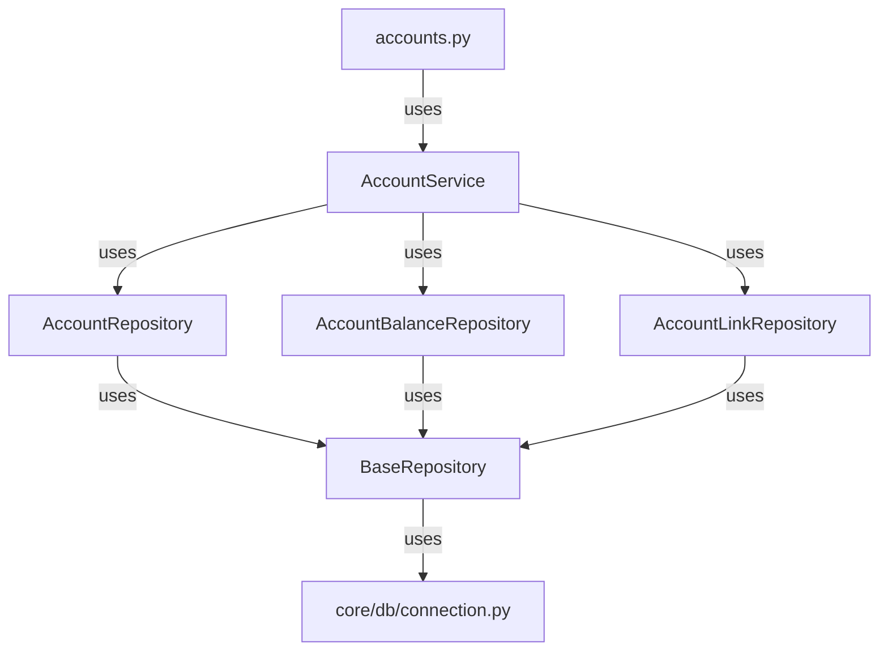
- ✅ **Compliant**: Router → Service → Repository → `core/db`.

---

### Loans
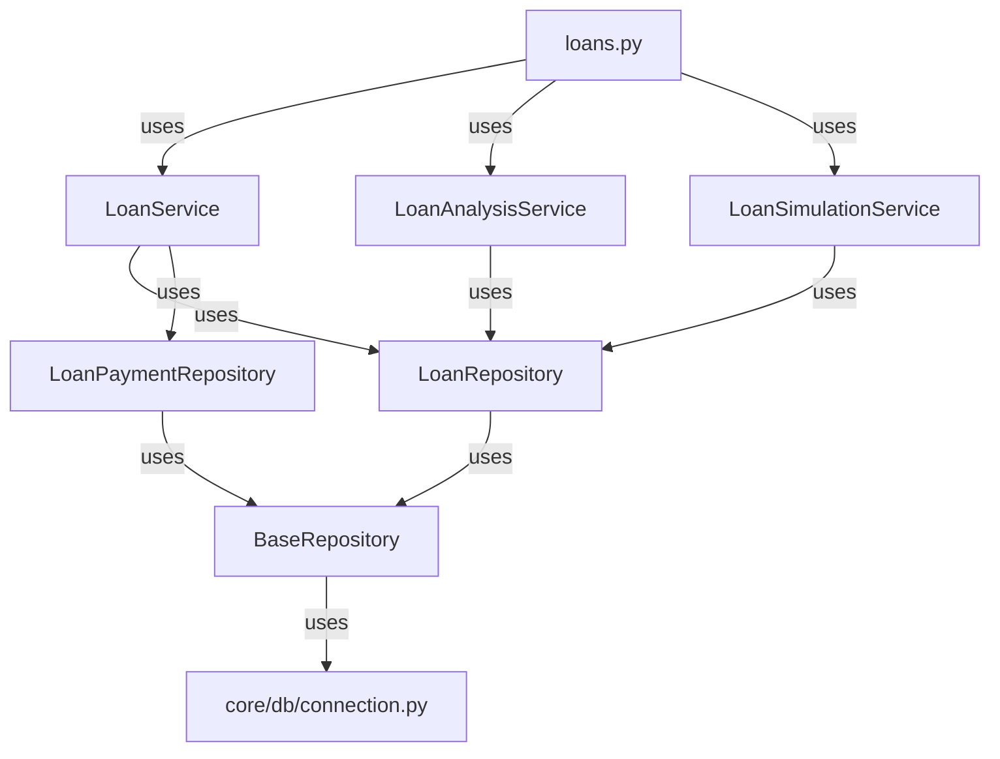
- ✅ **Compliant**: Router → Service → Repository → `core/db`.

---

### Credit Cards
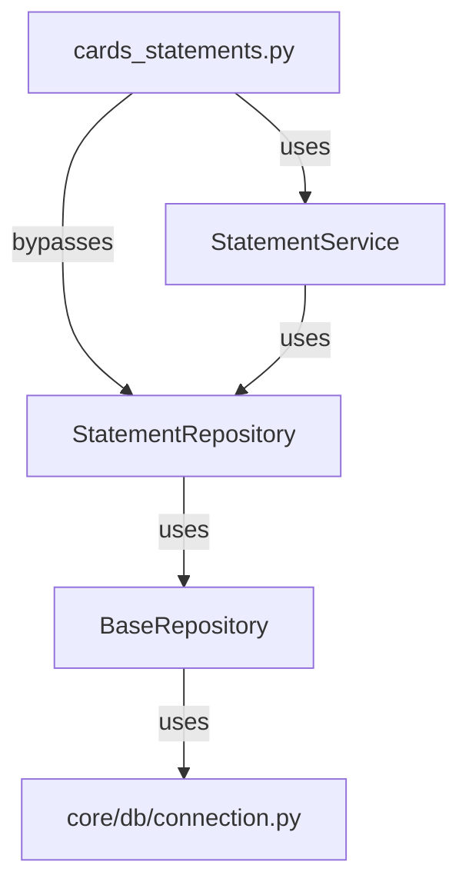
- ❌ **Non-Compliant**: Router directly uses `StatementRepository` alongside `StatementService`.

---

### Reconciliation
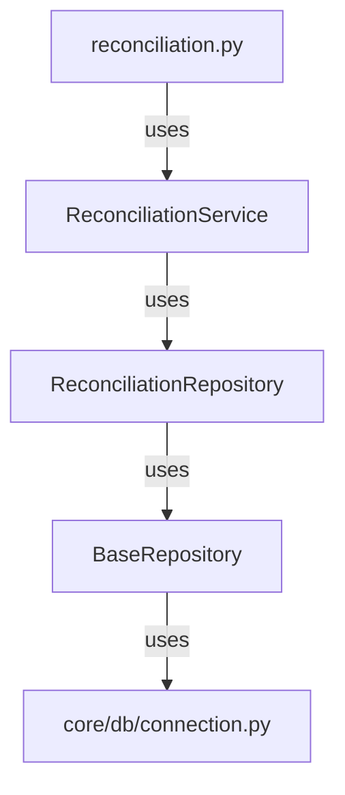
- ✅ **Compliant**: Router → Service → Repository → `core/db`.

---

### Cashflow
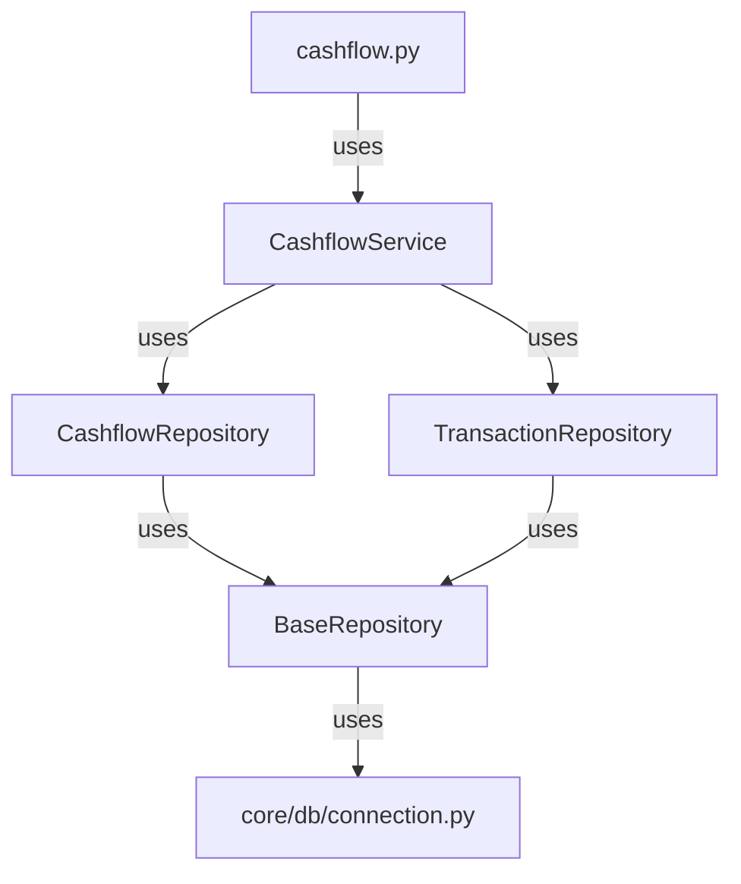
- ✅ **Compliant**: Router → Service → Repository → `core/db`.

---

### Investments
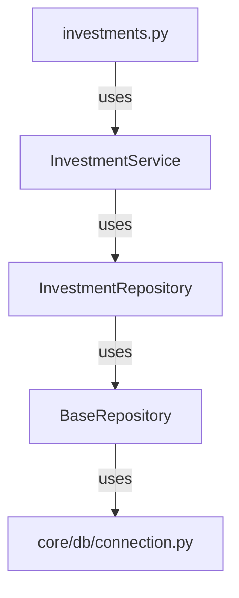
- ✅ **Compliant**: Router → Service → Repository → `core/db`.

---

### Members
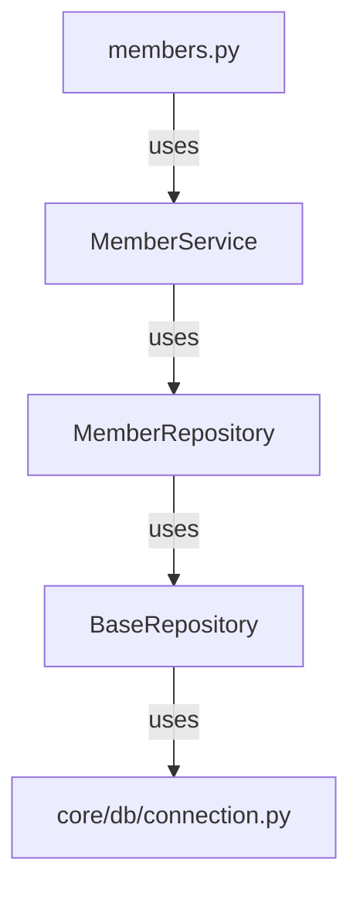
- ✅ **Compliant**: Router → Service → Repository → `core/db`.

---

### Export
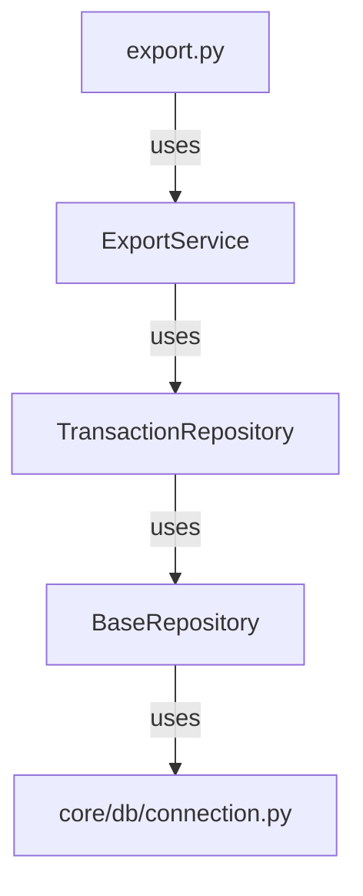
- ✅ **Compliant**: Router → Service → Repository → `core/db`.

---

### Banks
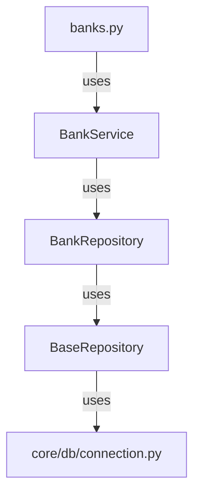
- ✅ **Compliant**: Router → Service → Repository → `core/db`.

---

### Import
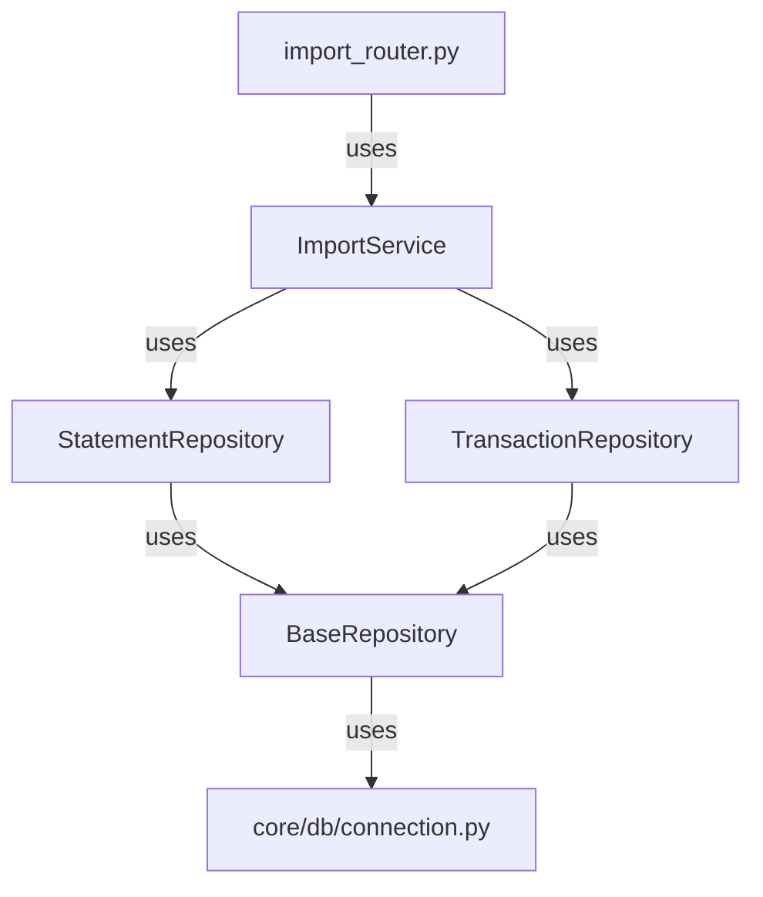
- ✅ **Compliant**: Router → Service → Repository → `core/db`.

---

## 2. Engine Dependency Graphs

### Behavior Engine
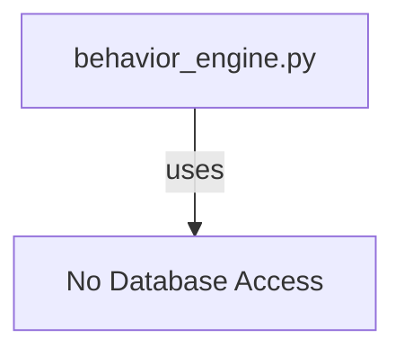
- ✅ **Compliant**: Engine does not access the database.

---

### Reconciliation Engine
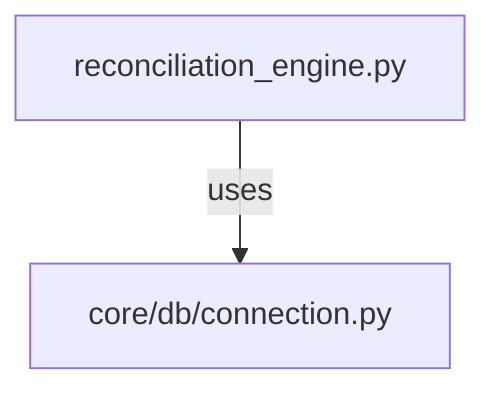
- ✅ **Compliant**: Engine uses `core.db.connection.get_connection()`.

---

### Ledger Audit Engine
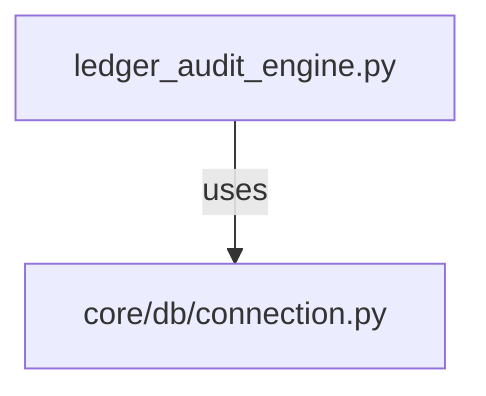
- ✅ **Compliant**: Engine uses `core.db.connection.get_connection()`.

---

### Balance Engine
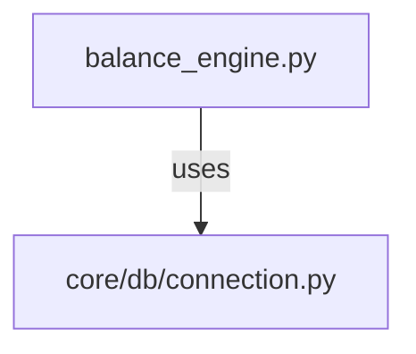
- ✅ **Compliant**: Engine uses `core.db.connection.get_connection()`.

---

## 3. Summary of Violations

| Feature          | Violation Type                          | Details                                                                                     | Status      |
|------------------|-----------------------------------------|---------------------------------------------------------------------------------------------|-------------|
| Credit Cards     | Router → Repository Bypass              | `cards_statements.py` directly uses `StatementRepository`.                                 | ❌ Pending  |
| **All Engines**  | **Engine → Database Access**            | **All engines now use `core.db.connection.get_connection()`.**                             | ✅ Complete |

---

## 4. Recommendations
1. **Refactor `cards_statements.py`**: Replace direct `StatementRepository` usage with `StatementService`.
2. **Update Tests/Scripts**: Replace direct `sqlite3.connect()` calls with `core.db.connection.get_connection()`.
3. **Implement DTOs/Mappers**: Restore the DTO and mapper pipeline for frontend contract stability.