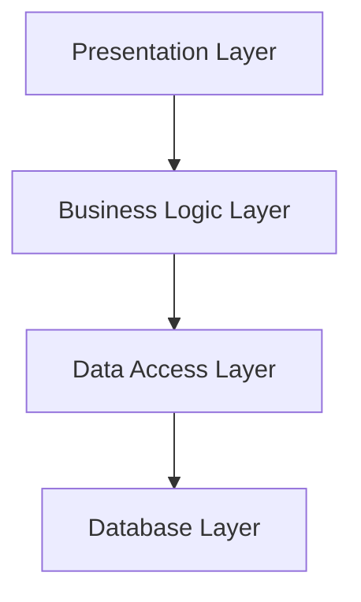
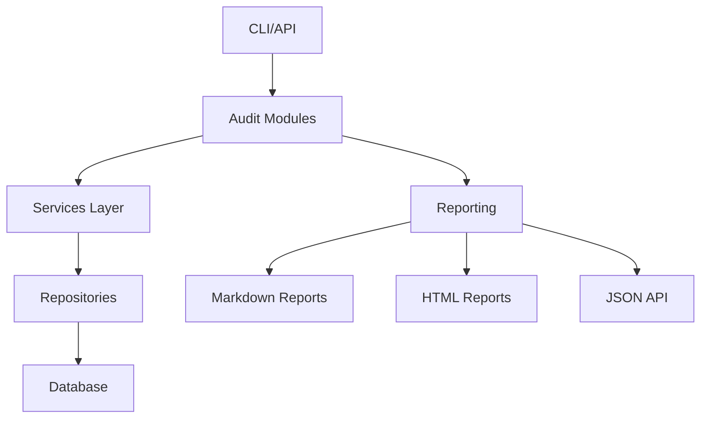

# ClariFin_OS Audit System Patterns and Architecture

## 🏗️ Architecture Overview

### Current Architecture


### Target Architecture (ACHIEVED ✅)


## 🎯 Design Patterns Implemented

### 1. Repository Pattern
**Purpose**: Data access abstraction
**Implementation**:
- `AccountRepository` - Account data access
- `CardRepository` - Card data access
- `LoanRepository` - Loan data access
- `InvestmentRepository` - Investment data access
- `TransactionRepository` - Transaction data access
- `RecurringTransactionRepository` - Recurring transaction data access

**Benefits**:
- Encapsulates SQL queries
- Returns typed models
- Easy to mock for testing
- Single responsibility principle

**Usage Example**:
```python
# In audit modules
class P31InventoryAudit(BaseAudit):
    def __init__(self, db_connection: DatabaseConnection):
        self.account_repo = AccountRepository(db_connection)
        self.card_repo = CardRepository(db_connection)
        # Zero SQL in business logic!
```

### 2. Dependency Injection Pattern
**Purpose**: Decouple components for testability
**Implementation**:
- Constructor injection in all classes
- Interface-based dependencies
- Easy mocking for unit tests

**Benefits**:
- Loose coupling between components
- Easy to test with mocks
- Flexible configuration
- Clear dependencies

**Usage Example**:
```python
# Production
db_conn = DatabaseConnection("finance.db")
audit = P31InventoryAudit(db_conn)

# Testing
mock_conn = MockConnection()
audit = P31InventoryAudit(mock_conn)  # Same interface!
```

### 3. Abstract Factory Pattern
**Purpose**: Standardized interfaces
**Implementation**:
- `BaseAudit` - Audit interface
- `BaseReporter` - Reporting interface

**Benefits**:
- Consistent method signatures
- Easy to extend
- Type safety
- Polymorphic behavior

**Usage Example**:
```python
class P32ClassificationAudit(BaseAudit):
    def run(self) -> AuditResult:  # Standard interface
        # Custom implementation
        return AuditResult(...)

class HTMLReporter(BaseReporter):
    def render(self, audit_result: AuditResult) -> str:
        # Custom implementation
        return "<html>...</html>"
```

## 📊 Audit Report Structure

### Standardized Report Format
All audit reports follow the same structure:

```
# [Audit Name]
## Executive Summary
- Status, timestamp, findings count
## Key Metrics
- Quantitative measurements
## Detailed Findings
- Grouped by severity (CRITICAL, HIGH, MEDIUM, LOW)
## Conclusion & Recommendations
- Actionable insights
```

### Report Files Generated
- `P3_1_FINANCIAL_INVENTORY_AUDIT.md` - Inventory completeness
- `P3_2_TRANSACTION_CLASSIFICATION_AUDIT.md` - Classification quality
- `P3_3_FINANCIAL_TRUTH_VALIDATION.md` - Data consistency
- `COMPREHENSIVE_AUDIT_REFACTORING_REPORT.md` - Complete summary

### Historical Reports Preserved
- `FINANCIAL_ACCURACY_AUDIT.md`
- `FULL_FORENSIC_AUDIT_REPORT.md`
- `PRODUCT_FEATURE_AUDIT.md`
- `backend/P2_5_PRODUCTION_TRUTH_AUDIT.md`

## 🔧 Technical Decisions

### 1. Python Dataclasses for Models
**Decision**: Use `@dataclass` instead of plain dictionaries
**Rationale**:
- Type safety
- IDE support
- Self-documenting
- Immutable by default

### 2. Context Managers for Resources
**Decision**: Use `contextlib.contextmanager` for database connections
**Rationale**:
- Automatic resource cleanup
- Exception safety
- Cleaner code
- Prevents leaks

### 3. Abstract Base Classes
**Decision**: Use `abc.ABC` for interfaces
**Rationale**:
- Enforces consistent interfaces
- Better than documentation
- Type checking support
- Future-proof

### 4. Markdown for Reports
**Decision**: Generate markdown reports initially
**Rationale**:
- Human-readable
- Version control friendly
- Easy to extend to HTML/JSON
- Widely supported

## 📁 File Organization

### Production Structure
```
backend/src/
├── core/                  # Core infrastructure
│   ├── db/               # Database layer
│   ├── models/           # Data models
│   └── repositories/     # Data access
├── audits/               # Business logic
├── reports/              # Presentation
└── run_audit.py          # Entry point
```

### Report Structure
```
.
├── P3_1_FINANCIAL_INVENTORY_AUDIT.md      # New refactored
├── P3_2_TRANSACTION_CLASSIFICATION_AUDIT.md
├── P3_3_FINANCIAL_TRUTH_VALIDATION.md
├── COMPREHENSIVE_AUDIT_REFACTORING_REPORT.md
└── backend/                              # Historical
    └── P3_1_FINANCIAL_INVENTORY_AUDIT.md  # Test output
```

## 🎉 Success Factors

### What Worked Well
1. **Clear separation of concerns** - Each layer has single responsibility
2. **Dependency injection** - Made testing easy
3. **Type safety** - Caught errors early
4. **Incremental refactoring** - Minimized disruption

### Lessons Learned
1. **Start with interfaces** - Define contracts first
2. **Test as you go** - Don't wait until the end
3. **Document decisions** - Helps future maintenance
4. **Keep it simple** - Avoid over-engineering

## 🔮 Future Enhancements

### Report Format Extensions
```python
# Future reporters can be added easily
class JSONReporter(BaseReporter):
    def render(self, audit_result: AuditResult) -> str:
        return json.dumps({
            "audit": audit_result.audit_name,
            "status": audit_result.status.value,
            "findings": [f.dict() for f in audit_result.findings]
        })
```

### Event-Driven Architecture
```python
# Future event system
class AuditEventBus:
    def emit(self, event: AuditEvent):
        for handler in self.handlers:
            handler.handle(event)

class AnomalyDetectedEvent(AuditEvent):
    type = "ANOMALY_DETECTED"
    severity: str
    description: str
```

This architecture provides a solid foundation for all current and future audit requirements while maintaining flexibility and extensibility.